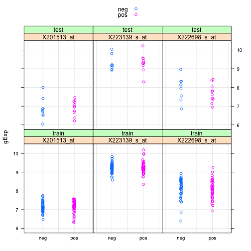

Seminar 10
========================================================

Ref1: http://www.ugrad.stat.ubc.ca/~stat540/seminars/seminar10_classification.html

*Excerpt from ref*
Supervised learning, classification, cross validation, variable 


```r
library(MASS)
library(reshape)
```

```
## Loading required package: plyr
## 
## Attaching package: 'reshape'
## 
## The following objects are masked from 'package:plyr':
## 
##     rename, round_any
```

```r
library(class)
```

```
## 
## Attaching package: 'class'
## 
## The following object is masked from 'package:reshape':
## 
##     condense
```

```r
library(car)
library(limma)
library(e1071)
library(glmnet)
```

```
## Error: there is no package called 'glmnet'
```

```r
library(ROCR)
```

```
## Loading required package: gplots
## KernSmooth 2.23 loaded
## Copyright M. P. Wand 1997-2009
## 
## Attaching package: 'gplots'
## 
## The following object is masked from 'package:stats':
## 
##     lowess
```

```r
library(CMA)
```

```
## Loading required package: Biobase
## Loading required package: BiocGenerics
## Loading required package: parallel
## 
## Attaching package: 'BiocGenerics'
## 
## The following objects are masked from 'package:parallel':
## 
##     clusterApply, clusterApplyLB, clusterCall, clusterEvalQ,
##     clusterExport, clusterMap, parApply, parCapply, parLapply,
##     parLapplyLB, parRapply, parSapply, parSapplyLB
## 
## The following object is masked from 'package:limma':
## 
##     plotMA
## 
## The following object is masked from 'package:stats':
## 
##     xtabs
## 
## The following objects are masked from 'package:base':
## 
##     anyDuplicated, append, as.data.frame, as.vector, cbind,
##     colnames, duplicated, eval, evalq, Filter, Find, get,
##     intersect, is.unsorted, lapply, Map, mapply, match, mget,
##     order, paste, pmax, pmax.int, pmin, pmin.int, Position, rank,
##     rbind, Reduce, rep.int, rownames, sapply, setdiff, sort,
##     table, tapply, union, unique, unlist
## 
## Welcome to Bioconductor
## 
##     Vignettes contain introductory material; view with
##     'browseVignettes()'. To cite Bioconductor, see
##     'citation("Biobase")', and for packages 'citation("pkgname")'.
## 
## 
## Attaching package: 'CMA'
## 
## The following object is masked from 'package:ROCR':
## 
##     prediction
## 
## The following object is masked from 'package:e1071':
## 
##     tune
## 
## The following object is masked from 'package:plyr':
## 
##     join
```

```r
library(GEOquery)
```

```
## Setting options('download.file.method.GEOquery'='auto')
```

```r
library(lattice)
```


# Data preparation


```r
setwd("/Users/sohrab/Me/Apply/Canada Apply/Courses/Second Semester/Stat 540/Lab/stat540-2014-salehi-sohrab/data")
if (file.exists("class_LNstatus.Rdata")) {
    # if previously downloaded
    load("class_LNstatus.Rdata")
} else {
    # if downloading for the first time takes a several mins!; returns a list
    datgeo <- getGEO("GSE23177", GSEMatrix = TRUE)
    dat <- datgeo[[1]]  #Note that dat is an ExpressionSets
    
    str(pData(dat), max.level = 0)
    
    # extract only those variables of interest
    pData(dat) <- subset(pData(dat), select = c("characteristics_ch1.2", "characteristics_ch1.3", 
        "characteristics_ch1"))
    names(pData(dat)) <- c("LnStatus", "LnRatio", "Set")
    
    # Note: LNRatio will not be used in this Seminar. However, you can use it to
    # try some of the regularization techniques learned in class
    
    # split the ExpressionSet into training and test sets.
    train.es <- dat[, dat$Set == "patient type: training set"]
    test.es <- dat[, dat$Set != "patient type: training set"]
    
    # Re-label factor
    pData(train.es)$LnStatus <- recode(pData(train.es)$LnStatus, "levels(pData(train.es)$LnStatus)[1]='neg'; else='pos'", 
        levels = c("neg", "pos"))
    
    pData(test.es)$LnStatus <- recode(pData(test.es)$LnStatus, "levels(pData(test.es)$LnStatus)[1]='neg'; else='pos'", 
        levels = c("neg", "pos"))
    
    # create data matrices with expression values (probesets in rows). Some of
    # the functions we will use do not take ExpressionSets as objects
    trainDat <- exprs(train.es)
    testDat <- exprs(test.es)
    
    # Redefine the quantitative variable LnRatio to make it a numeric variable.
    ntrain <- dim(pData(train.es))[1]
    ntest <- dim(pData(test.es))[1]
    
    pData(train.es)$LnRatio <- as.numeric(unlist(strsplit(as.vector(unlist(pData(train.es)$LnRatio)), 
        ":", fixed = TRUE))[(1:ntrain) * 2])
    pData(test.es)$LnRatio <- as.numeric(unlist(strsplit(as.vector(unlist(pData(test.es)$LnRatio)), 
        ":", fixed = TRUE))[(1:ntest) * 2])
    
    # save the data to avoid future re-downloading
    save(dat, trainDat, testDat, train.es, test.es, file = "class_LNstatus.Rdata")
}
```


```r
# undestand your data for classification
table(pData(train.es)$LnStatus)
```

```
## 
## neg pos 
##  48  48
```

```r
table(pData(test.es)$LnStatus)
```

```
## 
## neg pos 
##   9  11
```

```r

# understand the continuous response train
tapply(pData(train.es)$LnRatio, pData(train.es)$LnStatus, summary)
```

```
## $neg
##    Min. 1st Qu.  Median    Mean 3rd Qu.    Max. 
##       0       0       0       0       0       0 
## 
## $pos
##    Min. 1st Qu.  Median    Mean 3rd Qu.    Max. 
##   0.040   0.070   0.110   0.194   0.228   0.960
```

```r

# test
tapply(pData(test.es)$LnRatio, pData(test.es)$LnStatus, summary)
```

```
## $neg
##    Min. 1st Qu.  Median    Mean 3rd Qu.    Max. 
##       0       0       0       0       0       0 
## 
## $pos
##    Min. 1st Qu.  Median    Mean 3rd Qu.    Max. 
##   0.050   0.180   0.500   0.457   0.610   0.940
```

```r

# look at the expression of 3 randomly picked genes in both training and
# test sets
set.seed(1234)
(getMe <- sample(1:nrow(train.es), size = 3))  ## [1]   2756 15082 14766
```

```
## [1]  2756 15082 14766
```

```r

# training data
trDat <- trainDat[getMe, ]
str(trDat)
```

```
##  num [1:3, 1:96] 7.19 9.17 8.38 7.13 9.38 ...
##  - attr(*, "dimnames")=List of 2
##   ..$ : chr [1:3] "201513_at" "223139_s_at" "222698_s_at"
##   ..$ : chr [1:96] "GSM570518" "GSM570519" "GSM570520" "GSM570521" ...
```

```r


trDat <- data.frame(LnStatus = pData(train.es)$LnStatus, Set = rep("train", 
    nrow(pData(train.es))), t(trDat))
str(trDat)
```

```
## 'data.frame':	96 obs. of  5 variables:
##  $ LnStatus    : Factor w/ 2 levels "neg","pos": 1 1 2 1 1 2 1 1 2 1 ...
##  $ Set         : Factor w/ 1 level "train": 1 1 1 1 1 1 1 1 1 1 ...
##  $ X201513_at  : num  7.19 7.13 7.39 6.86 6.96 ...
##  $ X223139_s_at: num  9.17 9.38 9.03 9.55 9.5 ...
##  $ X222698_s_at: num  8.38 8.24 7.23 7.87 8.45 ...
```

```r

plotDat.train <- melt(trDat, id = c("LnStatus", "Set"), variable_name = "gene")
colnames(plotDat.train)[colnames(plotDat.train) == "value"] = "gExp"

# test data
tDat <- testDat[getMe, ]
str(tDat)
```

```
##  num [1:3, 1:20] 6.05 9.15 7.55 6.87 8.95 ...
##  - attr(*, "dimnames")=List of 2
##   ..$ : chr [1:3] "201513_at" "223139_s_at" "222698_s_at"
##   ..$ : chr [1:20] "GSM570498" "GSM570499" "GSM570500" "GSM570501" ...
```

```r


tDat <- data.frame(LnStatus = pData(test.es)$LnStatus, Set = rep("test", nrow(pData(test.es))), 
    t(tDat))
str(tDat)
```

```
## 'data.frame':	20 obs. of  5 variables:
##  $ LnStatus    : Factor w/ 2 levels "neg","pos": 1 1 1 1 1 1 1 1 1 2 ...
##  $ Set         : Factor w/ 1 level "test": 1 1 1 1 1 1 1 1 1 1 ...
##  $ X201513_at  : num  6.05 6.87 6.71 8 6.54 ...
##  $ X223139_s_at: num  9.15 8.95 9.09 9.81 9.2 ...
##  $ X222698_s_at: num  7.55 8.34 8.32 7.33 8.14 ...
```

```r

plotDat.test <- melt(tDat, id = c("LnStatus", "Set"), variable_name = "gene")
colnames(plotDat.test)[colnames(plotDat.test) == "value"] = "gExp"

plotDat <- rbind(plotDat.train, plotDat.test)

# plot 3 randomly picked genes in both training and test sets
stripplot(gExp ~ LnStatus | gene + Set, plotDat, grid = TRUE, group = LnStatus, 
    auto.key = TRUE, jitter.data = TRUE)
```

 


They look rather similar in train and test.


# Classification

## Feature and Model Selection
### Cross validation splits

```r
nfold <- 6

tabTrain <- table(train.es$LnStatus)

indlist <- sapply(names(tabTrain), function(z) which(train.es$LnStatus == z), 
    simplify = FALSE)

set.seed(1234)

# Each row contains 8 pos and 8 negative samples.
fold.pos <- matrix(sample(indlist[["pos"]]), nrow = nfold)
fold.neg <- matrix(sample(indlist[["neg"]]), nrow = nfold)

# Use CMA to do this:
splits <- GenerateLearningsets(y = train.es$LnStatus, method = "CV", fold = 6, 
    strat = TRUE)
```


### Loop for feature selection and modeling

### Results of the CV
`Exercise 1: perform 100 runs of this CV before selecting a model to test! Add at least on model to the list of models, e.g., use genes with a p-val threshold < cutoff.

Exercise 2: Use AUC as a criteria to select a model based on the training data! Tip: extract the predicted probabilities from each method and use the roc function in ROCR.`


#### Exercise 1
We'll add `naive bayes` classifier from the package `e1071`:

```r

# Define here the constants that you will not evaluate. For example, I will
# use the top-50 limma genes
ngenes <- 50

# number of methods you plan to compare, 7 original
nmethod <- 8

# number of runs
cvruns <- 2

# set aside an object to hold the average result of the 100 runs (following
# Gabi's code) we'll put in
method.names <- c("1NN", "5NN", "10NN", "15NN", "LDA", "Logit", "SVM", "Naive_Bayes")
dim.names <- list(paste0("Run", 1:cvruns), method.names)
mean.pr.err <- matrix(-1, cvruns, nmethod, dimnames = dim.names)
mean.pr.auc <- matrix(-1, cvruns, nmethod, dimnames = dim.names)


# Define here an output objects to store results (added the Naive Bayes
# Classifer)
for (r in 1:cvruns) {
    # use different folds each time
    fold.pos <- matrix(sample(indlist[["pos"]]), nrow = nfold)
    fold.neg <- matrix(sample(indlist[["neg"]]), nrow = nfold)
    
    # use a different output perhaps it's easier to just add another dimension
    # to this guy
    pr.perf <- list(pr.err = matrix(-1, nfold, nmethod, dimnames = list(paste0("Fold", 
        1:nfold), method.names)), pr.auc = matrix(-1, nfold, nmethod, dimnames = list(paste0("Fold", 
        1:nfold), method.names)))
    
    for (i in 1:nfold) {
        # Test Fold for the i-th step
        testdat.fold <- trainDat[, c(fold.pos[i, ], fold.neg[i, ])]
        
        # I will create a factor of classes for the test set of the i_th fold
        testclass.fold <- train.es$LnStatus[c(fold.pos[i, ], fold.neg[i, ])]
        
        # The rest of the samples are the training set for the i-th step
        traindat.fold <- trainDat[, -c(fold.pos[i, ], fold.neg[i, ])]
        trainclass.fold <- train.es$LnStatus[-c(fold.pos[i, ], fold.neg[i, ])]
        
        
        # Step 1: feature selection (do you remember limma?).
        
        # Note that a different set of genes will be selected for each fold! you can
        # then compare how consistent these sets were.
        
        limma.dat <- as.data.frame(traindat.fold)
        desMat <- model.matrix(~trainclass.fold, limma.dat)  #design matrix
        trainFit <- lmFit(limma.dat, desMat)
        eBtrainFit <- eBayes(trainFit)
        
        # top-50 limma genes
        top.fold <- topTable(eBtrainFit, coef = which(colnames(coef(trainFit)) != 
            "(Intercept)"), n = ngenes, sort.by = "P")
        
        # Retain the top-50 limma genes from the train and test sets
        traindat.fold <- traindat.fold[rownames(top.fold), ]
        testdat.fold <- testdat.fold[rownames(top.fold), ]
        
        
        # STEP 2: select a classifier Set a counter for the method tested
        l <- 0
        
        # kNN classifiers
        for (kk in c(1, 5, 10, 15)) {
            # every time you get inside this loop, the l counter gets redefined (i.e.,
            # 1, 2, etc for method 1, method 2, etc)
            l <- l + 1
            
            # knn needs samples in rows
            yhat.knn <- knn(train = t(traindat.fold), test = t(testdat.fold), 
                cl = trainclass.fold, k = kk, prob = T)
            
            # Store the prediction error for each kk within this fold count the number
            # of times the prediction was wrong in the test data.set
            pr.perf$pr.err[i, l] <- mean(yhat.knn != testclass.fold)
            predicted <- prediction(attributes(yhat.knn)$prob, yhat.knn)
            pr.perf$pr.auc[i, l] <- as.numeric(performance(predicted, "auc")@y.values)
        }  #end of kNN loop
        
        # LDA method. Note that you can change the prior parameter to reflect a
        # different proportion of case and control samples. The default is to use
        # the class proportions from the training set.
        
        m.lda <- lda(x = t(traindat.fold), group = trainclass.fold, prior = c(0.5, 
            0.5))
        full.lda <- predict(m.lda, newdata = t(testdat.fold))
        yhat.lda <- full.lda$class
        # extract scores
        scores.lda <- unlist(lapply(1:nrow(full.lda$posterior), function(x) full.lda$posterior[x, 
            yhat.lda[x]]))
        
        # count the number of times the prediction was wrong in the test data.set
        pr.perf$pr.err[i, "LDA"] <- mean(yhat.lda != testclass.fold)
        predicted <- prediction(scores.lda, yhat.lda)
        pr.perf$pr.auc[i, "LDA"] <- as.numeric(performance(predicted, "auc")@y.values)
        
        # Logit
        glm.dat <- data.frame(t(traindat.fold), group = trainclass.fold)
        m.log <- glm(group ~ ., data = glm.dat, family = binomial)
        
        pr.log <- predict(m.log, newdata = data.frame(t(testdat.fold)), type = "response")
        pr.cl <- rep(0, length(testclass.fold))
        pr.cl[pr.log > 1/2] <- "pos"
        pr.cl[pr.log <= 1/2] <- "neg"
        
        pr.cl <- factor(pr.cl)
        
        # count the number of times the prediction was wrong in the test data.set
        pr.perf$pr.err[i, "Logit"] <- mean(pr.cl != testclass.fold)
        # pr.perf$pr.auc[i, 'Logit'] <- as.numeric(performance(pr.cl,
        # 'auc'))@y.values
        predicted <- prediction(as.vector(pr.log), pr.cl)
        pr.perf$pr.auc[i, "Logit"] <- as.numeric(performance(predicted, "auc")@y.values)
        
        # SVM
        m.svm <- svm(x = t(traindat.fold), y = trainclass.fold, cost = 1, type = "C-classification", 
            kernel = "linear")
        pr.svm <- predict(m.svm, newdata = t(testdat.fold))
        
        # count the number of times the prediction was wrong in the test data.set
        pr.perf$pr.err[i, "SVM"] <- mean(pr.svm != testclass.fold)
        predicted <- prediction(rep(1, length(pr.svm)), pr.svm)
        pr.perf$pr.auc[i, "SVM"] <- as.numeric(performance(predicted, "auc")@y.values)
        
        # Naive Bayes
        m.nbayes <- naiveBayes(x = t(traindat.fold), y = trainclass.fold)
        pr.nbayes <- predict(m.nbayes, newdata = t(testdat.fold))
        
        # count the number of times the prediction was wrong in the test data.set
        pr.perf$pr.err[i, "Naive_Bayes"] <- mean(pr.nbayes != testclass.fold)
        predicted <- prediction(rep(1, length(pr.nbayes)), pr.nbayes)
        pr.perf$pr.auc[i, "Naive_Bayes"] <- as.numeric(performance(predicted, 
            "auc")@y.values)
        
    }  # end of each fold
    
    mean.pr.err[r, ] <- colMeans(pr.perf$pr.err)
    mean.pr.auc[r, ] <- colMeans(pr.perf$pr.auc)
}
```

```
## Error: unable to find an inherited method for function 'prediction' for
## signature '"numeric", "factor", "missing", "missing"'
```


### Error Rates

```r
cv.err <- colMeans(mean.pr.err)

# mean - 1 sd (sd of the 6 error rates)
ls <- cv.err - apply(mean.pr.err, 2, sd)

# mean + 1 sd (sd of the 6 error rates)
us <- cv.err + apply(mean.pr.err, 2, sd)

# plot the results
plot(1:nmethod, cv.err, ylim = c(0, 1), xlim = c(1, (nmethod + 0.5)), type = "n", 
    axes = FALSE, xlab = "Classifier", ylab = "Error rate", main = "6-fold CV Error")

for (j in 1:ncol(mean.pr.err)) points(jitter(rep(j, 6), factor = 2), jitter(mean.pr.err[, 
    j]), cex = 0.8, pch = "X", col = "gray")
```

```
## Error: 'x' and 'y' lengths differ
```

```r

for (i in 1:nmethod) lines(c(i, i), c(ls[i], us[i]), lwd = 2, col = "gray")
points(1:nmethod, ls, pch = 19, col = "red")
points(1:nmethod, us, pch = 19, col = "green")
points(1:nmethod, cv.err, pch = 19, cex = 1.5, col = "black")
axis(2, ylab = "Error rate")
axis(1, 1:nmethod, colnames(mean.pr.err))

box()
```

 


### AUC
#### Exercise 2

```r
cv.auc <- colMeans(mean.pr.auc)

# mean - 1 sd (sd of the 6 error rates)
ls <- cv.auc - apply(mean.pr.auc, 2, sd)

# mean + 1 sd (sd of the 6 error rates)
us <- cv.auc + apply(mean.pr.auc, 2, sd)

# plot the results
plot(1:nmethod, cv.err, ylim = c(0, 1), xlim = c(1, (nmethod + 0.5)), type = "n", 
    axes = FALSE, xlab = "Classifier", ylab = "Error rate", main = "6-fold CV Error")

for (j in 1:ncol(mean.pr.auc)) points(jitter(rep(j, 6), factor = 2), jitter(mean.pr.auc[, 
    j]), cex = 0.8, pch = "X", col = "gray")
```

```
## Error: 'x' and 'y' lengths differ
```

```r

for (i in 1:nmethod) lines(c(i, i), c(ls[i], us[i]), lwd = 2, col = "gray")
points(1:nmethod, ls, pch = 19, col = "red")
points(1:nmethod, us, pch = 19, col = "green")
points(1:nmethod, cv.err, pch = 19, cex = 1.5, col = "black")
axis(2, ylab = "AUC")
axis(1, 1:nmethod, colnames(mean.pr.auc))

box()
```

 


## Testing the selected model

```r
yhat.knn <- knn(train = t(trainDat), test = t(testDat), cl = train.es$LnStatus, 
    k = 10)
# Store the prediction error for each kk within this fold
pr.errTest <- mean(test.es$LnStatus != yhat.knn)
pr.errTest
```

```
## [1] 0.5
```


## CMA

```r
featureScores <- GeneSelection(X = t(trainDat), y = train.es$LnStatus, learningsets = splits, 
    method = "limma")
```

```
## GeneSelection: iteration 1 
## GeneSelection: iteration 2 
## GeneSelection: iteration 3 
## GeneSelection: iteration 4 
## GeneSelection: iteration 5 
## GeneSelection: iteration 6
```

```r

# Compare list of selected genes using:
toplist(featureScores)
```

```
## top  10  genes for iteration  1 
##  
##    index importance
## 1   9265      25.38
## 2   6936      24.85
## 3  21592      24.56
## 4   1702      23.99
## 5  21919      23.99
## 6  19932      21.29
## 7   6938      20.60
## 8  22524      20.18
## 9  17847      18.78
## 10  6937      18.75
```

```r

# We can aggregate the results across the 6 splits.

seliter <- numeric()
for (i in 1:nfold) seliter <- c(seliter, toplist(featureScores, iter = i, top = 10, 
    show = FALSE)$index)
sort(table(seliter), dec = T)  # summarize
```

```
## seliter
##  1702  9265  6936 21919   808  6938 18958 19932 20571 21592 23206 23567 
##     6     5     3     3     2     2     2     2     2     2     2     2 
##    18   377   767  2690  3386  6937  7182  7183  8447 10254 10292 13581 
##     1     1     1     1     1     1     1     1     1     1     1     1 
## 13620 13802 15997 16094 16165 17847 18668 19152 19265 19402 19526 19577 
##     1     1     1     1     1     1     1     1     1     1     1     1 
## 21533 22524 22943 
##     1     1     1
```

```r

# Choose the 20 probes which are chosen most commonly in the 6 splits
bestprobes <- as.numeric(names(sort(table(seliter), dec = T)))[1:20]

# examine the annotations. I just selected a few columns from the fData of
# the eSet.
fData(dat)[bestprobes, c("Gene Symbol", "Gene Title", "ENTREZ_GENE_ID", "Representative Public ID")]
```

```
##                    Gene Symbol
## 1569472_s_at              TTC3
## 212384_at    ATP6V1G2 /// BAT1
## 208661_s_at               TTC3
## 237746_at               SFRS11
## 1556088_at               RPAIN
## 208663_s_at               TTC3
## 228510_at                ATAT1
## 230609_at               CLINT1
## 232740_at            MCM3AP-AS
## 236196_at                     
## 242562_at              DNAJC24
## 243751_at                     
## 1552283_s_at           ZDHHC11
## 1554182_at   TRIM73 /// TRIM74
## 1555920_at                CBX3
## 201440_at                DDX23
## 202182_at                KAT2A
## 208662_s_at               TTC3
## 208920_at                  SRI
## 208921_s_at                SRI
##                                                                                             Gene Title
## 1569472_s_at                                                         tetratricopeptide repeat domain 3
## 212384_at    ATPase, H+ transporting, lysosomal 13kDa, V1 subunit G2 /// HLA-B associated transcript 1
## 208661_s_at                                                          tetratricopeptide repeat domain 3
## 237746_at                                                     Splicing factor, arginine/serine-rich 11
## 1556088_at                                                                     RPA interacting protein
## 208663_s_at                                                          tetratricopeptide repeat domain 3
## 228510_at                                                            alpha tubulin acetyltransferase 1
## 230609_at                                                                        clathrin interactor 1
## 232740_at                                                    MCM3AP antisense RNA (non-protein coding)
## 236196_at                                                                                             
## 242562_at                                                 DnaJ (Hsp40) homolog, subfamily C, member 24
## 243751_at                                                                                             
## 1552283_s_at                                                      zinc finger, DHHC-type containing 11
## 1554182_at                           tripartite motif-containing 73 /// tripartite motif-containing 74
## 1555920_at                                         Chromobox homolog 3 (HP1 gamma homolog, Drosophila)
## 201440_at                                                    DEAD (Asp-Glu-Ala-Asp) box polypeptide 23
## 202182_at                                                               K(lysine) acetyltransferase 2A
## 208662_s_at                                                          tetratricopeptide repeat domain 3
## 208920_at                                                                                       sorcin
## 208921_s_at                                                                                     sorcin
##                 ENTREZ_GENE_ID Representative Public ID
## 1569472_s_at              7267                 BC026260
## 212384_at         534 /// 7919                 AI282485
## 208661_s_at               7267                 AW510696
## 237746_at                 9295                 AI168187
## 1556088_at               84268                 AK098491
## 208663_s_at               7267                 AI652848
## 228510_at                79969                 AL566825
## 230609_at                 9685                 BF510429
## 232740_at               114044                 BC002458
## 236196_at                                      BF939032
## 242562_at               120526                 AW772288
## 243751_at                                      AA709148
## 1552283_s_at             79844                NM_024786
## 1554182_at   375593 /// 378108                 BC033871
## 1555920_at               11335                 BU683892
## 201440_at                 9416                NM_004818
## 202182_at                 2648                NM_021078
## 208662_s_at               7267                 AI885338
## 208920_at                 6717                 AV752215
## 208921_s_at               6717                   L12387
```


Solution by Dr. Paldevis:

```r
m <- matrix(which(dat$Set == "patient type: training set"), 1)

full.learningset <- new("learningsets", learnmatrix = m, method = "my own", 
    ntrain = 96, iter = 1)

fullFeatureScores <- GeneSelection(X = t(exprs(dat)), learningsets = full.learningset, 
    y = dat$LnStatus, method = "t.test")
```

```
## GeneSelection: iteration 1
```

```r

testclassif <- classification(X = t(exprs(dat)), y = dat$LnStatus, learningsets = full.learningset, 
    genesel = fullFeatureScores, nbgene = 100, classifier = pknnCMA, k = 5)
```

```
## iteration 1
```

```r

# Evaluation:
tres <- testclassif[[1]]
ftable(tres)
```

```
## number of missclassifications:  11 
## missclassification rate:  0.55 
## sensitivity: 0.545 
## specificity: 0.333 
##     predicted
## true 0 1
##    0 3 6
##    1 5 6
```

```r
roc(tres)
```

 


# Discussion points
`How good do you think a classifier will have to be to be clinically relevant? What level of specificity or sensitivity do you think is "good enough"? The author's data set has half lymph-node positive and half negative. The incidence of lymph-node-positive breast cancer is about 33% at the time of diagnosis (according to [http://seer.cancer.gov/statfacts/html/breast.html]). How does that affect your opinion about the classifier?`
