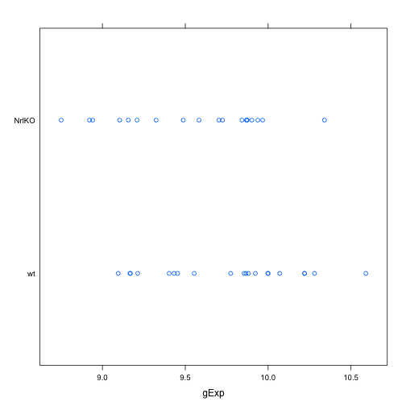
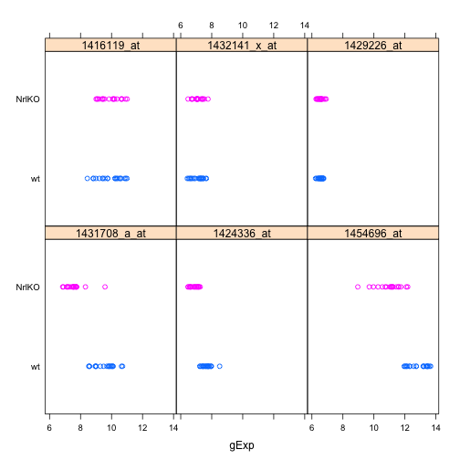
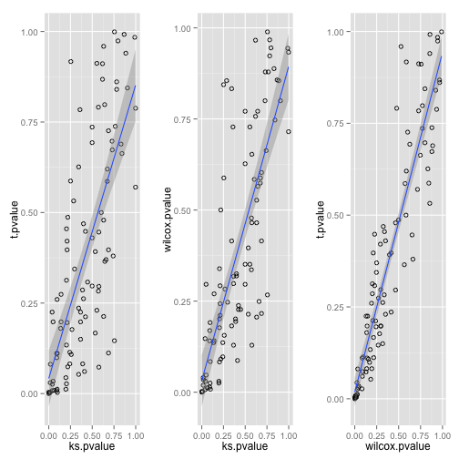

# Two group comparison
# ref: http://www.ugrad.stat.ubc.ca/~stat540/seminars/seminar04_compileNotebook-dataAggregation-twoGroupComparison.html


```r
library(lattice)

COMMON.SEED = 987

dataDir <- "/Users/sohrab/Me/Apply/Canada Apply/Courses/Second Semester/Stat 540/Lab/stat540_2014/examples/photoRec/data/"

prDat <- read.table(paste(dataDir, "GSE4051_data.tsv", sep = ""))
prDes <- readRDS(paste(dataDir, "GSE4051_design.rds", sep = ""))

str(prDat)
```

```
## 'data.frame':	29949 obs. of  39 variables:
##  $ Sample_20: num  7.24 9.48 10.01 8.36 8.59 ...
##  $ Sample_21: num  7.41 10.02 10.04 8.37 8.62 ...
##  $ Sample_22: num  7.17 9.85 9.91 8.4 8.52 ...
##  $ Sample_23: num  7.07 10.13 9.91 8.49 8.64 ...
##  $ Sample_16: num  7.38 7.64 8.42 8.36 8.51 ...
##  $ Sample_17: num  7.34 10.03 10.24 8.37 8.89 ...
##  $ Sample_6 : num  7.24 9.71 10.17 8.84 8.54 ...
##  $ Sample_24: num  7.11 9.75 9.39 8.37 8.36 ...
##  $ Sample_25: num  7.19 9.16 10.11 8.2 8.5 ...
##  $ Sample_26: num  7.18 9.49 9.41 8.73 8.39 ...
##  $ Sample_27: num  7.21 8.64 9.43 8.33 8.43 ...
##  $ Sample_14: num  7.09 9.56 9.88 8.57 8.59 ...
##  $ Sample_3 : num  7.16 9.55 9.84 8.33 8.5 ...
##  $ Sample_5 : num  7.08 9.32 9.24 8.3 8.48 ...
##  $ Sample_8 : num  7.11 8.24 9.13 8.13 8.33 ...
##  $ Sample_28: num  7.34 8.27 9.47 8.38 8.4 ...
##  $ Sample_29: num  7.66 10.03 9.88 8.56 8.69 ...
##  $ Sample_30: num  7.26 9.27 10.54 8.15 8.55 ...
##  $ Sample_31: num  7.31 9.26 10.1 8.37 8.49 ...
##  $ Sample_1 : num  7.15 9.87 9.68 8.28 8.5 ...
##  $ Sample_10: num  7.28 10.29 9.91 8.42 8.68 ...
##  $ Sample_4 : num  7.18 10.16 9.72 8.32 8.5 ...
##  $ Sample_7 : num  7.15 8.95 9.3 8.17 8.41 ...
##  $ Sample_32: num  7.54 9.53 9.92 8.78 8.57 ...
##  $ Sample_33: num  7.01 8.97 9.22 8.42 8.53 ...
##  $ Sample_34: num  6.81 8.83 9.39 8.1 8.32 ...
##  $ Sample_35: num  7.15 9.22 10.06 8.35 8.45 ...
##  $ Sample_13: num  7.33 9.33 9.75 8.43 8.48 ...
##  $ Sample_15: num  7.12 9.15 9.84 8.32 8.21 ...
##  $ Sample_18: num  7.21 9.49 10.03 8.55 8.5 ...
##  $ Sample_19: num  7.21 9.21 9.59 8.31 8.31 ...
##  $ Sample_36: num  7.25 9.66 9.51 8.49 8.42 ...
##  $ Sample_37: num  7.04 8.38 9.21 8.75 8.26 ...
##  $ Sample_38: num  7.37 9.44 9.48 8.49 8.34 ...
##  $ Sample_39: num  7.13 8.73 9.53 8.65 8.28 ...
##  $ Sample_11: num  7.42 9.83 10 8.6 8.43 ...
##  $ Sample_12: num  7.11 9.71 9.43 8.43 8.5 ...
##  $ Sample_2 : num  7.35 9.66 9.91 8.4 8.37 ...
##  $ Sample_9 : num  7.32 9.8 9.85 8.4 8.46 ...
```

```r
str(prDat, max.level = 0)
```

```
## 'data.frame':	29949 obs. of  39 variables:
```

```r
str(prDes)
```

```
## 'data.frame':	39 obs. of  4 variables:
##  $ sidChar : chr  "Sample_20" "Sample_21" "Sample_22" "Sample_23" ...
##  $ sidNum  : num  20 21 22 23 16 17 6 24 25 26 ...
##  $ devStage: Factor w/ 5 levels "E16","P2","P6",..: 1 1 1 1 1 1 1 2 2 2 ...
##  $ gType   : Factor w/ 2 levels "wt","NrlKO": 1 1 1 1 2 2 2 1 1 1 ...
```

```r

set.seed(COMMON.SEED)

theGene <- sample(1:nrow(prDat), 1)
theGene
```

```
## [1] 14294
```

```r
pDat <- data.frame(prDes, gExp = unlist(prDat[theGene, ]))
str(pDat)
```

```
## 'data.frame':	39 obs. of  5 variables:
##  $ sidChar : chr  "Sample_20" "Sample_21" "Sample_22" "Sample_23" ...
##  $ sidNum  : num  20 21 22 23 16 17 6 24 25 26 ...
##  $ devStage: Factor w/ 5 levels "E16","P2","P6",..: 1 1 1 1 1 1 1 2 2 2 ...
##  $ gType   : Factor w/ 2 levels "wt","NrlKO": 1 1 1 1 2 2 2 1 1 1 ...
##  $ gExp    : num  9.88 10.59 10.28 10.22 8.75 ...
```

```r

head(pDat)
```

```
##      sidChar sidNum devStage gType   gExp
## 12 Sample_20     20      E16    wt  9.881
## 13 Sample_21     21      E16    wt 10.590
## 14 Sample_22     22      E16    wt 10.280
## 15 Sample_23     23      E16    wt 10.220
## 9  Sample_16     16      E16 NrlKO  8.751
## 10 Sample_17     17      E16 NrlKO  9.902
```

```r
aggregate(gExp ~ gType, pDat, FUN = mean)
```

```
##   gType  gExp
## 1    wt 9.758
## 2 NrlKO 9.553
```

```r
stripplot(gType ~ gExp, pDat)
```

 

```r


theHtest <- t.test(gExp ~ gType, pDat)
str(theHtest)
```

```
## List of 9
##  $ statistic  : Named num 1.48
##   ..- attr(*, "names")= chr "t"
##  $ parameter  : Named num 36.8
##   ..- attr(*, "names")= chr "df"
##  $ p.value    : num 0.148
##  $ conf.int   : atomic [1:2] -0.0759 0.4861
##   ..- attr(*, "conf.level")= num 0.95
##  $ estimate   : Named num [1:2] 9.76 9.55
##   ..- attr(*, "names")= chr [1:2] "mean in group wt" "mean in group NrlKO"
##  $ null.value : Named num 0
##   ..- attr(*, "names")= chr "difference in means"
##  $ alternative: chr "two.sided"
##  $ method     : chr "Welch Two Sample t-test"
##  $ data.name  : chr "gExp by gType"
##  - attr(*, "class")= chr "htest"
```

```r

theHtest$data.name
```

```
## [1] "gExp by gType"
```

```r
head(pDat)
```

```
##      sidChar sidNum devStage gType   gExp
## 12 Sample_20     20      E16    wt  9.881
## 13 Sample_21     21      E16    wt 10.590
## 14 Sample_22     22      E16    wt 10.280
## 15 Sample_23     23      E16    wt 10.220
## 9  Sample_16     16      E16 NrlKO  8.751
## 10 Sample_17     17      E16 NrlKO  9.902
```

# doesn't like the formula interface (has no s3 ...)


```r
ks.test(gExp ~ gType, pDat)
```

```
## Warning: is.na() applied to non-(list or vector) of type 'language'
```

```
## Error: 'y' must be numeric or a function or a string naming a valid
## function
```


```r
# use the hard way
ks.test(pDat$gExp[pDat$gType == "wt"], pDat$gExp[pDat$gType != "wt"], pDat)
```

```
## Warning: cannot compute exact p-value with ties
```

```
## 
## 	Two-sample Kolmogorov-Smirnov test
## 
## data:  pDat$gExp[pDat$gType == "wt"] and pDat$gExp[pDat$gType != "wt"]
## D = 0.2974, p-value = 0.355
## alternative hypothesis: two-sided
```


```r
kDat <- readRDS(paste(dataDir, "GSE4051_MINI.rds", sep = ""))
kMat <- as.matrix(kDat[c("crabHammer", "eggBomb", "poisonFang")])

head(kDat)
```

```
##      sidChar sidNum devStage gType crabHammer eggBomb poisonFang
## 12 Sample_20     20      E16    wt     10.220   7.462      7.370
## 13 Sample_21     21      E16    wt     10.020   6.890      7.177
## 14 Sample_22     22      E16    wt      9.642   6.720      7.350
## 15 Sample_23     23      E16    wt      9.652   6.529      7.040
## 9  Sample_16     16      E16 NrlKO      8.583   6.470      7.494
## 10 Sample_17     17      E16 NrlKO     10.140   7.065      7.005
```

```r
str(kMat)
```

```
##  num [1:39, 1:3] 10.22 10.02 9.64 9.65 8.58 ...
##  - attr(*, "dimnames")=List of 2
##   ..$ : chr [1:39] "12" "13" "14" "15" ...
##   ..$ : chr [1:3] "crabHammer" "eggBomb" "poisonFang"
```

```r
median(kMat[, "crabHammer"])
```

```
## [1] 9.611
```

```r
median(kMat[, "eggBomb"])
```

```
## [1] 6.757
```

```r
median(kMat[, "poisonFang"])
```

```
## [1] 7.35
```

```r

apply(kMat, 2, median)
```

```
## crabHammer    eggBomb poisonFang 
##      9.611      6.757      7.350
```

```r
apply(kMat, 2, quantile, probs = 0.99)
```

```
## crabHammer    eggBomb poisonFang 
##     10.306      8.056      8.395
```

```r

head(kMat)
```

```
##    crabHammer eggBomb poisonFang
## 12     10.220   7.462      7.370
## 13     10.020   6.890      7.177
## 14      9.642   6.720      7.350
## 15      9.652   6.529      7.040
## 9       8.583   6.470      7.494
## 10     10.140   7.065      7.005
```

```r
# find min Sample for each gene
apply(kMat, 2, min)
```

```
## crabHammer    eggBomb poisonFang 
##      8.214      6.138      6.735
```

```r
which(kMat[, "crabHammer"] == 8.214)
```

```
## 36 
## 16
```

```r

# fine min gene Expression for each sample
apply(kMat, 1, min)
```

```
##    12    13    14    15     9    10    11    28    29    30    31    24 
## 7.370 6.890 6.720 6.529 6.470 7.005 6.735 6.587 6.170 6.870 6.800 6.138 
##    25    26    27    36    37    38    39    32    33    34    35    20 
## 6.166 6.269 6.264 6.530 7.100 6.269 6.211 6.286 6.347 6.270 6.188 7.005 
##    21    22    23    16    17    18    19     5     6     7     8     1 
## 7.082 6.757 6.155 7.228 7.226 7.363 7.081 6.993 6.992 6.608 7.003 6.981 
##     2     3     4 
## 7.165 7.075 6.558
```

```r
colnames(kMat)
```

```
## [1] "crabHammer" "eggBomb"    "poisonFang"
```

```r
colnames(kMat)[apply(kMat, 1, which.min)]
```

```
##  [1] "poisonFang" "eggBomb"    "eggBomb"    "eggBomb"    "eggBomb"   
##  [6] "poisonFang" "poisonFang" "eggBomb"    "eggBomb"    "eggBomb"   
## [11] "eggBomb"    "eggBomb"    "eggBomb"    "eggBomb"    "eggBomb"   
## [16] "eggBomb"    "poisonFang" "eggBomb"    "eggBomb"    "eggBomb"   
## [21] "eggBomb"    "eggBomb"    "eggBomb"    "poisonFang" "eggBomb"   
## [26] "eggBomb"    "eggBomb"    "eggBomb"    "eggBomb"    "poisonFang"
## [31] "eggBomb"    "poisonFang" "eggBomb"    "eggBomb"    "eggBomb"   
## [36] "poisonFang" "eggBomb"    "poisonFang" "eggBomb"
```

```r

colSums(kMat)
```

```
## crabHammer    eggBomb poisonFang 
##      367.7      264.7      287.8
```

```r
rowSums(kMat)
```

```
##    12    13    14    15     9    10    11    28    29    30    31    24 
## 25.05 24.09 23.71 23.22 22.55 24.21 24.09 22.96 22.66 23.99 23.26 22.96 
##    25    26    27    36    37    38    39    32    33    34    35    20 
## 22.78 22.60 23.40 22.17 24.80 22.49 22.31 22.58 23.14 22.60 22.75 25.43 
##    21    22    23    16    17    18    19     5     6     7     8     1 
## 24.17 23.86 21.80 24.52 24.76 24.94 24.44 24.82 23.98 23.70 24.52 23.86 
##     2     3     4 
## 23.64 23.93 23.42
```

```r

# sanity check?
all.equal(rowSums(kMat), apply(kMat, 1, sum))
```

```
## [1] TRUE
```


```r
# -----------------------------------

aggregate(eggBomb ~ devStage, kDat, FUN = mean)
```

```
##   devStage eggBomb
## 1      E16   6.879
## 2       P2   6.408
## 3       P6   6.459
## 4      P10   7.143
## 5  4_weeks   7.063
```

```r
aggregate(eggBomb ~ devStage * gType, kDat, FUN = mean)
```

```
##    devStage gType eggBomb
## 1       E16    wt   6.900
## 2        P2    wt   6.607
## 3        P6    wt   6.646
## 4       P10    wt   7.042
## 5   4_weeks    wt   7.117
## 6       E16 NrlKO   6.851
## 7        P2 NrlKO   6.209
## 8        P6 NrlKO   6.273
## 9       P10 NrlKO   7.243
## 10  4_weeks NrlKO   7.008
```

```r

aggregate(eggBomb ~ devStage * gType, kDat, FUN = range)
```

```
##    devStage gType eggBomb.1 eggBomb.2
## 1       E16    wt     6.529     7.462
## 2        P2    wt     6.170     6.870
## 3        P6    wt     6.211     7.574
## 4       P10    wt     6.155     8.173
## 5   4_weeks    wt     6.608     7.866
## 6       E16 NrlKO     6.470     7.065
## 7        P2 NrlKO     6.138     6.269
## 8        P6 NrlKO     6.188     6.347
## 9       P10 NrlKO     7.081     7.438
## 10  4_weeks NrlKO     6.558     7.204
```

```r


# Two sample test, on a handful of genes -----------------------------------
keepGenes <- c("1431708_a_at", "1424336_at", "1454696_at", "1416119_at", "1432141_x_at", 
    "1429226_at")
# rownames(prDat) %in% keepGenes # Don't run this line, rowNames of course
# tries to print out every row
miniDat <- subset(prDat, rownames(prDat) %in% keepGenes)

head(miniDat)
```

```
##              Sample_20 Sample_21 Sample_22 Sample_23 Sample_16 Sample_17
## 1416119_at      10.580    11.000    10.850    10.920     9.203    11.010
## 1424336_at       7.261     7.959     7.622     7.927     7.107     6.488
## 1429226_at       6.400     6.651     6.576     6.460     6.922     6.513
## 1431708_a_at     9.946    10.100     9.828     9.984     7.732     6.846
## 1432141_x_at     6.877     6.423     6.944     6.505     7.762     6.776
## 1454696_at      12.160    11.990    12.070    11.950     9.700    12.090
##              Sample_6 Sample_24 Sample_25 Sample_26 Sample_27 Sample_14
## 1416119_at     10.900    10.380    10.610    10.250     9.745    10.660
## 1424336_at      6.465     7.486     7.588     7.442     7.334     6.932
## 1429226_at      6.276     6.616     6.583     6.616     6.729     6.593
## 1431708_a_at    6.893     9.804     8.987     8.989     9.003     7.539
## 1432141_x_at    6.471     7.308     7.199     7.414     7.462     7.051
## 1454696_at     12.180    12.100    12.320    12.570    12.300    11.590
##              Sample_3 Sample_5 Sample_8 Sample_28 Sample_29 Sample_30
## 1416119_at     10.620   10.200    9.437     8.821    10.320    10.500
## 1424336_at      7.009    6.654    7.144     7.615     7.414     7.735
## 1429226_at      6.594    6.756    6.843     6.758     6.283     6.712
## 1431708_a_at    7.401    7.503    7.645     8.571    10.640     9.275
## 1432141_x_at    7.364    7.312    7.432     7.618     6.654     7.146
## 1454696_at     11.590   11.240   11.130    12.740    13.230    13.180
##              Sample_31 Sample_1 Sample_10 Sample_4 Sample_7 Sample_32
## 1416119_at       9.452   10.080    10.670   10.160    9.105    10.210
## 1424336_at       7.826    6.875     6.620    6.800    7.256     7.801
## 1429226_at       6.738    6.627     6.364    6.396    6.594     6.378
## 1431708_a_at     8.579    7.190     7.270    7.531    7.746    10.710
## 1432141_x_at     7.350    7.140     7.011    7.084    7.421     6.684
## 1454696_at      12.730   10.810    11.220   10.730   10.540    13.470
##              Sample_33 Sample_34 Sample_35 Sample_13 Sample_15 Sample_18
## 1416119_at       9.216     8.988     9.751     9.838     9.548    10.090
## 1424336_at       7.445     7.223     7.975     6.680     6.875     6.594
## 1429226_at       6.717     6.498     6.546     6.546     6.637     6.438
## 1431708_a_at     9.490     8.947     8.530     7.729     7.689     7.146
## 1432141_x_at     7.452     7.660     7.300     7.066     7.049     6.713
## 1454696_at      13.420    13.190    13.360    11.100    11.030    11.450
##              Sample_19 Sample_36 Sample_37 Sample_38 Sample_39 Sample_11
## 1416119_at       9.447     9.577     8.437     9.417     8.834     9.382
## 1424336_at       7.136     8.511     7.795     7.747     7.699     6.579
## 1429226_at       6.653     6.236     6.603     6.431     6.498     6.356
## 1431708_a_at     7.578    10.050     9.703    10.080     9.873     7.107
## 1432141_x_at     7.101     6.578     7.274     6.787     7.207     7.012
## 1454696_at      11.170    13.490    13.660    13.450    13.590     9.974
##              Sample_12 Sample_2 Sample_9
## 1416119_at       9.002    9.066   10.350
## 1424336_at       7.187    7.063    7.001
## 1429226_at       6.494    6.494    6.283
## 1431708_a_at     8.315    7.538    9.579
## 1432141_x_at     7.521    7.051    6.694
## 1454696_at       8.960   10.270   11.740
```

```r
la.transpose = t(miniDat)  # transpose returns a matrix

la.transpose
```

```
##           1416119_at 1424336_at 1429226_at 1431708_a_at 1432141_x_at
## Sample_20     10.580      7.261      6.400        9.946        6.877
## Sample_21     11.000      7.959      6.651       10.100        6.423
## Sample_22     10.850      7.622      6.576        9.828        6.944
## Sample_23     10.920      7.927      6.460        9.984        6.505
## Sample_16      9.203      7.107      6.922        7.732        7.762
## Sample_17     11.010      6.488      6.513        6.846        6.776
## Sample_6      10.900      6.465      6.276        6.893        6.471
## Sample_24     10.380      7.486      6.616        9.804        7.308
## Sample_25     10.610      7.588      6.583        8.987        7.199
## Sample_26     10.250      7.442      6.616        8.989        7.414
## Sample_27      9.745      7.334      6.729        9.003        7.462
## Sample_14     10.660      6.932      6.593        7.539        7.051
## Sample_3      10.620      7.009      6.594        7.401        7.364
## Sample_5      10.200      6.654      6.756        7.503        7.312
## Sample_8       9.437      7.144      6.843        7.645        7.432
## Sample_28      8.821      7.615      6.758        8.571        7.618
## Sample_29     10.320      7.414      6.283       10.640        6.654
## Sample_30     10.500      7.735      6.712        9.275        7.146
## Sample_31      9.452      7.826      6.738        8.579        7.350
## Sample_1      10.080      6.875      6.627        7.190        7.140
## Sample_10     10.670      6.620      6.364        7.270        7.011
## Sample_4      10.160      6.800      6.396        7.531        7.084
## Sample_7       9.105      7.256      6.594        7.746        7.421
## Sample_32     10.210      7.801      6.378       10.710        6.684
## Sample_33      9.216      7.445      6.717        9.490        7.452
## Sample_34      8.988      7.223      6.498        8.947        7.660
## Sample_35      9.751      7.975      6.546        8.530        7.300
## Sample_13      9.838      6.680      6.546        7.729        7.066
## Sample_15      9.548      6.875      6.637        7.689        7.049
## Sample_18     10.090      6.594      6.438        7.146        6.713
## Sample_19      9.447      7.136      6.653        7.578        7.101
## Sample_36      9.577      8.511      6.236       10.050        6.578
## Sample_37      8.437      7.795      6.603        9.703        7.274
## Sample_38      9.417      7.747      6.431       10.080        6.787
## Sample_39      8.834      7.699      6.498        9.873        7.207
## Sample_11      9.382      6.579      6.356        7.107        7.012
## Sample_12      9.002      7.187      6.494        8.315        7.521
## Sample_2       9.066      7.063      6.494        7.538        7.051
## Sample_9      10.350      7.001      6.283        9.579        6.694
##           1454696_at
## Sample_20     12.160
## Sample_21     11.990
## Sample_22     12.070
## Sample_23     11.950
## Sample_16      9.700
## Sample_17     12.090
## Sample_6      12.180
## Sample_24     12.100
## Sample_25     12.320
## Sample_26     12.570
## Sample_27     12.300
## Sample_14     11.590
## Sample_3      11.590
## Sample_5      11.240
## Sample_8      11.130
## Sample_28     12.740
## Sample_29     13.230
## Sample_30     13.180
## Sample_31     12.730
## Sample_1      10.810
## Sample_10     11.220
## Sample_4      10.730
## Sample_7      10.540
## Sample_32     13.470
## Sample_33     13.420
## Sample_34     13.190
## Sample_35     13.360
## Sample_13     11.100
## Sample_15     11.030
## Sample_18     11.450
## Sample_19     11.170
## Sample_36     13.490
## Sample_37     13.660
## Sample_38     13.450
## Sample_39     13.590
## Sample_11      9.974
## Sample_12      8.960
## Sample_2      10.270
## Sample_9      11.740
```

```r

# levels are the possible values that the factor could be set to, and
# factors are like categories
miniDat <- data.frame(gExp = as.vector(la.transpose), gene = factor(rep(rownames(miniDat), 
    each = ncol(miniDat)), levels = keepGenes))

# add the genotypes etc this is actually an amazing default tbehaviour by R
# One thing to note, if you supply a list, instead of a vector, it will
# append each element of the list as a separate column while vectors would
# be repeated (recycled)
miniDat <- data.frame(prDes, miniDat)
```

```
## Warning: row names were found from a short variable and have been
## discarded
```

```r

# The help entry on stripplot is quite instructive, e.g., To interpret y1 +
# y2 as a sum, one can either set allow.multiple=FALSE or use I(y1+y2).
stripplot(gType ~ gExp | gene, miniDat, scales = list(x = list(relation = "same")), 
    group = gType, auto.key = F)
```

 

```r

```


```r
# ------------------------------------------------

someData <- droplevels(subset(miniDat, gene == keepGenes[1]))
t.test(gExp ~ gType, someData)
```

```
## 
## 	Welch Two Sample t-test
## 
## data:  gExp by gType
## t = 9.838, df = 36.89, p-value = 7.381e-12
## alternative hypothesis: true difference in means is not equal to 0
## 95 percent confidence interval:
##  1.570 2.384
## sample estimates:
##    mean in group wt mean in group NrlKO 
##               9.554               7.578
```

```r

library(plyr)
# data.frame implies functions starting with d in plyr
head(miniDat)
```

```
##     sidChar sidNum devStage gType   gExp       gene
## 1 Sample_20     20      E16    wt 10.580 1416119_at
## 2 Sample_21     21      E16    wt 11.000 1416119_at
## 3 Sample_22     22      E16    wt 10.850 1416119_at
## 4 Sample_23     23      E16    wt 10.920 1416119_at
## 5 Sample_16     16      E16 NrlKO  9.203 1416119_at
## 6 Sample_17     17      E16 NrlKO 11.010 1416119_at
```

```r

# output is discarded, dumped onto the screen
d_ply(miniDat, ~gene, function(x) {
    t.test(gExp ~ gType, x)
}, .print = T)
```

```
## 
## 	Welch Two Sample t-test
## 
## data:  gExp by gType
## t = 9.838, df = 36.89, p-value = 7.381e-12
## alternative hypothesis: true difference in means is not equal to 0
## 95 percent confidence interval:
##  1.570 2.384
## sample estimates:
##    mean in group wt mean in group NrlKO 
##               9.554               7.578 
## 
## 
## 	Welch Two Sample t-test
## 
## data:  gExp by gType
## t = 9.061, df = 36.49, p-value = 7.146e-11
## alternative hypothesis: true difference in means is not equal to 0
## 95 percent confidence interval:
##  0.6239 0.9835
## sample estimates:
##    mean in group wt mean in group NrlKO 
##               7.670               6.867 
## 
## 
## 	Welch Two Sample t-test
## 
## data:  gExp by gType
## t = 8.077, df = 33.49, p-value = 2.278e-09
## alternative hypothesis: true difference in means is not equal to 0
## 95 percent confidence interval:
##  1.402 2.346
## sample estimates:
##    mean in group wt mean in group NrlKO 
##               12.85               10.97 
## 
## 
## 	Welch Two Sample t-test
## 
## data:  gExp by gType
## t = -0.184, df = 36.53, p-value = 0.8551
## alternative hypothesis: true difference in means is not equal to 0
## 95 percent confidence interval:
##  -0.5079  0.4234
## sample estimates:
##    mean in group wt mean in group NrlKO 
##               9.893               9.935 
## 
## 
## 	Welch Two Sample t-test
## 
## data:  gExp by gType
## t = -0.1324, df = 36.31, p-value = 0.8954
## alternative hypothesis: true difference in means is not equal to 0
## 95 percent confidence interval:
##  -0.2413  0.2118
## sample estimates:
##    mean in group wt mean in group NrlKO 
##               7.092               7.107 
## 
## 
## 	Welch Two Sample t-test
## 
## data:  gExp by gType
## t = 0.0983, df = 35.58, p-value = 0.9223
## alternative hypothesis: true difference in means is not equal to 0
## 95 percent confidence interval:
##  -0.1019  0.1123
## sample estimates:
##    mean in group wt mean in group NrlKO 
##               6.551               6.546
```

```r

results <- dlply(miniDat, ~gene, function(x) {
    t.test(gExp ~ gType, x)
})
names(results)
```

```
## [1] "1431708_a_at" "1424336_at"   "1454696_at"   "1416119_at"  
## [5] "1432141_x_at" "1429226_at"
```

```r

# dl -> data.frame to list dd -> data.frame to data.frame

# for each gene, apply t.test
ttRes <- ddply(miniDat, ~gene, function(y) {
    yy <- t.test(gExp ~ gType, y)
    round(c(tStat = yy$statistic, est = yy$estimate), 3)
})
ttRes
```

```
##           gene tStat.t est.mean in group wt est.mean in group NrlKO
## 1 1431708_a_at   9.838                9.554                   7.578
## 2   1424336_at   9.061                7.670                   6.867
## 3   1454696_at   8.077               12.848                  10.974
## 4   1416119_at  -0.184                9.893                   9.935
## 5 1432141_x_at  -0.132                7.092                   7.107
## 6   1429226_at   0.098                6.551                   6.546
```


```r
# report p.values for t.test, wil.cox test and K.S test
ttRes <- ddply( miniDat,  ~ gene, function(y) {
  g1 = y$gExp[y$gType == "wt"] 
  g2 = y$gExp[y$gType != "wt"]
  yy1 <- t.test(gExp ~ gType, y)
  yy2 <- ks.test(g1, g2, y)
  yy3 <- wilcox.test(gExp ~ gType, y)
  round(c(t.pvalue = yy1$p.value, ks.pvalue = yy2$p.value, wilcox.pvalue = yy3$p.value), 3)
} )
```

```
## Warning: cannot compute exact p-value with ties
## Warning: cannot compute exact p-value with ties
## Warning: cannot compute exact p-value with ties
## Warning: cannot compute exact p-value with ties
## Warning: cannot compute exact p-value with ties
## Warning: cannot compute exact p-value with ties
## Warning: cannot compute exact p-value with ties
## Warning: cannot compute exact p-value with ties
```

```r
ttRes
```

```
##           gene t.pvalue ks.pvalue wilcox.pvalue
## 1 1431708_a_at    0.000     0.000         0.000
## 2   1424336_at    0.000     0.000         0.000
## 3   1454696_at    0.000     0.000         0.000
## 4   1416119_at    0.855     0.713         0.967
## 5 1432141_x_at    0.895     0.411         0.944
## 6   1429226_at    0.922     0.995         0.747
```

```r

## more genes, lets sample a 100
# reload the data
prDat <- read.table(paste(dataDir, "GSE4051_data.tsv", sep=""))
prDes <- readRDS(paste(dataDir, "GSE4051_design.rds", sep=""))


sample.indexes <- sample(nrow(prDat), 100)
newData <- prDat[sample.indexes, ]

# reshape the data (remember to name the columns!)
newData <- data.frame(gExp = as.vector(t(newData)),
                      gene = factor(rep(rownames(newData), each=ncol(newData)), 
                             levels = rownames(newData))
                      )

newData <- data.frame(prDes, newData)
```

```
## Warning: row names were found from a short variable and have been
## discarded
```

```r

tests <- ddply(newData, ~gene, function(y) {
  g1 = y$gExp[y$gType == "wt"] 
  g2 = y$gExp[y$gType != "wt"]
  yy1 <- t.test(gExp ~ gType, y)
  yy2 <- ks.test(g1, g2, y)
  yy3 <- wilcox.test(gExp ~ gType, y)
  round(c(t.pvalue = yy1$p.value, ks.pvalue = yy2$p.value, wilcox.pvalue = yy3$p.value), 3)
})
```

```
## Warning: cannot compute exact p-value with ties
## Warning: cannot compute exact p-value with ties
## Warning: cannot compute exact p-value with ties
## Warning: cannot compute exact p-value with ties
## Warning: cannot compute exact p-value with ties
## Warning: cannot compute exact p-value with ties
## Warning: cannot compute exact p-value with ties
## Warning: cannot compute exact p-value with ties
## Warning: cannot compute exact p-value with ties
## Warning: cannot compute exact p-value with ties
## Warning: cannot compute exact p-value with ties
## Warning: cannot compute exact p-value with ties
## Warning: cannot compute exact p-value with ties
## Warning: cannot compute exact p-value with ties
## Warning: cannot compute exact p-value with ties
## Warning: cannot compute exact p-value with ties
## Warning: cannot compute exact p-value with ties
## Warning: cannot compute exact p-value with ties
## Warning: cannot compute exact p-value with ties
## Warning: cannot compute exact p-value with ties
## Warning: cannot compute exact p-value with ties
## Warning: cannot compute exact p-value with ties
## Warning: cannot compute exact p-value with ties
## Warning: cannot compute exact p-value with ties
## Warning: cannot compute exact p-value with ties
## Warning: cannot compute exact p-value with ties
## Warning: cannot compute exact p-value with ties
## Warning: cannot compute exact p-value with ties
## Warning: cannot compute exact p-value with ties
## Warning: cannot compute exact p-value with ties
## Warning: cannot compute exact p-value with ties
## Warning: cannot compute exact p-value with ties
## Warning: cannot compute exact p-value with ties
## Warning: cannot compute exact p-value with ties
## Warning: cannot compute exact p-value with ties
## Warning: cannot compute exact p-value with ties
## Warning: cannot compute exact p-value with ties
## Warning: cannot compute exact p-value with ties
## Warning: cannot compute exact p-value with ties
## Warning: cannot compute exact p-value with ties
## Warning: cannot compute exact p-value with ties
## Warning: cannot compute exact p-value with ties
## Warning: cannot compute exact p-value with ties
## Warning: cannot compute exact p-value with ties
## Warning: cannot compute exact p-value with ties
## Warning: cannot compute exact p-value with ties
## Warning: cannot compute exact p-value with ties
## Warning: cannot compute exact p-value with ties
## Warning: cannot compute exact p-value with ties
## Warning: cannot compute exact p-value with ties
## Warning: cannot compute exact p-value with ties
## Warning: cannot compute exact p-value with ties
## Warning: cannot compute exact p-value with ties
## Warning: cannot compute exact p-value with ties
## Warning: cannot compute exact p-value with ties
## Warning: cannot compute exact p-value with ties
## Warning: cannot compute exact p-value with ties
## Warning: cannot compute exact p-value with ties
## Warning: cannot compute exact p-value with ties
## Warning: cannot compute exact p-value with ties
## Warning: cannot compute exact p-value with ties
## Warning: cannot compute exact p-value with ties
## Warning: cannot compute exact p-value with ties
## Warning: cannot compute exact p-value with ties
## Warning: cannot compute exact p-value with ties
## Warning: cannot compute exact p-value with ties
## Warning: cannot compute exact p-value with ties
## Warning: cannot compute exact p-value with ties
## Warning: cannot compute exact p-value with ties
## Warning: cannot compute exact p-value with ties
## Warning: cannot compute exact p-value with ties
## Warning: cannot compute exact p-value with ties
## Warning: cannot compute exact p-value with ties
## Warning: cannot compute exact p-value with ties
## Warning: cannot compute exact p-value with ties
## Warning: cannot compute exact p-value with ties
## Warning: cannot compute exact p-value with ties
## Warning: cannot compute exact p-value with ties
## Warning: cannot compute exact p-value with ties
## Warning: cannot compute exact p-value with ties
## Warning: cannot compute exact p-value with ties
## Warning: cannot compute exact p-value with ties
## Warning: cannot compute exact p-value with ties
## Warning: cannot compute exact p-value with ties
## Warning: cannot compute exact p-value with ties
## Warning: cannot compute exact p-value with ties
## Warning: cannot compute exact p-value with ties
## Warning: cannot compute exact p-value with ties
## Warning: cannot compute exact p-value with ties
## Warning: cannot compute exact p-value with ties
## Warning: cannot compute exact p-value with ties
## Warning: cannot compute exact p-value with ties
## Warning: cannot compute exact p-value with ties
## Warning: cannot compute exact p-value with ties
## Warning: cannot compute exact p-value with ties
## Warning: cannot compute exact p-value with ties
## Warning: cannot compute exact p-value with ties
## Warning: cannot compute exact p-value with ties
## Warning: cannot compute exact p-value with ties
## Warning: cannot compute exact p-value with ties
## Warning: cannot compute exact p-value with ties
## Warning: cannot compute exact p-value with ties
## Warning: cannot compute exact p-value with ties
## Warning: cannot compute exact p-value with ties
## Warning: cannot compute exact p-value with ties
## Warning: cannot compute exact p-value with ties
## Warning: cannot compute exact p-value with ties
## Warning: cannot compute exact p-value with ties
## Warning: cannot compute exact p-value with ties
## Warning: cannot compute exact p-value with ties
## Warning: cannot compute exact p-value with ties
## Warning: cannot compute exact p-value with ties
## Warning: cannot compute exact p-value with ties
## Warning: cannot compute exact p-value with ties
## Warning: cannot compute exact p-value with ties
## Warning: cannot compute exact p-value with ties
## Warning: cannot compute exact p-value with ties
## Warning: cannot compute exact p-value with ties
## Warning: cannot compute exact p-value with ties
## Warning: cannot compute exact p-value with ties
## Warning: cannot compute exact p-value with ties
## Warning: cannot compute exact p-value with ties
## Warning: cannot compute exact p-value with ties
## Warning: cannot compute exact p-value with ties
## Warning: cannot compute exact p-value with ties
## Warning: cannot compute exact p-value with ties
## Warning: cannot compute exact p-value with ties
## Warning: cannot compute exact p-value with ties
## Warning: cannot compute exact p-value with ties
## Warning: cannot compute exact p-value with ties
## Warning: cannot compute exact p-value with ties
## Warning: cannot compute exact p-value with ties
```

```r

tt <- data.matrix(tests[, -1])
rownames(tt) = tests$gene

# plot the pvalues etc
library(ggplot2)
require(gridExtra)
```

```
## Loading required package: gridExtra
## Loading required package: grid
```

```r
# ref: http://www.cookbook-r.com/Graphs/Scatterplots_(ggplot2)/
p1 <- ggplot(tests, aes(x=ks.pvalue, y=t.pvalue)) +
  geom_point(shape=1) +    # Use hollow circles
  geom_smooth(method=lm)   # Add linear regression line 
                          #  (by default includes 95% confidence region)

p2 <- ggplot(tests, aes(x=ks.pvalue, y=wilcox.pvalue)) +
  geom_point(shape=1) +    
  geom_smooth(method=lm)

p3 <- ggplot(tests, aes(x=wilcox.pvalue, y=t.pvalue)) +
  geom_point(shape=1) +    
  geom_smooth(method=lm)

grid.arrange(p1, p2, p3, ncol=3)
```

 

```r

# tranform into true/false matrix
TRESHOLD = .05
ttt <- aaply(tt, 1, function(y) {
  y < TRESHOLD
})
head(ttt)
```

```
##             
## X1           t.pvalue ks.pvalue wilcox.pvalue
##   1460369_at    FALSE     FALSE         FALSE
##   1441854_at    FALSE     FALSE         FALSE
##   1440260_at    FALSE     FALSE         FALSE
##   1451901_at    FALSE     FALSE         FALSE
##   1425423_at    FALSE     FALSE         FALSE
##   1434036_at     TRUE     FALSE          TRUE
```

```r

# for each gene, how many tests indicate its significant?
rowSums(ttt)
```

```
##   1460369_at   1441854_at   1440260_at   1451901_at   1425423_at 
##            0            0            0            0            0 
##   1434036_at   1430199_at   1454422_at 1447673_x_at   1423596_at 
##            2            0            0            0            0 
## 1431854_a_at 1423000_a_at   1428657_at 1423958_a_at   1443629_at 
##            2            0            0            2            0 
## 1421100_a_at   1459102_at   1419478_at   1447607_at 1450533_a_at 
##            0            0            0            0            0 
## 1437048_x_at   1423752_at   1449350_at   1458715_at   1416023_at 
##            0            0            0            0            0 
## 1436728_s_at 1436884_x_at   1429205_at 1423302_a_at   1435024_at 
##            0            1            3            0            3 
##   1447736_at   1429107_at   1443547_at 1420460_a_at 1424948_x_at 
##            0            0            0            0            0 
##   1429108_at   1438277_at   1453300_at   1455323_at   1458091_at 
##            0            0            0            0            0 
##   1442630_at   1423793_at 1425803_a_at   1417830_at   1424577_at 
##            0            0            0            2            0 
##   1449576_at   1417930_at 1438056_x_at   1435822_at   1421019_at 
##            0            0            2            0            0 
##   1432947_at   1447955_at   1439470_at 1429762_a_at 1432094_a_at 
##            0            2            3            0            0 
## 1418144_a_at 1420116_s_at   1431016_at   1443198_at 1436015_s_at 
##            2            0            0            0            0 
##   1440267_at 1451895_a_at   1460071_at   1459207_at   1436908_at 
##            0            0            0            0            0 
##   1459209_at   1420047_at   1448179_at   1417965_at   1448819_at 
##            0            0            0            0            0 
##   1455079_at   1431052_at 1451113_a_at 1454971_x_at   1436175_at 
##            0            0            0            1            0 
##   1455775_at 1416522_a_at 1423834_s_at   1449955_at   1446140_at 
##            0            0            0            0            2 
##   1436811_at   1458388_at   1417516_at   1419658_at   1435583_at 
##            0            0            3            0            0 
##   1423711_at   1419993_at   1457354_at   1449790_at   1441003_at 
##            0            0            3            0            0 
##   1453368_at   1434119_at 1417393_a_at   1457246_at   1433875_at 
##            0            0            0            0            3 
##   1432222_at 1424839_a_at 1456012_x_at   1444035_at   1457574_at 
##            0            0            3            0            0
```

```r

# how many genes are hits by only two  test?
sum( aaply(ttt, 1, function(y) { ifelse(sum(y) == 2 ,1,0)} ))
```

```
## [1] 8
```

```r

# how many genes are hits by no test?
sum( aaply(ttt, 1, function(y) { ifelse(sum(y) == 0 ,1,0)} ))
```

```
## [1] 83
```

```r

## timing study

# put it all into a function
DEAnalyze <- function(sample.size = 10) {
  
  # get the samples
  sample.indexes <- sample(nrow(prDat), 100)
  newData <- prDat[sample.indexes, ]
  
  # reshape the data (remember to name the columns!)
  newData <- data.frame(gExp = as.vector(t(newData)),
                        gene = factor(rep(rownames(newData), each=ncol(newData)), 
                                      levels = rownames(newData))
  )
  
  newData <- data.frame(prDes, newData)
  
  ddply(newData, ~gene, function(y) {
    g1 = y$gExp[y$gType == "wt"] 
    g2 = y$gExp[y$gType != "wt"]
    yy1 <- t.test(gExp ~ gType, y)
    yy2 <- ks.test(g1, g2, y)
    yy3 <- wilcox.test(gExp ~ gType, y)
    round(c(t.pvalue = yy1$p.value, ks.pvalue = yy2$p.value, wilcox.pvalue = yy3$p.value), 3)
  })
}

# time it for different sample sizes
sampleSizes = c(10, 50, 100, 500)
de.times <- adply(sampleSizes, 1, function(y) {system.time(DEAnalyze(y)) })
```

```
## Warning: row names were found from a short variable and have been discarded
## Warning: cannot compute exact p-value with ties
## Warning: cannot compute exact p-value with ties
## Warning: cannot compute exact p-value with ties
## Warning: cannot compute exact p-value with ties
## Warning: cannot compute exact p-value with ties
## Warning: cannot compute exact p-value with ties
## Warning: cannot compute exact p-value with ties
## Warning: cannot compute exact p-value with ties
## Warning: cannot compute exact p-value with ties
## Warning: cannot compute exact p-value with ties
## Warning: cannot compute exact p-value with ties
## Warning: cannot compute exact p-value with ties
## Warning: cannot compute exact p-value with ties
## Warning: cannot compute exact p-value with ties
## Warning: cannot compute exact p-value with ties
## Warning: cannot compute exact p-value with ties
## Warning: cannot compute exact p-value with ties
## Warning: cannot compute exact p-value with ties
## Warning: cannot compute exact p-value with ties
## Warning: cannot compute exact p-value with ties
## Warning: cannot compute exact p-value with ties
## Warning: cannot compute exact p-value with ties
## Warning: cannot compute exact p-value with ties
## Warning: cannot compute exact p-value with ties
## Warning: cannot compute exact p-value with ties
## Warning: cannot compute exact p-value with ties
## Warning: cannot compute exact p-value with ties
## Warning: cannot compute exact p-value with ties
## Warning: cannot compute exact p-value with ties
## Warning: cannot compute exact p-value with ties
## Warning: cannot compute exact p-value with ties
## Warning: cannot compute exact p-value with ties
## Warning: cannot compute exact p-value with ties
## Warning: cannot compute exact p-value with ties
## Warning: cannot compute exact p-value with ties
## Warning: cannot compute exact p-value with ties
## Warning: cannot compute exact p-value with ties
## Warning: cannot compute exact p-value with ties
## Warning: cannot compute exact p-value with ties
## Warning: cannot compute exact p-value with ties
## Warning: cannot compute exact p-value with ties
## Warning: cannot compute exact p-value with ties
## Warning: cannot compute exact p-value with ties
## Warning: cannot compute exact p-value with ties
## Warning: cannot compute exact p-value with ties
## Warning: cannot compute exact p-value with ties
## Warning: cannot compute exact p-value with ties
## Warning: cannot compute exact p-value with ties
## Warning: cannot compute exact p-value with ties
## Warning: cannot compute exact p-value with ties
## Warning: cannot compute exact p-value with ties
## Warning: cannot compute exact p-value with ties
## Warning: cannot compute exact p-value with ties
## Warning: cannot compute exact p-value with ties
## Warning: cannot compute exact p-value with ties
## Warning: cannot compute exact p-value with ties
## Warning: cannot compute exact p-value with ties
## Warning: cannot compute exact p-value with ties
## Warning: cannot compute exact p-value with ties
## Warning: cannot compute exact p-value with ties
## Warning: cannot compute exact p-value with ties
## Warning: cannot compute exact p-value with ties
## Warning: cannot compute exact p-value with ties
## Warning: cannot compute exact p-value with ties
## Warning: cannot compute exact p-value with ties
## Warning: cannot compute exact p-value with ties
## Warning: cannot compute exact p-value with ties
## Warning: cannot compute exact p-value with ties
## Warning: cannot compute exact p-value with ties
## Warning: cannot compute exact p-value with ties
## Warning: cannot compute exact p-value with ties
## Warning: cannot compute exact p-value with ties
## Warning: cannot compute exact p-value with ties
## Warning: cannot compute exact p-value with ties
## Warning: cannot compute exact p-value with ties
## Warning: cannot compute exact p-value with ties
## Warning: cannot compute exact p-value with ties
## Warning: cannot compute exact p-value with ties
## Warning: cannot compute exact p-value with ties
## Warning: cannot compute exact p-value with ties
## Warning: cannot compute exact p-value with ties
## Warning: cannot compute exact p-value with ties
## Warning: cannot compute exact p-value with ties
## Warning: cannot compute exact p-value with ties
## Warning: cannot compute exact p-value with ties
## Warning: cannot compute exact p-value with ties
## Warning: cannot compute exact p-value with ties
## Warning: cannot compute exact p-value with ties
## Warning: cannot compute exact p-value with ties
## Warning: cannot compute exact p-value with ties
## Warning: cannot compute exact p-value with ties
## Warning: cannot compute exact p-value with ties
## Warning: cannot compute exact p-value with ties
## Warning: cannot compute exact p-value with ties
## Warning: cannot compute exact p-value with ties
## Warning: cannot compute exact p-value with ties
## Warning: cannot compute exact p-value with ties
## Warning: cannot compute exact p-value with ties
## Warning: cannot compute exact p-value with ties
## Warning: cannot compute exact p-value with ties
## Warning: cannot compute exact p-value with ties
## Warning: cannot compute exact p-value with ties
## Warning: cannot compute exact p-value with ties
## Warning: cannot compute exact p-value with ties
## Warning: cannot compute exact p-value with ties
## Warning: cannot compute exact p-value with ties
## Warning: cannot compute exact p-value with ties
## Warning: cannot compute exact p-value with ties
## Warning: cannot compute exact p-value with ties
## Warning: cannot compute exact p-value with ties
## Warning: cannot compute exact p-value with ties
## Warning: cannot compute exact p-value with ties
## Warning: cannot compute exact p-value with ties
## Warning: cannot compute exact p-value with ties
## Warning: cannot compute exact p-value with ties
## Warning: cannot compute exact p-value with ties
## Warning: cannot compute exact p-value with ties
## Warning: cannot compute exact p-value with ties
## Warning: cannot compute exact p-value with ties
## Warning: cannot compute exact p-value with ties
## Warning: cannot compute exact p-value with ties
## Warning: cannot compute exact p-value with ties
## Warning: cannot compute exact p-value with ties
## Warning: cannot compute exact p-value with ties
## Warning: cannot compute exact p-value with ties
## Warning: cannot compute exact p-value with ties
## Warning: cannot compute exact p-value with ties
## Warning: cannot compute exact p-value with ties
## Warning: cannot compute exact p-value with ties
## Warning: cannot compute exact p-value with ties
## Warning: cannot compute exact p-value with ties
## Warning: cannot compute exact p-value with ties
## Warning: cannot compute exact p-value with ties
## Warning: cannot compute exact p-value with ties
## Warning: cannot compute exact p-value with ties
## Warning: cannot compute exact p-value with ties
## Warning: cannot compute exact p-value with ties
## Warning: cannot compute exact p-value with ties
## Warning: cannot compute exact p-value with ties
## Warning: cannot compute exact p-value with ties
## Warning: cannot compute exact p-value with ties
## Warning: cannot compute exact p-value with ties
## Warning: cannot compute exact p-value with ties
## Warning: cannot compute exact p-value with ties
## Warning: row names were found from a short variable and have been discarded
## Warning: cannot compute exact p-value with ties
## Warning: cannot compute exact p-value with ties
## Warning: cannot compute exact p-value with ties
## Warning: cannot compute exact p-value with ties
## Warning: cannot compute exact p-value with ties
## Warning: cannot compute exact p-value with ties
## Warning: cannot compute exact p-value with ties
## Warning: cannot compute exact p-value with ties
## Warning: cannot compute exact p-value with ties
## Warning: cannot compute exact p-value with ties
## Warning: cannot compute exact p-value with ties
## Warning: cannot compute exact p-value with ties
## Warning: cannot compute exact p-value with ties
## Warning: cannot compute exact p-value with ties
## Warning: cannot compute exact p-value with ties
## Warning: cannot compute exact p-value with ties
## Warning: cannot compute exact p-value with ties
## Warning: cannot compute exact p-value with ties
## Warning: cannot compute exact p-value with ties
## Warning: cannot compute exact p-value with ties
## Warning: cannot compute exact p-value with ties
## Warning: cannot compute exact p-value with ties
## Warning: cannot compute exact p-value with ties
## Warning: cannot compute exact p-value with ties
## Warning: cannot compute exact p-value with ties
## Warning: cannot compute exact p-value with ties
## Warning: cannot compute exact p-value with ties
## Warning: cannot compute exact p-value with ties
## Warning: cannot compute exact p-value with ties
## Warning: cannot compute exact p-value with ties
## Warning: cannot compute exact p-value with ties
## Warning: cannot compute exact p-value with ties
## Warning: cannot compute exact p-value with ties
## Warning: cannot compute exact p-value with ties
## Warning: cannot compute exact p-value with ties
## Warning: cannot compute exact p-value with ties
## Warning: cannot compute exact p-value with ties
## Warning: cannot compute exact p-value with ties
## Warning: cannot compute exact p-value with ties
## Warning: cannot compute exact p-value with ties
## Warning: cannot compute exact p-value with ties
## Warning: cannot compute exact p-value with ties
## Warning: cannot compute exact p-value with ties
## Warning: cannot compute exact p-value with ties
## Warning: cannot compute exact p-value with ties
## Warning: cannot compute exact p-value with ties
## Warning: cannot compute exact p-value with ties
## Warning: cannot compute exact p-value with ties
## Warning: cannot compute exact p-value with ties
## Warning: cannot compute exact p-value with ties
## Warning: cannot compute exact p-value with ties
## Warning: cannot compute exact p-value with ties
## Warning: cannot compute exact p-value with ties
## Warning: cannot compute exact p-value with ties
## Warning: cannot compute exact p-value with ties
## Warning: cannot compute exact p-value with ties
## Warning: cannot compute exact p-value with ties
## Warning: cannot compute exact p-value with ties
## Warning: cannot compute exact p-value with ties
## Warning: cannot compute exact p-value with ties
## Warning: cannot compute exact p-value with ties
## Warning: cannot compute exact p-value with ties
## Warning: cannot compute exact p-value with ties
## Warning: cannot compute exact p-value with ties
## Warning: cannot compute exact p-value with ties
## Warning: cannot compute exact p-value with ties
## Warning: cannot compute exact p-value with ties
## Warning: cannot compute exact p-value with ties
## Warning: cannot compute exact p-value with ties
## Warning: cannot compute exact p-value with ties
## Warning: cannot compute exact p-value with ties
## Warning: cannot compute exact p-value with ties
## Warning: cannot compute exact p-value with ties
## Warning: cannot compute exact p-value with ties
## Warning: cannot compute exact p-value with ties
## Warning: cannot compute exact p-value with ties
## Warning: cannot compute exact p-value with ties
## Warning: cannot compute exact p-value with ties
## Warning: cannot compute exact p-value with ties
## Warning: cannot compute exact p-value with ties
## Warning: cannot compute exact p-value with ties
## Warning: cannot compute exact p-value with ties
## Warning: cannot compute exact p-value with ties
## Warning: cannot compute exact p-value with ties
## Warning: cannot compute exact p-value with ties
## Warning: cannot compute exact p-value with ties
## Warning: cannot compute exact p-value with ties
## Warning: cannot compute exact p-value with ties
## Warning: cannot compute exact p-value with ties
## Warning: cannot compute exact p-value with ties
## Warning: cannot compute exact p-value with ties
## Warning: cannot compute exact p-value with ties
## Warning: cannot compute exact p-value with ties
## Warning: cannot compute exact p-value with ties
## Warning: cannot compute exact p-value with ties
## Warning: cannot compute exact p-value with ties
## Warning: cannot compute exact p-value with ties
## Warning: cannot compute exact p-value with ties
## Warning: cannot compute exact p-value with ties
## Warning: cannot compute exact p-value with ties
## Warning: cannot compute exact p-value with ties
## Warning: cannot compute exact p-value with ties
## Warning: cannot compute exact p-value with ties
## Warning: cannot compute exact p-value with ties
## Warning: cannot compute exact p-value with ties
## Warning: cannot compute exact p-value with ties
## Warning: cannot compute exact p-value with ties
## Warning: cannot compute exact p-value with ties
## Warning: cannot compute exact p-value with ties
## Warning: cannot compute exact p-value with ties
## Warning: cannot compute exact p-value with ties
## Warning: cannot compute exact p-value with ties
## Warning: cannot compute exact p-value with ties
## Warning: cannot compute exact p-value with ties
## Warning: cannot compute exact p-value with ties
## Warning: cannot compute exact p-value with ties
## Warning: cannot compute exact p-value with ties
## Warning: cannot compute exact p-value with ties
## Warning: cannot compute exact p-value with ties
## Warning: cannot compute exact p-value with ties
## Warning: cannot compute exact p-value with ties
## Warning: cannot compute exact p-value with ties
## Warning: cannot compute exact p-value with ties
## Warning: cannot compute exact p-value with ties
## Warning: cannot compute exact p-value with ties
## Warning: cannot compute exact p-value with ties
## Warning: cannot compute exact p-value with ties
## Warning: cannot compute exact p-value with ties
## Warning: cannot compute exact p-value with ties
## Warning: cannot compute exact p-value with ties
## Warning: cannot compute exact p-value with ties
## Warning: cannot compute exact p-value with ties
## Warning: cannot compute exact p-value with ties
## Warning: cannot compute exact p-value with ties
## Warning: row names were found from a short variable and have been discarded
## Warning: cannot compute exact p-value with ties
## Warning: cannot compute exact p-value with ties
## Warning: cannot compute exact p-value with ties
## Warning: cannot compute exact p-value with ties
## Warning: cannot compute exact p-value with ties
## Warning: cannot compute exact p-value with ties
## Warning: cannot compute exact p-value with ties
## Warning: cannot compute exact p-value with ties
## Warning: cannot compute exact p-value with ties
## Warning: cannot compute exact p-value with ties
## Warning: cannot compute exact p-value with ties
## Warning: cannot compute exact p-value with ties
## Warning: cannot compute exact p-value with ties
## Warning: cannot compute exact p-value with ties
## Warning: cannot compute exact p-value with ties
## Warning: cannot compute exact p-value with ties
## Warning: cannot compute exact p-value with ties
## Warning: cannot compute exact p-value with ties
## Warning: cannot compute exact p-value with ties
## Warning: cannot compute exact p-value with ties
## Warning: cannot compute exact p-value with ties
## Warning: cannot compute exact p-value with ties
## Warning: cannot compute exact p-value with ties
## Warning: cannot compute exact p-value with ties
## Warning: cannot compute exact p-value with ties
## Warning: cannot compute exact p-value with ties
## Warning: cannot compute exact p-value with ties
## Warning: cannot compute exact p-value with ties
## Warning: cannot compute exact p-value with ties
## Warning: cannot compute exact p-value with ties
## Warning: cannot compute exact p-value with ties
## Warning: cannot compute exact p-value with ties
## Warning: cannot compute exact p-value with ties
## Warning: cannot compute exact p-value with ties
## Warning: cannot compute exact p-value with ties
## Warning: cannot compute exact p-value with ties
## Warning: cannot compute exact p-value with ties
## Warning: cannot compute exact p-value with ties
## Warning: cannot compute exact p-value with ties
## Warning: cannot compute exact p-value with ties
## Warning: cannot compute exact p-value with ties
## Warning: cannot compute exact p-value with ties
## Warning: cannot compute exact p-value with ties
## Warning: cannot compute exact p-value with ties
## Warning: cannot compute exact p-value with ties
## Warning: cannot compute exact p-value with ties
## Warning: cannot compute exact p-value with ties
## Warning: cannot compute exact p-value with ties
## Warning: cannot compute exact p-value with ties
## Warning: cannot compute exact p-value with ties
## Warning: cannot compute exact p-value with ties
## Warning: cannot compute exact p-value with ties
## Warning: cannot compute exact p-value with ties
## Warning: cannot compute exact p-value with ties
## Warning: cannot compute exact p-value with ties
## Warning: cannot compute exact p-value with ties
## Warning: cannot compute exact p-value with ties
## Warning: cannot compute exact p-value with ties
## Warning: cannot compute exact p-value with ties
## Warning: cannot compute exact p-value with ties
## Warning: cannot compute exact p-value with ties
## Warning: cannot compute exact p-value with ties
## Warning: cannot compute exact p-value with ties
## Warning: cannot compute exact p-value with ties
## Warning: cannot compute exact p-value with ties
## Warning: cannot compute exact p-value with ties
## Warning: cannot compute exact p-value with ties
## Warning: cannot compute exact p-value with ties
## Warning: cannot compute exact p-value with ties
## Warning: cannot compute exact p-value with ties
## Warning: cannot compute exact p-value with ties
## Warning: cannot compute exact p-value with ties
## Warning: cannot compute exact p-value with ties
## Warning: cannot compute exact p-value with ties
## Warning: cannot compute exact p-value with ties
## Warning: cannot compute exact p-value with ties
## Warning: cannot compute exact p-value with ties
## Warning: cannot compute exact p-value with ties
## Warning: cannot compute exact p-value with ties
## Warning: cannot compute exact p-value with ties
## Warning: cannot compute exact p-value with ties
## Warning: cannot compute exact p-value with ties
## Warning: cannot compute exact p-value with ties
## Warning: cannot compute exact p-value with ties
## Warning: cannot compute exact p-value with ties
## Warning: cannot compute exact p-value with ties
## Warning: cannot compute exact p-value with ties
## Warning: cannot compute exact p-value with ties
## Warning: cannot compute exact p-value with ties
## Warning: cannot compute exact p-value with ties
## Warning: cannot compute exact p-value with ties
## Warning: cannot compute exact p-value with ties
## Warning: cannot compute exact p-value with ties
## Warning: cannot compute exact p-value with ties
## Warning: cannot compute exact p-value with ties
## Warning: cannot compute exact p-value with ties
## Warning: cannot compute exact p-value with ties
## Warning: cannot compute exact p-value with ties
## Warning: cannot compute exact p-value with ties
## Warning: cannot compute exact p-value with ties
## Warning: cannot compute exact p-value with ties
## Warning: cannot compute exact p-value with ties
## Warning: cannot compute exact p-value with ties
## Warning: cannot compute exact p-value with ties
## Warning: cannot compute exact p-value with ties
## Warning: cannot compute exact p-value with ties
## Warning: cannot compute exact p-value with ties
## Warning: cannot compute exact p-value with ties
## Warning: cannot compute exact p-value with ties
## Warning: cannot compute exact p-value with ties
## Warning: cannot compute exact p-value with ties
## Warning: cannot compute exact p-value with ties
## Warning: cannot compute exact p-value with ties
## Warning: cannot compute exact p-value with ties
## Warning: cannot compute exact p-value with ties
## Warning: cannot compute exact p-value with ties
## Warning: cannot compute exact p-value with ties
## Warning: cannot compute exact p-value with ties
## Warning: cannot compute exact p-value with ties
## Warning: cannot compute exact p-value with ties
## Warning: cannot compute exact p-value with ties
## Warning: cannot compute exact p-value with ties
## Warning: cannot compute exact p-value with ties
## Warning: cannot compute exact p-value with ties
## Warning: cannot compute exact p-value with ties
## Warning: cannot compute exact p-value with ties
## Warning: cannot compute exact p-value with ties
## Warning: cannot compute exact p-value with ties
## Warning: cannot compute exact p-value with ties
## Warning: cannot compute exact p-value with ties
## Warning: cannot compute exact p-value with ties
## Warning: cannot compute exact p-value with ties
## Warning: cannot compute exact p-value with ties
## Warning: cannot compute exact p-value with ties
## Warning: row names were found from a short variable and have been discarded
## Warning: cannot compute exact p-value with ties
## Warning: cannot compute exact p-value with ties
## Warning: cannot compute exact p-value with ties
## Warning: cannot compute exact p-value with ties
## Warning: cannot compute exact p-value with ties
## Warning: cannot compute exact p-value with ties
## Warning: cannot compute exact p-value with ties
## Warning: cannot compute exact p-value with ties
## Warning: cannot compute exact p-value with ties
## Warning: cannot compute exact p-value with ties
## Warning: cannot compute exact p-value with ties
## Warning: cannot compute exact p-value with ties
## Warning: cannot compute exact p-value with ties
## Warning: cannot compute exact p-value with ties
## Warning: cannot compute exact p-value with ties
## Warning: cannot compute exact p-value with ties
## Warning: cannot compute exact p-value with ties
## Warning: cannot compute exact p-value with ties
## Warning: cannot compute exact p-value with ties
## Warning: cannot compute exact p-value with ties
## Warning: cannot compute exact p-value with ties
## Warning: cannot compute exact p-value with ties
## Warning: cannot compute exact p-value with ties
## Warning: cannot compute exact p-value with ties
## Warning: cannot compute exact p-value with ties
## Warning: cannot compute exact p-value with ties
## Warning: cannot compute exact p-value with ties
## Warning: cannot compute exact p-value with ties
## Warning: cannot compute exact p-value with ties
## Warning: cannot compute exact p-value with ties
## Warning: cannot compute exact p-value with ties
## Warning: cannot compute exact p-value with ties
## Warning: cannot compute exact p-value with ties
## Warning: cannot compute exact p-value with ties
## Warning: cannot compute exact p-value with ties
## Warning: cannot compute exact p-value with ties
## Warning: cannot compute exact p-value with ties
## Warning: cannot compute exact p-value with ties
## Warning: cannot compute exact p-value with ties
## Warning: cannot compute exact p-value with ties
## Warning: cannot compute exact p-value with ties
## Warning: cannot compute exact p-value with ties
## Warning: cannot compute exact p-value with ties
## Warning: cannot compute exact p-value with ties
## Warning: cannot compute exact p-value with ties
## Warning: cannot compute exact p-value with ties
## Warning: cannot compute exact p-value with ties
## Warning: cannot compute exact p-value with ties
## Warning: cannot compute exact p-value with ties
## Warning: cannot compute exact p-value with ties
## Warning: cannot compute exact p-value with ties
## Warning: cannot compute exact p-value with ties
## Warning: cannot compute exact p-value with ties
## Warning: cannot compute exact p-value with ties
## Warning: cannot compute exact p-value with ties
## Warning: cannot compute exact p-value with ties
## Warning: cannot compute exact p-value with ties
## Warning: cannot compute exact p-value with ties
## Warning: cannot compute exact p-value with ties
## Warning: cannot compute exact p-value with ties
## Warning: cannot compute exact p-value with ties
## Warning: cannot compute exact p-value with ties
## Warning: cannot compute exact p-value with ties
## Warning: cannot compute exact p-value with ties
## Warning: cannot compute exact p-value with ties
## Warning: cannot compute exact p-value with ties
## Warning: cannot compute exact p-value with ties
## Warning: cannot compute exact p-value with ties
## Warning: cannot compute exact p-value with ties
## Warning: cannot compute exact p-value with ties
## Warning: cannot compute exact p-value with ties
## Warning: cannot compute exact p-value with ties
## Warning: cannot compute exact p-value with ties
## Warning: cannot compute exact p-value with ties
## Warning: cannot compute exact p-value with ties
## Warning: cannot compute exact p-value with ties
## Warning: cannot compute exact p-value with ties
## Warning: cannot compute exact p-value with ties
## Warning: cannot compute exact p-value with ties
## Warning: cannot compute exact p-value with ties
## Warning: cannot compute exact p-value with ties
## Warning: cannot compute exact p-value with ties
## Warning: cannot compute exact p-value with ties
## Warning: cannot compute exact p-value with ties
## Warning: cannot compute exact p-value with ties
## Warning: cannot compute exact p-value with ties
## Warning: cannot compute exact p-value with ties
## Warning: cannot compute exact p-value with ties
## Warning: cannot compute exact p-value with ties
## Warning: cannot compute exact p-value with ties
## Warning: cannot compute exact p-value with ties
## Warning: cannot compute exact p-value with ties
## Warning: cannot compute exact p-value with ties
## Warning: cannot compute exact p-value with ties
## Warning: cannot compute exact p-value with ties
## Warning: cannot compute exact p-value with ties
## Warning: cannot compute exact p-value with ties
## Warning: cannot compute exact p-value with ties
## Warning: cannot compute exact p-value with ties
## Warning: cannot compute exact p-value with ties
## Warning: cannot compute exact p-value with ties
## Warning: cannot compute exact p-value with ties
## Warning: cannot compute exact p-value with ties
## Warning: cannot compute exact p-value with ties
## Warning: cannot compute exact p-value with ties
## Warning: cannot compute exact p-value with ties
## Warning: cannot compute exact p-value with ties
## Warning: cannot compute exact p-value with ties
## Warning: cannot compute exact p-value with ties
## Warning: cannot compute exact p-value with ties
## Warning: cannot compute exact p-value with ties
## Warning: cannot compute exact p-value with ties
## Warning: cannot compute exact p-value with ties
## Warning: cannot compute exact p-value with ties
## Warning: cannot compute exact p-value with ties
## Warning: cannot compute exact p-value with ties
## Warning: cannot compute exact p-value with ties
## Warning: cannot compute exact p-value with ties
## Warning: cannot compute exact p-value with ties
## Warning: cannot compute exact p-value with ties
## Warning: cannot compute exact p-value with ties
## Warning: cannot compute exact p-value with ties
## Warning: cannot compute exact p-value with ties
## Warning: cannot compute exact p-value with ties
## Warning: cannot compute exact p-value with ties
## Warning: cannot compute exact p-value with ties
```

```r
de.times$sampleSize = sampleSizes
de.times
```

```
##   X1 user.self sys.self elapsed user.child sys.child sampleSize
## 1  1     0.641    0.012   0.671          0         0         10
## 2  2     0.701    0.008   0.727          0         0         50
## 3  3     0.770    0.012   0.812          0         0        100
## 4  4     0.807    0.012   0.850          0         0        500
```

