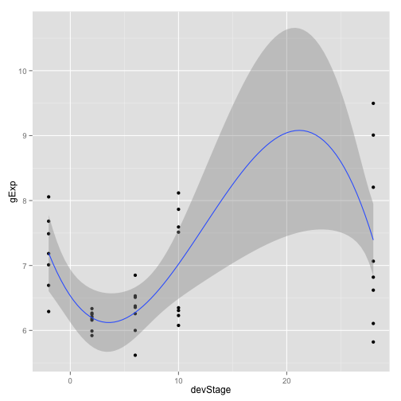

# Seminar 5
# Fitting and interpretting linear models (low volume)
# ref: http://www.ugrad.stat.ubc.ca/~stat540/seminars/seminar05_lowVolumeLinearModelling.html


```r
library(lattice)
library(ggplot2)
library(car)

# load the data
dataDir <- "/Users/sohrab/Me/Apply/Canada Apply/Courses/Second Semester/Stat 540/Lab/stat540_2014/examples/photoRec/data/"
prDat <- read.table(paste(dataDir, "GSE4051_data.tsv", sep = ""))
str(prDat, max.level = 0)
```

```
## 'data.frame':	29949 obs. of  39 variables:
```

```r
prDesc <- readRDS(paste(dataDir, "GSE4051_design.rds", sep = ""))
str(prDesc)
```

```
## 'data.frame':	39 obs. of  4 variables:
##  $ sidChar : chr  "Sample_20" "Sample_21" "Sample_22" "Sample_23" ...
##  $ sidNum  : num  20 21 22 23 16 17 6 24 25 26 ...
##  $ devStage: Factor w/ 5 levels "E16","P2","P6",..: 1 1 1 1 1 1 1 2 2 2 ...
##  $ gType   : Factor w/ 2 levels "wt","NrlKO": 1 1 1 1 2 2 2 1 1 1 ...
```

```r

(luckyGenes <- c("1419655_at", "1438815_at"))
```

```
## [1] "1419655_at" "1438815_at"
```

```r


prepareData <- function(gene.list = NULL) {
    if (is.null(gene.list)) 
        return(NULL)
    
    filteredPrDat <- prDat[rownames(prDat) %in% gene.list, ]
    (newDat <- with(filteredPrDat, data.frame(prDesc, gExp = as.vector(t(filteredPrDat)), 
        gene = factor(rep(gene.list, each = ncol(filteredPrDat)), levels = gene.list))))
    
    
}

jDat <- prepareData(luckyGenes)
```

```
## Warning: row names were found from a short variable and have been
## discarded
```

```r

str(jDat)
```

```
## 'data.frame':	78 obs. of  6 variables:
##  $ sidChar : chr  "Sample_20" "Sample_21" "Sample_22" "Sample_23" ...
##  $ sidNum  : num  20 21 22 23 16 17 6 24 25 26 ...
##  $ devStage: Factor w/ 5 levels "E16","P2","P6",..: 1 1 1 1 1 1 1 2 2 2 ...
##  $ gType   : Factor w/ 2 levels "wt","NrlKO": 1 1 1 1 2 2 2 1 1 1 ...
##  $ gExp    : num  10.93 10.74 10.67 10.68 9.61 ...
##  $ gene    : Factor w/ 2 levels "1419655_at","1438815_at": 1 1 1 1 1 1 1 1 1 1 ...
```

```r
head(jDat)
```

```
##     sidChar sidNum devStage gType   gExp       gene
## 1 Sample_20     20      E16    wt 10.930 1419655_at
## 2 Sample_21     21      E16    wt 10.740 1419655_at
## 3 Sample_22     22      E16    wt 10.670 1419655_at
## 4 Sample_23     23      E16    wt 10.680 1419655_at
## 5 Sample_16     16      E16 NrlKO  9.606 1419655_at
## 6 Sample_17     17      E16 NrlKO 10.840 1419655_at
```

```r
tail(jDat)
```

```
##      sidChar sidNum devStage gType  gExp       gene
## 73 Sample_38     38  4_weeks    wt 8.211 1438815_at
## 74 Sample_39     39  4_weeks    wt 8.436 1438815_at
## 75 Sample_11     11  4_weeks NrlKO 8.465 1438815_at
## 76 Sample_12     12  4_weeks NrlKO 8.841 1438815_at
## 77  Sample_2      2  4_weeks NrlKO 8.506 1438815_at
## 78  Sample_9      9  4_weeks NrlKO 8.952 1438815_at
```


The graphs match...!

```r
stripplot(gExp ~ devStage | gene, jDat, group = gType, jitter.data = TRUE, auto.key = TRUE, 
    type = c("p", "a"), grid = TRUE)
```

 

```r

# the plotting function

makeStripplot <- function(a.data.frame, pch = 1, cex = 3) {
    # check that the input has the minimum requirements
    reqVariables <- c("gExp", "devStage", "gType", "gene")
    if (!all(sapply(reqVariables, function(x) !is.null(a.data.frame[[x]])))) {
        print("Error! The input data.frame doesn't contain required fields!")
        return(NULL)
    }
    
    (f <- stripplot(gExp ~ devStage | gene, a.data.frame, group = gType, jitter.data = TRUE, 
        auto.key = TRUE, type = c("p", "a"), grid = TRUE, pch = pch, cex = cex))
}

# fugly version...
makeStripplot(jDat, pch = 17, cex = 3)
```

 

```r

makeStripplot(jDat)
```

 

```r
str(newDat)
```

```
## Error: object 'newDat' not found
```

```r
head(newDat)
```

```
## Error: object 'newDat' not found
```


Do a two-sample t-test

```r
targetProbesetName <- "1456341_a_at"
targetDevStage1 <- "P2"
targetDevStage2 <- "4_weeks"

levels(prDesc$devStage)
```

```
## [1] "E16"     "P2"      "P6"      "P10"     "4_weeks"
```

```r
# assuming a common variance
ttDat <- prepareData(list(targetProbesetName))
t.test(gExp ~ devStage, subset(ttDat, devStage %in% c(targetDevStage1, targetDevStage2)), 
    var.equal = T)
```

```
## 
## 	Two Sample t-test
## 
## data:  gExp by devStage
## t = -18.84, df = 14, p-value = 2.411e-11
## alternative hypothesis: true difference in means is not equal to 0
## 95 percent confidence interval:
##  -4.078 -3.244
## sample estimates:
##      mean in group P2 mean in group 4_weeks 
##                 6.326                 9.987
```


Fit a linear model with a categorical covariate

```r
targetProbesetName <- "1438786_a_at"
ttDat <- prepareData(list(targetProbesetName))
makeStripplot(ttDat)
```

 

```r

# use lm to fit a linear model
the.fit <- lm(formula = gExp ~ devStage, subset(ttDat, gType == "wt"))
summary(the.fit)
```

```
## 
## Call:
## lm(formula = gExp ~ devStage, data = subset(ttDat, gType == "wt"))
## 
## Residuals:
##     Min      1Q  Median      3Q     Max 
## -1.1565 -0.4400  0.0288  0.4915  1.2065 
## 
## Coefficients:
##                 Estimate Std. Error t value Pr(>|t|)    
## (Intercept)        8.523      0.379   22.50  5.7e-13 ***
## devStageP2        -1.450      0.536   -2.71    0.016 *  
## devStageP6        -0.107      0.536   -0.20    0.845    
## devStageP10       -1.201      0.536   -2.24    0.040 *  
## devStage4_weeks    0.081      0.536    0.15    0.882    
## ---
## Signif. codes:  0 '***' 0.001 '**' 0.01 '*' 0.05 '.' 0.1 ' ' 1
## 
## Residual standard error: 0.758 on 15 degrees of freedom
## Multiple R-squared:  0.497,	Adjusted R-squared:  0.363 
## F-statistic: 3.71 on 4 and 15 DF,  p-value: 0.0272
```

```r

# the Estimate for Intercept make sence, as its the predicted value of gExp
# when the independent variable (in this case devStage) is zero (as
# categorical variables, they're encoded in such a way where the first one
# is encoded as zero and so on) and given the graph for the wt, which is
# above 8.5 for the wt at E16, its sounds a reasonable.

## Perform inference for a contrast P2 and P10
coef(the.fit)
```

```
##     (Intercept)      devStageP2      devStageP6     devStageP10 
##          8.5227         -1.4503         -0.1067         -1.2012 
## devStage4_weeks 
##          0.0810
```

```r
contMat <- matrix(c(0, 1, 0, -1, 0), nr = 1, nc = 5)
(obsDiff <- contMat %*% (coef(the.fit)))
```

```
##        [,1]
## [1,] -0.249
```

```r

(sampMeans <- aggregate(gExp ~ devStage, ttDat, FUN = mean, subset = gType == 
    "wt"))
```

```
##   devStage  gExp
## 1      E16 8.523
## 2       P2 7.072
## 3       P6 8.416
## 4      P10 7.322
## 5  4_weeks 8.604
```

```r
with(sampMeans, gExp[devStage == "P2"] - gExp[devStage == "P10"])
```

```
## [1] -0.249
```

```r

# get the variance covariance matrix
vcov(the.fit)
```

```
##                 (Intercept) devStageP2 devStageP6 devStageP10
## (Intercept)          0.1435    -0.1435    -0.1435     -0.1435
## devStageP2          -0.1435     0.2870     0.1435      0.1435
## devStageP6          -0.1435     0.1435     0.2870      0.1435
## devStageP10         -0.1435     0.1435     0.1435      0.2870
## devStage4_weeks     -0.1435     0.1435     0.1435      0.1435
##                 devStage4_weeks
## (Intercept)             -0.1435
## devStageP2               0.1435
## devStageP6               0.1435
## devStageP10              0.1435
## devStage4_weeks          0.2870
```

```r

# check
summary(the.fit)$coefficients[, "Std. Error"]
```

```
##     (Intercept)      devStageP2      devStageP6     devStageP10 
##          0.3788          0.5357          0.5357          0.5357 
## devStage4_weeks 
##          0.5357
```

```r
sqrt(diag(vcov(the.fit)))
```

```
##     (Intercept)      devStageP2      devStageP6     devStageP10 
##          0.3788          0.5357          0.5357          0.5357 
## devStage4_weeks 
##          0.5357
```

```r

# calcualte the standard error for the statistic
(estSe <- contMat %*% vcov(the.fit) %*% t(contMat))
```

```
##       [,1]
## [1,] 0.287
```

```r
(testStat <- obsDiff/estSe)
```

```
##         [,1]
## [1,] -0.8676
```

```r

# calculate a two-way p-value, given that the statistic has a Student's
# distribution and is symetric
2 * pt(abs(testStat), df = df.residual(the.fit), lower.tail = FALSE)
```

```
##        [,1]
## [1,] 0.3993
```

```r

## Fit a linear model with two categorical covariates
makeStripplot(oDat <- prepareData("1448690_at"))
```

 

```r
str(oDat)
```

```
## 'data.frame':	39 obs. of  6 variables:
##  $ sidChar : chr  "Sample_20" "Sample_21" "Sample_22" "Sample_23" ...
##  $ sidNum  : num  20 21 22 23 16 17 6 24 25 26 ...
##  $ devStage: Factor w/ 5 levels "E16","P2","P6",..: 1 1 1 1 1 1 1 2 2 2 ...
##  $ gType   : Factor w/ 2 levels "wt","NrlKO": 1 1 1 1 2 2 2 1 1 1 ...
##  $ gExp    : num  8.02 9.05 8.71 8.92 6.8 ...
##  $ gene    : Factor w/ 1 level "1448690_at": 1 1 1 1 1 1 1 1 1 1 ...
```

```r


oFitBig <- lm(gExp ~ devStage * gType, dat = oDat)
summary(oFitBig)
```

```
## 
## Call:
## lm(formula = gExp ~ devStage * gType, data = oDat)
## 
## Residuals:
##     Min      1Q  Median      3Q     Max 
## -1.1520 -0.5646  0.0278  0.3120  2.2663 
## 
## Coefficients:
##                            Estimate Std. Error t value Pr(>|t|)    
## (Intercept)                  8.6780     0.3987   21.77  < 2e-16 ***
## devStageP2                  -1.0290     0.5638   -1.83  0.07830 .  
## devStageP6                  -1.9145     0.5638   -3.40  0.00200 ** 
## devStageP10                 -2.1932     0.5638   -3.89  0.00054 ***
## devStage4_weeks             -2.0820     0.5638   -3.69  0.00091 ***
## gTypeNrlKO                  -0.8423     0.6090   -1.38  0.17716    
## devStageP2:gTypeNrlKO        0.0698     0.8299    0.08  0.93352    
## devStageP6:gTypeNrlKO        0.1653     0.8299    0.20  0.84348    
## devStageP10:gTypeNrlKO       0.2258     0.8299    0.27  0.78745    
## devStage4_weeks:gTypeNrlKO   0.6461     0.8299    0.78  0.44257    
## ---
## Signif. codes:  0 '***' 0.001 '**' 0.01 '*' 0.05 '.' 0.1 ' ' 1
## 
## Residual standard error: 0.797 on 29 degrees of freedom
## Multiple R-squared:  0.59,	Adjusted R-squared:  0.463 
## F-statistic: 4.64 on 9 and 29 DF,  p-value: 0.000734
```

```r
summary(oFitBig)$coef
```

```
##                            Estimate Std. Error  t value  Pr(>|t|)
## (Intercept)                 8.67800     0.3987 21.76755 1.634e-19
## devStageP2                 -1.02900     0.5638 -1.82512 7.830e-02
## devStageP6                 -1.91450     0.5638 -3.39571 2.003e-03
## devStageP10                -2.19325     0.5638 -3.89012 5.387e-04
## devStage4_weeks            -2.08200     0.5638 -3.69280 9.149e-04
## gTypeNrlKO                 -0.84233     0.6090 -1.38320 1.772e-01
## devStageP2:gTypeNrlKO       0.06983     0.8299  0.08415 9.335e-01
## devStageP6:gTypeNrlKO       0.16533     0.8299  0.19922 8.435e-01
## devStageP10:gTypeNrlKO      0.22583     0.8299  0.27212 7.875e-01
## devStage4_weeks:gTypeNrlKO  0.64608     0.8299  0.77852 4.426e-01
```

```r

# now omit the interaction term
oFitSmall <- lm(gExp ~ devStage + gType, dat = oDat)
summary(oFitSmall)$coef
```

```
##                 Estimate Std. Error t value  Pr(>|t|)
## (Intercept)       8.5803     0.3046  28.165 1.177e-24
## devStageP2       -1.0104     0.3924  -2.575 1.470e-02
## devStageP6       -1.8481     0.3924  -4.710 4.328e-05
## devStageP10      -2.0966     0.3924  -5.343 6.703e-06
## devStage4_weeks  -1.7752     0.3924  -4.524 7.444e-05
## gTypeNrlKO       -0.6144     0.2430  -2.528 1.643e-02
```

```r

# compare the models
(a <- anova(oFitBig, oFitSmall))
```

```
## Analysis of Variance Table
## 
## Model 1: gExp ~ devStage * gType
## Model 2: gExp ~ devStage + gType
##   Res.Df  RSS Df Sum of Sq   F Pr(>F)
## 1     29 18.4                        
## 2     33 18.9 -4    -0.497 0.2   0.94
```

```r


# test another probeset, 1429225_at
makeStripplot(oDat <- prepareData("1429225_at"))
```

 

```r
str(oDat)
```

```
## 'data.frame':	39 obs. of  6 variables:
##  $ sidChar : chr  "Sample_20" "Sample_21" "Sample_22" "Sample_23" ...
##  $ sidNum  : num  20 21 22 23 16 17 6 24 25 26 ...
##  $ devStage: Factor w/ 5 levels "E16","P2","P6",..: 1 1 1 1 1 1 1 2 2 2 ...
##  $ gType   : Factor w/ 2 levels "wt","NrlKO": 1 1 1 1 2 2 2 1 1 1 ...
##  $ gExp    : num  7.01 8.06 6.69 7.49 6.29 ...
##  $ gene    : Factor w/ 1 level "1429225_at": 1 1 1 1 1 1 1 1 1 1 ...
```

```r


oFitBig <- lm(gExp ~ devStage * gType, dat = oDat)
summary(oFitBig)
```

```
## 
## Call:
## lm(formula = gExp ~ devStage * gType, data = oDat)
## 
## Residuals:
##     Min      1Q  Median      3Q     Max 
## -1.5625 -0.1951  0.0267  0.1857  1.1145 
## 
## Coefficients:
##                            Estimate Std. Error t value Pr(>|t|)    
## (Intercept)                   7.313      0.262   27.94   <2e-16 ***
## devStageP2                   -1.158      0.370   -3.13   0.0040 ** 
## devStageP6                   -1.250      0.370   -3.38   0.0021 ** 
## devStageP10                  -1.072      0.370   -2.90   0.0071 ** 
## devStage4_weeks              -0.909      0.370   -2.46   0.0203 *  
## gTypeNrlKO                   -0.260      0.400   -0.65   0.5203    
## devStageP2:gTypeNrlKO         0.280      0.545    0.51   0.6107    
## devStageP6:gTypeNrlKO         0.759      0.545    1.39   0.1742    
## devStageP10:gTypeNrlKO        1.791      0.545    3.29   0.0026 ** 
## devStage4_weeks:gTypeNrlKO    2.239      0.545    4.11   0.0003 ***
## ---
## Signif. codes:  0 '***' 0.001 '**' 0.01 '*' 0.05 '.' 0.1 ' ' 1
## 
## Residual standard error: 0.523 on 29 degrees of freedom
## Multiple R-squared:  0.739,	Adjusted R-squared:  0.659 
## F-statistic: 9.14 on 9 and 29 DF,  p-value: 2.1e-06
```

```r
summary(oFitBig)$coef
```

```
##                            Estimate Std. Error t value  Pr(>|t|)
## (Intercept)                  7.3125     0.2617 27.9391 1.619e-22
## devStageP2                  -1.1583     0.3701 -3.1292 3.973e-03
## devStageP6                  -1.2495     0.3701 -3.3757 2.110e-03
## devStageP10                 -1.0718     0.3701 -2.8955 7.125e-03
## devStage4_weeks             -0.9088     0.3701 -2.4551 2.032e-02
## gTypeNrlKO                  -0.2602     0.3998 -0.6507 5.203e-01
## devStageP2:gTypeNrlKO        0.2804     0.5448  0.5147 6.107e-01
## devStageP6:gTypeNrlKO        0.7589     0.5448  1.3929 1.742e-01
## devStageP10:gTypeNrlKO       1.7914     0.5448  3.2880 2.648e-03
## devStage4_weeks:gTypeNrlKO   2.2389     0.5448  4.1094 2.970e-04
```

```r

# now omit the interaction term
oFitSmall <- lm(gExp ~ devStage + gType, dat = oDat)
summary(oFitSmall)$coef
```

```
##                 Estimate Std. Error t value  Pr(>|t|)
## (Intercept)       6.8652     0.2722 25.2199 3.848e-23
## devStageP2       -1.0926     0.3506 -3.1161 3.780e-03
## devStageP6       -0.9446     0.3506 -2.6940 1.101e-02
## devStageP10      -0.2506     0.3506 -0.7147 4.798e-01
## devStage4_weeks   0.1362     0.3506  0.3883 7.003e-01
## gTypeNrlKO        0.7836     0.2172  3.6085 1.007e-03
```

```r

# compare the models
(a <- anova(oFitBig, oFitSmall))
```

```
## Analysis of Variance Table
## 
## Model 1: gExp ~ devStage * gType
## Model 2: gExp ~ devStage + gType
##   Res.Df   RSS Df Sum of Sq    F Pr(>F)    
## 1     29  7.95                             
## 2     33 15.12 -4     -7.17 6.54  7e-04 ***
## ---
## Signif. codes:  0 '***' 0.001 '**' 0.01 '*' 0.05 '.' 0.1 ' ' 1
```


## Ideas for further work

```r
# inputs a list of genes, conducts lm over them all and returns the results
# in a list
aggregateTesting <- function(gene.list) {
    theDat <- prepareData(gene.list)
    lapply(gene.list, function(x) {
        lm(gExp ~ devStage, data = theDat, subset = gene == x)
    })
}

k = aggregateTesting(list("1429225_at", "1448690_at"))
```

```
## Warning: row names were found from a short variable and have been
## discarded
```

```r

summary(k[[1]])
```

```
## 
## Call:
## lm(formula = gExp ~ devStage, data = theDat, subset = gene == 
##     x)
## 
## Residuals:
##     Min      1Q  Median      3Q     Max 
## -1.5711 -0.5401  0.0166  0.3845  2.1039 
## 
## Coefficients:
##                 Estimate Std. Error t value Pr(>|t|)    
## (Intercept)        7.201      0.298   24.20   <2e-16 ***
## devStageP2        -1.037      0.408   -2.54    0.016 *  
## devStageP6        -0.889      0.408   -2.18    0.036 *  
## devStageP10       -0.195      0.408   -0.48    0.636    
## devStage4_weeks    0.192      0.408    0.47    0.640    
## ---
## Signif. codes:  0 '***' 0.001 '**' 0.01 '*' 0.05 '.' 0.1 ' ' 1
## 
## Residual standard error: 0.787 on 34 degrees of freedom
## Multiple R-squared:  0.309,	Adjusted R-squared:  0.227 
## F-statistic:  3.8 on 4 and 34 DF,  p-value: 0.0117
```

```r

## corresponding to the lecture method,
install.packages("car")
```

```
## Installing package into '/Users/sohrab/Library/R/3.0/library'
## (as 'lib' is unspecified)
```

```
## Error: trying to use CRAN without setting a mirror
```

```r
library(car)
# copy the data
agDat <- oDat

# make it quantitative
agDat$devStage <- recode(agDat$devStage, "'E16'=-2; 'P2'=2; 'P6'=6; 'P10'=10; '4_weeks'=28", 
    as.factor.result = FALSE)

agDat
```

```
##      sidChar sidNum devStage gType  gExp       gene
## 12 Sample_20     20       -2    wt 7.010 1429225_at
## 13 Sample_21     21       -2    wt 8.057 1429225_at
## 14 Sample_22     22       -2    wt 6.694 1429225_at
## 15 Sample_23     23       -2    wt 7.489 1429225_at
## 9  Sample_16     16       -2 NrlKO 6.291 1429225_at
## 10 Sample_17     17       -2 NrlKO 7.184 1429225_at
## 11  Sample_6      6       -2 NrlKO 7.682 1429225_at
## 28 Sample_24     24        2    wt 6.248 1429225_at
## 29 Sample_25     25        2    wt 5.921 1429225_at
## 30 Sample_26     26        2    wt 6.267 1429225_at
## 31 Sample_27     27        2    wt 6.181 1429225_at
## 24 Sample_14     14        2 NrlKO 6.159 1429225_at
## 25  Sample_3      3        2 NrlKO 6.212 1429225_at
## 26  Sample_5      5        2 NrlKO 5.991 1429225_at
## 27  Sample_8      8        2 NrlKO 6.336 1429225_at
## 36 Sample_28     28        6    wt 6.000 1429225_at
## 37 Sample_29     29        6    wt 5.618 1429225_at
## 38 Sample_30     30        6    wt 6.376 1429225_at
## 39 Sample_31     31        6    wt 6.258 1429225_at
## 32  Sample_1      1        6 NrlKO 6.510 1429225_at
## 33 Sample_10     10        6 NrlKO 6.850 1429225_at
## 34  Sample_4      4        6 NrlKO 6.532 1429225_at
## 35  Sample_7      7        6 NrlKO 6.355 1429225_at
## 20 Sample_32     32       10    wt 6.349 1429225_at
## 21 Sample_33     33       10    wt 6.230 1429225_at
## 22 Sample_34     34       10    wt 6.307 1429225_at
## 23 Sample_35     35       10    wt 6.077 1429225_at
## 16 Sample_13     13       10 NrlKO 7.865 1429225_at
## 17 Sample_15     15       10 NrlKO 7.593 1429225_at
## 18 Sample_18     18       10 NrlKO 8.117 1429225_at
## 19 Sample_19     19       10 NrlKO 7.513 1429225_at
## 5  Sample_36     36       28    wt 7.066 1429225_at
## 6  Sample_37     37       28    wt 5.822 1429225_at
## 7  Sample_38     38       28    wt 6.620 1429225_at
## 8  Sample_39     39       28    wt 6.107 1429225_at
## 1  Sample_11     11       28 NrlKO 9.497 1429225_at
## 2  Sample_12     12       28 NrlKO 9.008 1429225_at
## 3   Sample_2      2       28 NrlKO 8.205 1429225_at
## 4   Sample_9      9       28 NrlKO 6.820 1429225_at
```

```r
# make a function to plot devStage
plotLinearModel <- function(the.data, formula.string) {
    ggplot(the.data, aes(x = devStage, y = gExp)) + geom_point() + stat_smooth(aes(x = devStage, 
        y = gExp), formula = reformulate(formula.string, "y"), method = "lm")
    # stat_smooth(formula=y~x, method='lm')
}

plotLinearModel(agDat, "y~poly(x,3)")
```

 

```r

## one method is to introduce a completely different covariate generate
## random values from a normal distribution and use them as age
agDat <- oDat
agDat$age <- rnorm(nrow(agDat), m = 20, sd = 5)

# fit a linear model

# fit a quadratic model
ggplot(agDat, aes(age, gExp)) + geom_point() + stat_smooth(formula = y ~ poly(x, 
    2), method = "lm")
```

 

```r


# dropping the 4-week data and analyze using quadratic model
agDat <- subset(agDat, devStage != "28")
plotLinearModel(agDat, "y~poly(x,2)")
```

```
## geom_smooth: Only one unique x value each group.Maybe you want aes(group = 1)?
```

 


```r
########################################## 
`?`(pt)
t = matrix(2, nrow = 20, ncol = 1)
t[10] <- 2

mu1 = 5
mu2 = 10
mu = matrix(c(mu1, mu2), nrow = 2, ncol = 1)

createDesignMatrix <- function(paramNum, len) {
    designMatrix <- matrix(0, nrow = len, ncol = paramNum)
    k = lapply(seq(paramNum), function(x) {
        startPoint <- (x - 1) * len/paramNum + 1
        stopPoint <- startPoint - 1 + len/paramNum
        print(paste(startPoint, stopPoint, sep = "_"))
        designMatrix[startPoint:stopPoint, x] <<- 1
    })
    designMatrix
}

createDesignMatrix(3, 30)
```

```
## [1] "1_10"
## [1] "11_20"
## [1] "21_30"
```

```
##       [,1] [,2] [,3]
##  [1,]    1    0    0
##  [2,]    1    0    0
##  [3,]    1    0    0
##  [4,]    1    0    0
##  [5,]    1    0    0
##  [6,]    1    0    0
##  [7,]    1    0    0
##  [8,]    1    0    0
##  [9,]    1    0    0
## [10,]    1    0    0
## [11,]    0    1    0
## [12,]    0    1    0
## [13,]    0    1    0
## [14,]    0    1    0
## [15,]    0    1    0
## [16,]    0    1    0
## [17,]    0    1    0
## [18,]    0    1    0
## [19,]    0    1    0
## [20,]    0    1    0
## [21,]    0    0    1
## [22,]    0    0    1
## [23,]    0    0    1
## [24,]    0    0    1
## [25,]    0    0    1
## [26,]    0    0    1
## [27,]    0    0    1
## [28,]    0    0    1
## [29,]    0    0    1
## [30,]    0    0    1
```

