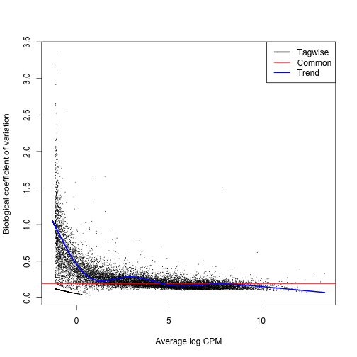
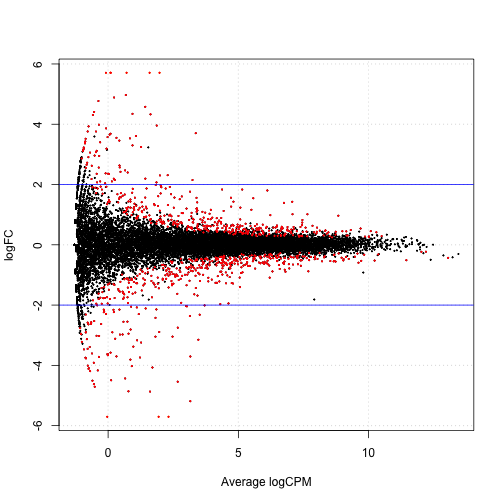
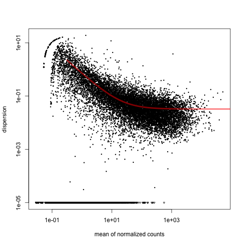
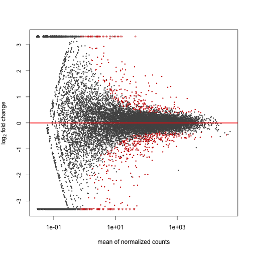
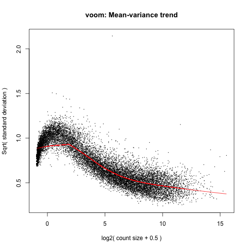

Seminar 7 
========================================================

Ref1: http://www.ugrad.stat.ubc.ca/~stat540/#seminar07

*Excerpt from ref*
The mRNA from 21 mice belonging to two different strains have been sequenced


```r
library(edgeR)
```

```
## Loading required package: limma
```

```r
library(plyr)
library(gplots)
```

```
## KernSmooth 2.23 loaded
## Copyright M. P. Wand 1997-2009
## 
## Attaching package: 'gplots'
## 
## The following object is masked from 'package:stats':
## 
##     lowess
```

```r
source("style.R")
```


# load the data

```r
setwd("/Users/sohrab/Me/Apply/Canada Apply/Courses/Second Semester/Stat 540/Lab/stat540-2014-salehi-sohrab/Seminar 7")
dat <- read.table("data/bottomly_count_table.tsv", header = TRUE, row.names = 1)
des <- read.table("data/bottomly_phenodata.tsv", header = TRUE, row.names = 1)
str(dat)
```

```
## 'data.frame':	36536 obs. of  21 variables:
##  $ SRX033480: int  369 0 0 0 0 0 21 15 517 0 ...
##  $ SRX033488: int  744 0 1 0 1 1 46 43 874 0 ...
##  $ SRX033481: int  287 0 0 0 1 0 20 12 340 0 ...
##  $ SRX033489: int  769 0 1 0 5 1 36 34 813 0 ...
##  $ SRX033482: int  348 0 1 0 0 0 12 14 378 0 ...
##  $ SRX033490: int  803 0 1 0 4 0 55 32 860 0 ...
##  $ SRX033483: int  433 0 0 0 0 0 27 19 528 0 ...
##  $ SRX033476: int  469 0 7 0 0 0 44 18 401 0 ...
##  $ SRX033478: int  585 0 6 0 0 0 32 44 584 0 ...
##  $ SRX033479: int  321 0 1 0 0 0 47 22 401 0 ...
##  $ SRX033472: int  301 0 1 0 4 0 40 17 331 0 ...
##  $ SRX033473: int  461 0 1 0 1 0 40 24 431 0 ...
##  $ SRX033474: int  309 0 1 0 1 0 30 29 341 0 ...
##  $ SRX033475: int  374 0 1 0 0 0 27 15 480 0 ...
##  $ SRX033491: int  781 0 1 0 1 0 46 34 930 0 ...
##  $ SRX033484: int  555 0 2 0 2 0 28 23 585 0 ...
##  $ SRX033492: int  820 0 1 0 1 0 40 38 1137 0 ...
##  $ SRX033485: int  294 0 1 0 1 0 21 17 490 0 ...
##  $ SRX033493: int  758 0 4 0 1 0 52 29 1079 0 ...
##  $ SRX033486: int  419 0 1 0 1 0 27 12 565 0 ...
##  $ SRX033494: int  857 0 5 0 2 0 45 28 726 0 ...
```

```r

# sanity check
des
```

```
##           num.tech.reps   strain experiment.number lane.number
## SRX033480             1 C57BL/6J                 6           1
## SRX033488             1 C57BL/6J                 7           1
## SRX033481             1 C57BL/6J                 6           2
## SRX033489             1 C57BL/6J                 7           2
## SRX033482             1 C57BL/6J                 6           3
## SRX033490             1 C57BL/6J                 7           3
## SRX033483             1 C57BL/6J                 6           5
## SRX033476             1 C57BL/6J                 4           6
## SRX033478             1 C57BL/6J                 4           7
## SRX033479             1 C57BL/6J                 4           8
## SRX033472             1   DBA/2J                 4           1
## SRX033473             1   DBA/2J                 4           2
## SRX033474             1   DBA/2J                 4           3
## SRX033475             1   DBA/2J                 4           5
## SRX033491             1   DBA/2J                 7           5
## SRX033484             1   DBA/2J                 6           6
## SRX033492             1   DBA/2J                 7           6
## SRX033485             1   DBA/2J                 6           7
## SRX033493             1   DBA/2J                 7           7
## SRX033486             1   DBA/2J                 6           8
## SRX033494             1   DBA/2J                 7           8
```

```r
all(rownames(des) == colnames(dat))
```

```
## [1] TRUE
```


Take a look at [this](http://will-landau.com/research/jsm2013.pdf) to have a comparison of dispersion computation methods.

Furthermore, take a look at [this](http://en.wikipedia.org/wiki/Trend_estimation#Fitting_a_trend:_least-squares) for finding out what trend means. 

"trend" will mean the slope of the least squares line?

# GLM edgeR

```r
# pointer1:
# http://www.stat.berkeley.edu/~stark/SticiGui/Text/randomVariables.htm a
# video on Negative Binomial

# ref3:
# http://www.bioconductor.org/packages/release/bioc/vignettes/edgeR/inst/doc/edgeRUsersGuide.pdf
# Explaining the GLM edgeR,
```

$$ Y \sim NB(\mu, \varphi) \text{ with mean } \mu \text{ and dispersion } \varphi$$

$$ f(y; \mu, \phi) = P(Y=y) = \frac{\Gamma(y+\phi^{-1})}{\Gamma(\phi^{-1})\Gamma(y+1)}(\frac{1}{1+\mu \phi})^{\phi^{-1}}(\frac{\mu}{\phi^{-1} + \mu})^y  $$


According to [this,](https://stat.ethz.ch/pipermail/bioconductor/2014-January/056975.html) the edgeR pipline has been updated, now you can just use:


```r
# y <- estimateDisp(y,design)
```


According to [this](http://comments.gmane.org/gmane.science.biology.informatics.conductor/52384) you should be using trended dispersion in RNA-seq data modeling, for there are some 


(qCML) is only applicable to experiments with 1 factor (basically estimateCommonDisp() and
estimateTagwiseDisp() functions).

```r
table(des$strain)
```

```
## 
## C57BL/6J   DBA/2J 
##       10       11
```

```r
group <- factor(c(rep("1", 10), rep("2", 11)))
group
```

```
##  [1] 1 1 1 1 1 1 1 1 1 1 2 2 2 2 2 2 2 2 2 2 2
## Levels: 1 2
```

```r

dge.glm <- DGEList(counts = dat, group = group)
str(dge.glm)
```

```
## Formal class 'DGEList' [package "edgeR"] with 1 slots
##   ..@ .Data:List of 2
##   .. ..$ : int [1:36536, 1:21] 369 0 0 0 0 0 21 15 517 0 ...
##   .. .. ..- attr(*, "dimnames")=List of 2
##   .. .. .. ..$ : chr [1:36536] "ENSMUSG00000000001" "ENSMUSG00000000003" "ENSMUSG00000000028" "ENSMUSG00000000031" ...
##   .. .. .. ..$ : chr [1:21] "SRX033480" "SRX033488" "SRX033481" "SRX033489" ...
##   .. ..$ :'data.frame':	21 obs. of  3 variables:
##   .. .. ..$ group       : Factor w/ 2 levels "1","2": 1 1 1 1 1 1 1 1 1 1 ...
##   .. .. ..$ lib.size    : num [1:21] 3040296 6303665 2717092 6545795 3016179 ...
##   .. .. ..$ norm.factors: num [1:21] 1 1 1 1 1 1 1 1 1 1 ...
```

```r
names(dge.glm)
```

```
## [1] "counts"  "samples"
```

```r
dge.glm[["samples"]]
```

```
##           group lib.size norm.factors
## SRX033480     1  3040296            1
## SRX033488     1  6303665            1
## SRX033481     1  2717092            1
## SRX033489     1  6545795            1
## SRX033482     1  3016179            1
## SRX033490     1  7097379            1
## SRX033483     1  3707895            1
## SRX033476     1  5165144            1
## SRX033478     1  4953201            1
## SRX033479     1  4192872            1
## SRX033472     2  3970729            1
## SRX033473     2  4733003            1
## SRX033474     2  3702051            1
## SRX033475     2  3569483            1
## SRX033491     2  7276198            1
## SRX033484     2  4422272            1
## SRX033492     2  7115851            1
## SRX033485     2  3467730            1
## SRX033493     2  7339817            1
## SRX033486     2  3879114            1
## SRX033494     2  6771680            1
```

```r

dge.glm$counts[1:10, 1:3]
```

```
##                    SRX033480 SRX033488 SRX033481
## ENSMUSG00000000001       369       744       287
## ENSMUSG00000000003         0         0         0
## ENSMUSG00000000028         0         1         0
## ENSMUSG00000000031         0         0         0
## ENSMUSG00000000037         0         1         1
## ENSMUSG00000000049         0         1         0
## ENSMUSG00000000056        21        46        20
## ENSMUSG00000000058        15        43        12
## ENSMUSG00000000078       517       874       340
## ENSMUSG00000000085         0         0         0
```

```r

length(dge.glm$counts[1, ])
```

```
## [1] 21
```

```r
length(dge.glm$counts[, 1])
```

```
## [1] 36536
```

```r

# make the design matrix
design <- model.matrix(~group)
# design ?estimateGLMCommonDisp
```


Worth's noting that ***tag*** here means trasncript/gene. 

# Symbols from:

$$ f(y; \mu, \phi) = P(Y=y) = \frac{\Gamma(y+\Phi^{-1})}{\Gamma(\Phi =^{-1})\Gamma(y+1)}(\frac{1}{1+\mu \Phi}^{\Phi^{-1}})(\frac{\mu}{\phi^{-1} + \mu})^y  $$


```r
# estimate the deviance, according to the following formula from
# http://biostatistics.oxfordjournals.org/content/9/2/321.full Small-sample
# estimation of negative binomial dispersion, with applications to SAGE data
# Robinson and Smyth 2007


# Here we're estimating different types of dispersion. According to
# [here](https://stat.ethz.ch/pipermail/bioconductor/2014-January/056975.html),
# this has little to do with the final results.  We can just use y <-
# estimateDisp(y,design) and it will do these steps itself altogether a.
# assuming all genes/tags share a common dispersion

dge.glm.com.disp <- estimateGLMCommonDisp(dge.glm, design, verbose = TRUE)
```

```
## Disp = 0.03893 , BCV = 0.1973
```

```r
stop()
```

```
## Error:
```

```r
# b. assuming
dge.glm.trend.disp <- estimateGLMTrendedDisp(dge.glm.com.disp, design)
```

```
## Loading required package: splines
```

```r

dge.glm.tag.disp <- estimateGLMTagwiseDisp(dge.glm.trend.disp, design)

# plot the tagwise dispersion against log2-CPM (counts per million)
plotBCV(dge.glm.tag.disp)
```

 

```r

fit <- glmFit(dge.glm.tag.disp, design)
colnames(coef(fit))
```

```
## [1] "(Intercept)" "group2"
```

```r

lrt <- glmLRT(fit, coef = 2)

# like top table?
topTags(lrt)
```

```
## Coefficient:  group2 
##                     logFC logCPM    LR    PValue       FDR
## ENSMUSG00000020912 -5.187  3.155 401.8 2.238e-89 8.177e-85
## ENSMUSG00000050141 -5.363  2.319 311.6 9.787e-70 1.788e-65
## ENSMUSG00000035775 -4.543  2.674 298.0 9.042e-67 1.101e-62
## ENSMUSG00000015484 -1.968  4.307 282.5 2.113e-63 1.930e-59
## ENSMUSG00000024248 -3.152  3.463 277.0 3.337e-62 2.438e-58
## ENSMUSG00000030532  1.547  5.572 269.4 1.568e-60 9.548e-57
## ENSMUSG00000054354 -6.283  1.940 249.3 3.657e-56 1.909e-52
## ENSMUSG00000023236  1.426  7.067 245.0 3.133e-55 1.431e-51
## ENSMUSG00000050824  3.705  3.365 229.7 7.099e-52 2.882e-48
## ENSMUSG00000015852 -2.362  3.138 214.8 1.210e-48 4.049e-45
```

```r

tt.glm <- topTags(lrt, n = Inf)
class(tt.glm)
```

```
## [1] "TopTags"
## attr(,"package")
## [1] "edgeR"
```

```r

nrow(tt.glm$table[tt.glm$table$FDR < 0.01, ])
```

```
## [1] 600
```

```r

interestingSamples <- rownames(tt.glm$table[tt.glm$table$FDR < 1e-50, ])
cpm(dge.glm.tag.disp)[interestingSamples, ]
```

```
##                    SRX033480 SRX033488 SRX033481 SRX033489 SRX033482
## ENSMUSG00000020912     20.39    12.691     15.83    14.819    19.230
## ENSMUSG00000050141     14.14    10.153     10.67     6.264     9.946
## ENSMUSG00000035775     14.47    10.629     19.51    11.305    12.930
## ENSMUSG00000015484     26.97    33.949     32.76    36.206    31.497
## ENSMUSG00000024248     14.80    26.017     17.30    23.527    18.567
## ENSMUSG00000030532     27.96    24.906     21.35    25.360    18.567
## ENSMUSG00000054354     10.85     7.615     11.41     8.708     8.289
## ENSMUSG00000023236     65.45    78.684     72.50    72.413    76.587
##                    SRX033490 SRX033483 SRX033476 SRX033478 SRX033479
## ENSMUSG00000020912    17.330    26.430    13.359    23.621    14.310
## ENSMUSG00000050141     7.890     8.361     6.583    11.911    12.402
## ENSMUSG00000035775    12.540    12.136     6.389    13.527    11.210
## ENSMUSG00000015484    33.393    30.745    34.655    26.851    31.482
## ENSMUSG00000024248    25.784    18.879    24.781    14.334    14.310
## ENSMUSG00000030532    26.770    26.430    19.167    23.217    20.034
## ENSMUSG00000054354     7.608     7.012     3.291     4.442     5.963
## ENSMUSG00000023236    80.875    83.336    55.178    57.740    66.303
##                    SRX033472 SRX033473 SRX033474 SRX033475 SRX033491
## ENSMUSG00000020912    0.5037    0.4226    1.0805    0.2802    1.0995
## ENSMUSG00000050141    0.2518    0.0000    0.0000    0.2802    0.8246
## ENSMUSG00000035775    0.7555    0.0000    0.2701    0.2802    0.6872
## ENSMUSG00000015484    7.0516    4.8595    9.1841    7.8443    8.5209
## ENSMUSG00000024248    2.2666    1.2677    1.8908    3.3618    3.1610
## ENSMUSG00000030532   69.7605   70.5683   63.2082   63.0343   73.8023
## ENSMUSG00000054354    0.0000    0.0000    0.0000    0.0000    0.5497
## ENSMUSG00000023236  195.4301  183.6044  176.1186  156.3252  206.9762
##                    SRX033484 SRX033492 SRX033485 SRX033493 SRX033486
## ENSMUSG00000020912    0.0000    0.7027    0.8651    0.1362    0.0000
## ENSMUSG00000050141    0.0000    0.1405    0.0000    0.1362    0.2578
## ENSMUSG00000035775    0.6784    0.1405    0.5767    0.1362    1.8045
## ENSMUSG00000015484    9.4974    8.4319    8.9396    6.6759   10.3116
## ENSMUSG00000024248    1.5829    1.6864    1.7302    1.7712    2.5779
## ENSMUSG00000030532   70.0997   70.6873   62.5770   78.6123   59.2919
## ENSMUSG00000054354    0.0000    0.0000    0.0000    0.0000    0.0000
## ENSMUSG00000023236  177.9628  192.8090  207.0519  201.6399  204.6859
##                    SRX033494
## ENSMUSG00000020912    0.0000
## ENSMUSG00000050141    0.1477
## ENSMUSG00000035775    0.5907
## ENSMUSG00000015484    8.8604
## ENSMUSG00000024248    3.1012
## ENSMUSG00000030532   71.3265
## ENSMUSG00000054354    0.0000
## ENSMUSG00000023236  192.7144
```

```r

summary(de.glm <- decideTestsDGE(lrt, p = 0.05, adjust = "BH"))
```

```
##    [,1] 
## -1   451
## 0  35660
## 1    425
```

```r

# plotting the tagwise log fold changes against log-cpm (count per million)
tags.glm <- rownames(dge.glm.tag.disp)[as.logical(de.glm)]
plotSmear(lrt, de.tags = tags.glm)
abline(h = c(-2, 2), col = "blue")
```

 

```r

```

For home
1. count equal to zero across all samples 


```r

# remove those that
dat1 <- dat[rowSums(dat) != 0, ]
dge.glm <- DGEList(counts = dat1, group = group)

# estimate the tagwise dispersion (and all the other necessary ones)
y <- estimateDisp(dge.glm, design)
fit <- glmFit(y, design)
colnames(coef(fit))
```

```
## [1] "(Intercept)" "group2"
```

```r

lrt <- glmLRT(fit, coef = 2)
topTags(lrt)
```

```
## Coefficient:  group2 
##                     logFC logCPM    LR    PValue       FDR
## ENSMUSG00000020912 -5.187  3.155 414.1 4.799e-92 6.686e-88
## ENSMUSG00000050141 -5.362  2.319 314.1 2.845e-70 1.982e-66
## ENSMUSG00000035775 -4.543  2.674 305.1 2.589e-68 1.203e-64
## ENSMUSG00000015484 -1.968  4.307 288.8 9.248e-65 3.221e-61
## ENSMUSG00000024248 -3.152  3.463 283.7 1.178e-63 3.282e-60
## ENSMUSG00000030532  1.547  5.572 260.0 1.719e-58 3.991e-55
## ENSMUSG00000023236  1.426  7.067 248.9 4.564e-56 9.084e-53
## ENSMUSG00000054354 -6.283  1.940 248.4 5.855e-56 1.020e-52
## ENSMUSG00000050824  3.705  3.365 235.3 4.130e-53 6.393e-50
## ENSMUSG00000015852 -2.361  3.138 219.5 1.180e-49 1.644e-46
```


2. count equal to zero in at least one sample in each genotype group

```r

# remove those that
dat2 <- lapply(1:nrow(dat), function(x) all(dat[x, ] > 0))
dat3 <- dat[unlist(dat2), ]
dge.glm <- DGEList(counts = dat3, group = group)

# estimate the tagwise dispersion (and all the other necessary ones)
y <- estimateDisp(dge.glm, design)

fit <- glmFit(y, design)
colnames(coef(fit))
```

```
## [1] "(Intercept)" "group2"
```

```r

lrt <- glmLRT(fit, coef = 2)
topTags(lrt)
```

```
## Coefficient:  group2 
##                     logFC logCPM    LR    PValue       FDR
## ENSMUSG00000015484 -1.970  4.309 321.1 8.267e-72 7.602e-68
## ENSMUSG00000030532  1.546  5.574 290.3 4.220e-65 1.940e-61
## ENSMUSG00000024248 -3.153  3.466 284.6 7.376e-64 2.261e-60
## ENSMUSG00000023236  1.426  7.069 274.7 1.071e-61 2.463e-58
## ENSMUSG00000015852 -2.362  3.141 231.1 3.428e-52 6.305e-49
## ENSMUSG00000050824  3.704  3.367 228.0 1.652e-51 2.533e-48
## ENSMUSG00000028393  1.802  6.113 213.8 2.084e-48 2.738e-45
## ENSMUSG00000072572 -2.009  3.709 198.0 5.566e-45 6.398e-42
## ENSMUSG00000066800 -2.321  3.520 187.1 1.383e-42 1.413e-39
## ENSMUSG00000074064  1.392  6.755 180.7 3.495e-41 3.214e-38
```


#DESeq

```r
# source('http://www.bioconductor.org/biocLite.R') biocLite('DESeq')

library(DESeq)
```

```
## Loading required package: Biobase
## Loading required package: BiocGenerics
## Loading required package: parallel
## 
## Attaching package: 'BiocGenerics'
## 
## The following objects are masked from 'package:parallel':
## 
##     clusterApply, clusterApplyLB, clusterCall, clusterEvalQ,
##     clusterExport, clusterMap, parApply, parCapply, parLapply,
##     parLapplyLB, parRapply, parSapply, parSapplyLB
## 
## The following object is masked from 'package:stats':
## 
##     xtabs
## 
## The following objects are masked from 'package:base':
## 
##     anyDuplicated, as.data.frame, cbind, colnames, duplicated,
##     eval, Filter, Find, get, intersect, lapply, Map, mapply,
##     match, mget, order, paste, pmax, pmax.int, pmin, pmin.int,
##     Position, rank, rbind, Reduce, rep.int, rownames, sapply,
##     setdiff, sort, table, tapply, union, unique, unlist
## 
## Welcome to Bioconductor
## 
##     Vignettes contain introductory material; view with
##     'browseVignettes()'. To cite Bioconductor, see
##     'citation("Biobase")', and for packages 'citation("pkgname")'.
## 
## Loading required package: lattice
## 
## Attaching package: 'DESeq'
## 
## The following object is masked from 'package:limma':
## 
##     plotMA
```

```r
deSeqDat <- newCountDataSet(dat, group)
head(counts(deSeqDat))
```

```
##                    SRX033480 SRX033488 SRX033481 SRX033489 SRX033482
## ENSMUSG00000000001       369       744       287       769       348
## ENSMUSG00000000003         0         0         0         0         0
## ENSMUSG00000000028         0         1         0         1         1
## ENSMUSG00000000031         0         0         0         0         0
## ENSMUSG00000000037         0         1         1         5         0
## ENSMUSG00000000049         0         1         0         1         0
##                    SRX033490 SRX033483 SRX033476 SRX033478 SRX033479
## ENSMUSG00000000001       803       433       469       585       321
## ENSMUSG00000000003         0         0         0         0         0
## ENSMUSG00000000028         1         0         7         6         1
## ENSMUSG00000000031         0         0         0         0         0
## ENSMUSG00000000037         4         0         0         0         0
## ENSMUSG00000000049         0         0         0         0         0
##                    SRX033472 SRX033473 SRX033474 SRX033475 SRX033491
## ENSMUSG00000000001       301       461       309       374       781
## ENSMUSG00000000003         0         0         0         0         0
## ENSMUSG00000000028         1         1         1         1         1
## ENSMUSG00000000031         0         0         0         0         0
## ENSMUSG00000000037         4         1         1         0         1
## ENSMUSG00000000049         0         0         0         0         0
##                    SRX033484 SRX033492 SRX033485 SRX033493 SRX033486
## ENSMUSG00000000001       555       820       294       758       419
## ENSMUSG00000000003         0         0         0         0         0
## ENSMUSG00000000028         2         1         1         4         1
## ENSMUSG00000000031         0         0         0         0         0
## ENSMUSG00000000037         2         1         1         1         1
## ENSMUSG00000000049         0         0         0         0         0
##                    SRX033494
## ENSMUSG00000000001       857
## ENSMUSG00000000003         0
## ENSMUSG00000000028         5
## ENSMUSG00000000031         0
## ENSMUSG00000000037         2
## ENSMUSG00000000049         0
```

```r

deSeqDat <- estimateSizeFactors(deSeqDat)
sizeFactors(deSeqDat)
```

```
## SRX033480 SRX033488 SRX033481 SRX033489 SRX033482 SRX033490 SRX033483 
##    0.6439    1.3454    0.5785    1.4295    0.6355    1.5240    0.7933 
## SRX033476 SRX033478 SRX033479 SRX033472 SRX033473 SRX033474 SRX033475 
##    1.1272    1.0772    0.8984    0.8886    1.0255    0.7987    0.7796 
## SRX033491 SRX033484 SRX033492 SRX033485 SRX033493 SRX033486 SRX033494 
##    1.6162    0.9882    1.5720    0.7558    1.5922    0.8264    1.4715
```

```r

deSeqDat <- estimateDispersions(deSeqDat)
plotDispEsts(deSeqDat)
```

 

```r

results <- nbinomTest(deSeqDat, levels(group)[1], levels(group)[2])
str(results)
```

```
## 'data.frame':	36536 obs. of  8 variables:
##  $ id            : chr  "ENSMUSG00000000001" "ENSMUSG00000000003" "ENSMUSG00000000028" "ENSMUSG00000000031" ...
##  $ baseMean      : num  489.18 0 1.57 0 1.1 ...
##  $ baseMeanA     : num  509.685 0 1.657 0 0.859 ...
##  $ baseMeanB     : num  470.53 0 1.49 0 1.32 ...
##  $ foldChange    : num  0.923 NaN 0.898 NaN 1.537 ...
##  $ log2FoldChange: num  -0.115 NaN -0.156 NaN 0.62 ...
##  $ pval          : num  0.498 NA 0.829 NA 0.968 ...
##  $ padj          : num  1 NA 1 NA 1 ...
```

```r

plotMA(results)
```

 


# Limma and Voom
## [ref 2: ](http://www.statsci.org/smyth/pubs/VoomPreprint.pdf) explains how a not-count specific method
such as limma could be adapted to count data. Main idea is based on modeling mean-varience relationship.


```r
library(limma)
norm.factor <- calcNormFactors(dat)
dat.voomed <- voom(dat, design, plot = TRUE, lib.size = colSums(dat) * norm.factor)
```

 

```r

dat.voomed
```

```
## An object of class "EList"
## $E
##                    SRX033480 SRX033488 SRX033481 SRX033489 SRX033482
## ENSMUSG00000000001     6.941     6.916     6.720     6.871     6.860
## ENSMUSG00000000003    -2.588    -3.625    -2.447    -3.716    -2.585
## ENSMUSG00000000028    -2.588    -2.040    -2.447    -2.132    -1.000
## ENSMUSG00000000031    -2.588    -3.625    -2.447    -3.716    -2.585
## ENSMUSG00000000037    -2.588    -2.040    -0.862    -0.257    -2.585
##                    SRX033490 SRX033483 SRX033476 SRX033478 SRX033479
## ENSMUSG00000000001    6.8447      6.87    6.4977    6.8899     6.279
## ENSMUSG00000000003   -3.8055     -2.89   -3.3773   -3.3036    -3.049
## ENSMUSG00000000028   -2.2205     -2.89    0.5296    0.3968    -1.465
## ENSMUSG00000000031   -3.8055     -2.89   -3.3773   -3.3036    -3.049
## ENSMUSG00000000037   -0.6355     -2.89   -3.3773   -3.3036    -3.049
##                    SRX033472 SRX033473 SRX033474 SRX033475 SRX033491
## ENSMUSG00000000001    6.2110     6.615     6.397     6.693     6.737
## ENSMUSG00000000003   -3.0250    -3.236    -2.877    -2.855    -3.873
## ENSMUSG00000000028   -1.4400    -1.651    -1.292    -1.270    -2.288
## ENSMUSG00000000031   -3.0250    -3.236    -2.877    -2.855    -3.873
## ENSMUSG00000000037    0.1449    -1.651    -1.292    -2.855    -2.288
##                    SRX033484 SRX033492 SRX033485 SRX033493 SRX033486
## ENSMUSG00000000001    6.9151     6.855     6.375     6.718     6.760
## ENSMUSG00000000003   -3.2025    -3.825    -2.827    -3.849    -2.952
## ENSMUSG00000000028   -0.8806    -2.240    -1.242    -0.679    -1.367
## ENSMUSG00000000031   -3.2025    -3.825    -2.827    -3.849    -2.952
## ENSMUSG00000000037   -0.8806    -2.240    -1.242    -2.264    -1.367
##                    SRX033494
## ENSMUSG00000000001     7.005
## ENSMUSG00000000003    -3.739
## ENSMUSG00000000028    -0.280
## ENSMUSG00000000031    -3.739
## ENSMUSG00000000037    -1.417
## 36531 more rows ...
## 
## $weights
##        [,1]   [,2]   [,3]   [,4]   [,5]   [,6]   [,7]   [,8]   [,9]  [,10]
## [1,] 15.907 19.293 15.443 19.597 15.899 19.891 16.895 18.482 18.240 17.413
## [2,]  1.632  1.547  1.632  1.531  1.632  1.517  1.632  1.595  1.612  1.632
## [3,]  1.469  1.383  1.488  1.378  1.470  1.374  1.436  1.397  1.402  1.421
## [4,]  1.632  1.547  1.632  1.531  1.632  1.517  1.632  1.595  1.612  1.632
## [5,]  1.558  1.421  1.585  1.414  1.558  1.407  1.507  1.445  1.453  1.484
##       [,11]  [,12]  [,13]  [,14]  [,15]  [,16]  [,17]  [,18]  [,19]  [,20]
## [1,] 16.988 17.670 16.503 16.432 19.760 17.564 19.603 16.339 19.682 16.748
## [2,]  1.632  1.632  1.632  1.632  1.531  1.632  1.539  1.632  1.535  1.632
## [3,]  1.403  1.390  1.415  1.416  1.354  1.392  1.358  1.419  1.356  1.409
## [4,]  1.632  1.632  1.632  1.632  1.531  1.632  1.539  1.632  1.535  1.632
## [5,]  1.423  1.406  1.437  1.439  1.370  1.409  1.373  1.442  1.371  1.429
##       [,21]
## [1,] 19.318
## [2,]  1.555
## [3,]  1.364
## [4,]  1.555
## [5,]  1.377
## 36531 more rows ...
## 
## $design
##   (Intercept) group2
## 1           1      0
## 2           1      0
## 3           1      0
## 4           1      0
## 5           1      0
## 16 more rows ...
## 
## $targets
## [1] 3006197 6166939 2726341 6572633 3000692
## 16 more rows ...
```

```r

fit <- lmFit(dat.voomed, design)
fit <- eBayes(fit)
topTable(fit)
```

```
##                                    ID X.Intercept.    group2 AveExpr
## ENSMUSG00000025867 ENSMUSG00000025867       12.477 -0.013979  12.471
## ENSMUSG00000022892 ENSMUSG00000022892       12.268 -0.086479  12.223
## ENSMUSG00000037852 ENSMUSG00000037852       12.321 -0.237470  12.194
## ENSMUSG00000042700 ENSMUSG00000042700       10.716 -0.048029  10.692
## ENSMUSG00000029461 ENSMUSG00000029461       10.300  0.020715  10.311
## ENSMUSG00000020658 ENSMUSG00000020658        9.610 -0.019628   9.601
## ENSMUSG00000060261 ENSMUSG00000060261        9.469 -0.015743   9.461
## ENSMUSG00000032549 ENSMUSG00000032549       11.904  0.003545  11.905
## ENSMUSG00000024462 ENSMUSG00000024462       10.227 -0.138929  10.153
## ENSMUSG00000030102 ENSMUSG00000030102       12.085 -0.026149  12.073
##                         F   P.Value adj.P.Val
## ENSMUSG00000025867 154234 2.584e-55 9.442e-51
## ENSMUSG00000022892 138459 1.103e-54 1.568e-50
## ENSMUSG00000037852 134826 1.576e-54 1.568e-50
## ENSMUSG00000042700 133973 1.717e-54 1.568e-50
## ENSMUSG00000029461 121795 6.182e-54 4.424e-50
## ENSMUSG00000020658 119935 7.604e-54 4.424e-50
## ENSMUSG00000060261 117841 9.635e-54 4.424e-50
## ENSMUSG00000032549 117324 1.022e-53 4.424e-50
## ENSMUSG00000024462 116767 1.090e-53 4.424e-50
## ENSMUSG00000030102 112155 1.874e-53 6.417e-50
```


# Take home
1. Choose a specific threshold for the adjusted p value, 


```r
cutoff <- 1e-05
```


2. find the genes identified as differentially expressed using each of 

  2.a edgeR, 

```r
group <- factor(c(rep("1", 10), rep("2", 11)))
dge.glm <- DGEList(counts = dat, group = group)
design <- model.matrix(~group)

y <- estimateGLMCommonDisp(dge.glm, design, verbose = TRUE)
```

```
## Disp = 0.03893 , BCV = 0.1973
```

```r
y <- estimateGLMTrendedDisp(y, design)
y <- estimateGLMTagwiseDisp(y, design)
# it didn't work :( y <- estimateDisp(dge.glm, design)

fit <- glmFit(y, design)
colnames(coef(fit))
```

```
## [1] "(Intercept)" "group2"
```

```r

lrt <- glmLRT(fit, coef = 2)
y1 <- topTags(lrt, n = Inf)$table
y1 <- y1[y1$FDR < cutoff, ]
```

  
  2.b DESeq and   

```r
deSeqDat <- newCountDataSet(dat, group)
deSeqDat <- estimateSizeFactors(deSeqDat)
# add common scale for values in colunms (e.g. samples), this command has a
# side effect on input
sizeFactors(deSeqDat)
```

```
## SRX033480 SRX033488 SRX033481 SRX033489 SRX033482 SRX033490 SRX033483 
##    0.6439    1.3454    0.5785    1.4295    0.6355    1.5240    0.7933 
## SRX033476 SRX033478 SRX033479 SRX033472 SRX033473 SRX033474 SRX033475 
##    1.1272    1.0772    0.8984    0.8886    1.0255    0.7987    0.7796 
## SRX033491 SRX033484 SRX033492 SRX033485 SRX033493 SRX033486 SRX033494 
##    1.6162    0.9882    1.5720    0.7558    1.5922    0.8264    1.4715
```

```r

# why there are NA's in the result?
deSeqDat <- estimateDispersions(deSeqDat)
y2 <- nbinomTest(deSeqDat, levels(group)[1], levels(group)[2])
y2 <- y2[y2$padj < cutoff & !is.na(y2$padj), ]
```

  
  2.c voom+limma. 

```r
norm.factor <- calcNormFactors(dat)
dat.voomed <- voom(dat, design, lib.size = colSums(dat) * norm.factor)

fit <- lmFit(dat.voomed, design)
fit <- eBayes(fit)
y3 <- topTable(fit, p.value = cutoff, n = Inf, coef = 2)
y3 <- y3[y3$adj.P.Val < cutoff, ]
```

  
3.a Compare the number of genes in these 3 lists, 

```r
(t = list(edgeR = nrow(y1), DESeq = nrow(y2), `voom+limma` = nrow(y3)))
```

```
## $edgeR
## [1] 237
## 
## $DESeq
## [1] 152
## 
## $`voom+limma`
## [1] 144
```

3.b and draw a venn digram demonstrating the overlap (if any!).

```r
venn(list(edgeR = rownames(y1), DESeq = y2$id, `voom+limma` = y3$ID))
```

 


