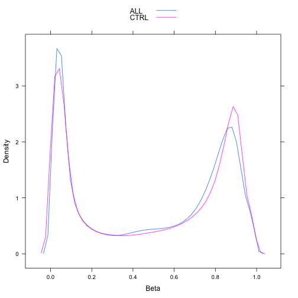
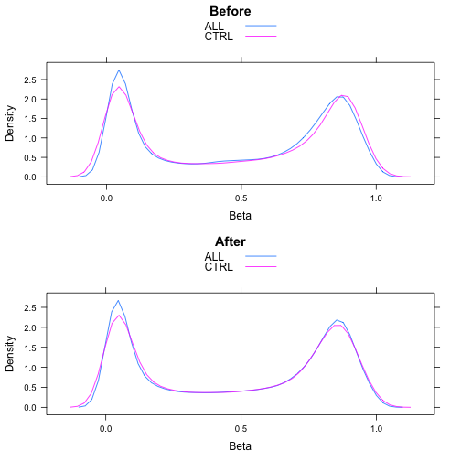
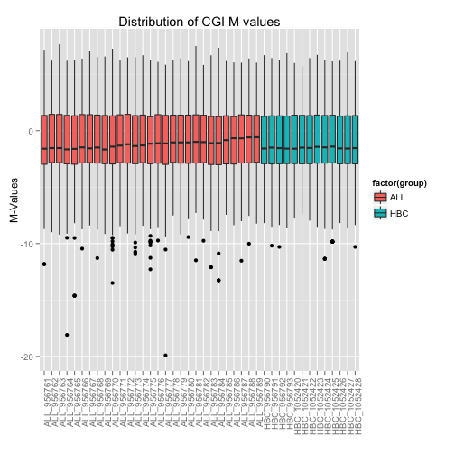
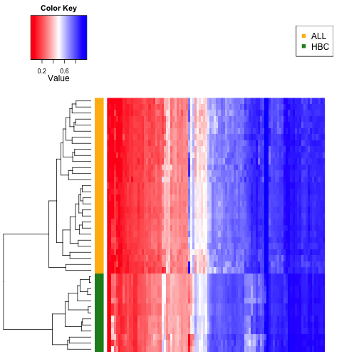
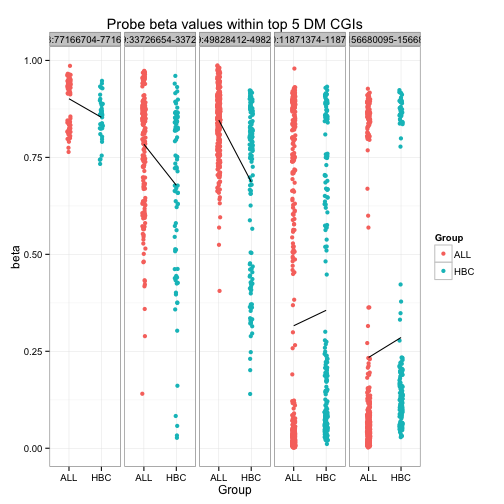
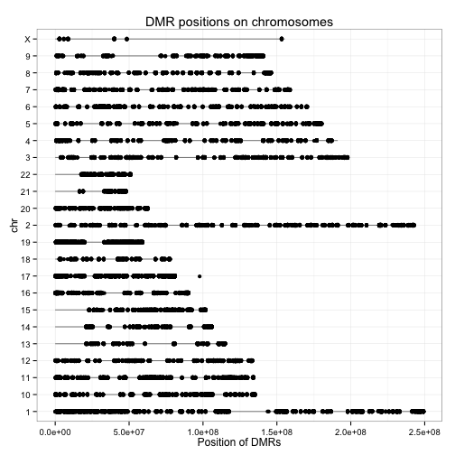

Seminar 8 DNA methylation analysis with Illumina's Infinium HumanMethylation450K array
========================================================

Ref1: http://www.ugrad.stat.ubc.ca/~stat540/seminars/seminar08_methylation.html


*Excerpt from ref*
This seminar is inspired by a STAT 540 project in 2013: Analysis of Gene Expression Omnibus Leukaemia Data from the Illumina HumanMethylation450 Array by Alice Zhu, Rachel Edgar, Shaun Jackman and Nick Fishbane. See their project website here.


```r
library(GEOquery)
```

```
## Loading required package: Biobase
## Loading required package: BiocGenerics
## Loading required package: parallel
## 
## Attaching package: 'BiocGenerics'
## 
## The following objects are masked from 'package:parallel':
## 
##     clusterApply, clusterApplyLB, clusterCall, clusterEvalQ,
##     clusterExport, clusterMap, parApply, parCapply, parLapply,
##     parLapplyLB, parRapply, parSapply, parSapplyLB
## 
## The following object is masked from 'package:stats':
## 
##     xtabs
## 
## The following objects are masked from 'package:base':
## 
##     anyDuplicated, append, as.data.frame, as.vector, cbind,
##     colnames, duplicated, eval, evalq, Filter, Find, get,
##     intersect, is.unsorted, lapply, Map, mapply, match, mget,
##     order, paste, pmax, pmax.int, pmin, pmin.int, Position, rank,
##     rbind, Reduce, rep.int, rownames, sapply, setdiff, sort,
##     table, tapply, union, unique, unlist
## 
## Welcome to Bioconductor
## 
##     Vignettes contain introductory material; view with
##     'browseVignettes()'. To cite Bioconductor, see
##     'citation("Biobase")', and for packages 'citation("pkgname")'.
## 
## Setting options('download.file.method.GEOquery'='auto')
```

```r
library(gplots)
```

```
## KernSmooth 2.23 loaded
## Copyright M. P. Wand 1997-2009
## 
## Attaching package: 'gplots'
## 
## The following object is masked from 'package:stats':
## 
##     lowess
```

```r
library(wateRmelon)
```

```
## Loading required package: limma
## 
## Attaching package: 'limma'
## 
## The following object is masked from 'package:BiocGenerics':
## 
##     plotMA
## 
## Loading required package: matrixStats
## matrixStats v0.8.14 (2013-11-23) successfully loaded. See ?matrixStats for help.
## 
## Attaching package: 'matrixStats'
## 
## The following objects are masked from 'package:Biobase':
## 
##     anyMissing, rowMedians
## 
## Loading required package: methylumi
## Loading required package: scales
## Loading required package: reshape2
## Loading required package: ggplot2
```

```
## Warning: replacing previous import by 'graphics::image' when loading
## 'methylumi'
```

```
## Loading required package: lumi
```

```
## Warning: replacing previous import by 'nleqslv::nleqslv' when loading
## 'lumi'
```

```
## 
## Attaching package: 'lumi'
## 
## The following objects are masked from 'package:methylumi':
## 
##     estimateM, getHistory
## 
## Loading required package: IlluminaHumanMethylation450k.db
## Loading required package: AnnotationDbi
## Loading required package: org.Hs.eg.db
## Loading required package: DBI
```

```
## Warning: 'IlluminaHumanMethylation450k.db' is deprecated.
## Use 'FDb.InfiniumMethylation.hg19' instead.
## Use 'FDb.InfiniumMethylation.hg18' instead.
## Use 'mapToGenome() function in minfi or methylumi' instead.
## See help("Deprecated")
```

```
## Loading required package: ROC
```

```r
library(IlluminaHumanMethylation450k.db)
library(reshape2)
library(lattice)
require(gridExtra)  # also loads grid
```

```
## Loading required package: gridExtra
## Loading required package: grid
```

```r
library(limma)
```


```r
source("style.R")
```


## Explore 450k methylation array data

Download/load the dataset

```r
setwd("/Users/sohrab/Me/Apply/Canada Apply/Courses/Second Semester/Stat 540/Lab/stat540-2014-salehi-sohrab/data")

if (file.exists("methyl_ALL.Rdata")) {
    # if previously downloaded
    load("methyl_ALL.Rdata")
} else {
    # if downloading for the first time
    GSE39141 <- getGEO("GSE39141")
    show(GSE39141)  ## 33 samples (29 ALL and 4 healthy B cells)
    GSE42865 <- getGEO("GSE42865")  # took ~2 mins for JB
    show(GSE42865)  ## 16 samples (9 healthy cells B cells and 7 other cells)
    
    # Extract expression matrices (turn into data frames at once)
    ALL.dat <- as.data.frame(exprs(GSE39141[[1]]))
    CTRL.dat <- as.data.frame(exprs(GSE42865[[1]]))
    
    # Obtain the meta-data for the samples and rename them perhaps?
    ALL.meta <- pData(phenoData(GSE39141[[1]]))
    CTRL.meta <- pData(phenoData(GSE42865[[1]]))
    
    # create some labels
    ALL.meta$Group <- c(rep("ALL", 29), rep("HBC", 4))
    ## ALL: Case; HBC: Healthy B Cells
    
    # Subset both meta-data and data for control (healthy) donors
    CTRL.meta <- droplevels(subset(CTRL.meta, grepl("Healthy donor", characteristics_ch1.1)))
    CTRL.dat <- subset(CTRL.dat, select = as.character(CTRL.meta$geo_accession))
    
    # Rename variables
    names(ALL.dat) <- paste(ALL.meta$Group, gsub("GSM", "", names(ALL.dat)), 
        sep = "_")
    names(CTRL.dat) <- paste("HBC", gsub("GSM", "", names(CTRL.dat)), sep = "_")
    
    # save the data to avoid future re-downloading
    save(ALL.dat, CTRL.dat, ALL.meta, CTRL.meta, file = "methyl_ALL.Rdata")
}
```

Density plot of average Beta values for probes in the two datasets:

```r
# package all together
t <- melt(CTRL.dat)
```

```
## Using  as id variables
```

```r
t1 <- melt(ALL.dat)
```

```
## Using  as id variables
```

```r
t2 <- rbind(t, t1)
t2$condition <- factor(rep(c("CTRL", "ALL"), times = c(nrow(t), nrow(t1))))

densityplot(~value, t2, group = condition, auto.key = T, plot.points = F, xlab = "Beta")
```

 

```r


(p <- ggplot(fDat, aes(geneExp, BrainRegion, color = Genotype), main = "Hello") + 
    geom_point() + facet_wrap(~Sex) + labs(title = paste("Gene expression for probeset", 
    probeName)) + xlab("Gene Expression") + ylab("Brain Region"))
```

```
## Error: object 'fDat' not found
```


## Normalization

Using `wateRmelon`, quantile normalize the experiments via `betaqn` method. There're 15 different normalization methods. Let's see what [this](http://www.biomedcentral.com/1471-2164/14/293) paper has to say...

$β = M/(M + U + 100)$ where $M$ indicates intensity of methylated and $U$ not methylated. They conclude that quantile normalization yeilds `markedly` improved methods, using the 3 metrics they've derived.

Check out [this paper](http://www.ncbi.nlm.nih.gov/pmc/articles/PMC3012676/) for more info on $\beta$ and $M$ values.


```r
beta.matrix <- as.matrix(cbind(ALL.dat, CTRL.dat))
str(beta.matrix, max.level = 0)
```

```
##  num [1:485577, 1:42] 0.512 0.911 0.857 0.149 0.729 ...
##  - attr(*, "dimnames")=List of 2
```

```r
system.time(beta.norm <- betaqn(beta.matrix))
```

```
##    user  system elapsed 
##   54.48   15.52   95.02
```

```r

t3 <- melt(beta.norm)
t3$condition <- t2$condition
t3$Var2 <- NULL

t2.sample <- t2[sample(seq(nrow(t2)), 1e+05), ]
t3.sample <- t3[sample(seq(nrow(t3)), 1e+05), ]


p1 <- densityplot(~value, t2.sample, group = condition, auto.key = T, plot.points = F, 
    xlab = "Beta", main = "Before")
p2 <- densityplot(~value, t3.sample, group = condition, auto.key = T, plot.points = F, 
    xlab = "Beta", main = "After")

grid.arrange(p1, p2, nrow = 2)
```

 


The above plots look more similar to me.


## M values

Assumptions of a linear model: don't have more than one mode and span $R$?
<br />
[Here's](http://people.duke.edu/~rnau/testing.htm) a reference on assumption of linear regression. The most relevant I've found is the normality of the errors. So is $\Beta$ value indicative of some kind of an error?


```r
# we'll use this normalization for the probes from now on
M.norm <- beta2m(beta.norm)
```


## CpG Islands
The idea is that CpG islands have a better understood biological function. It'd be interesting to know whether the mean
of the probes in the same CpG island is a good enough representation of it's methylation state or not...

```r
# Annotate probe ID to CpG islands association
cginame <- as.data.frame(IlluminaHumanMethylation450kCPGINAME)
names(cginame) <- c("Probe_ID", "cginame")
rownames(cginame) <- cginame$Probe_ID
length(levels(factor(cginame$cginame)))  # No. of CGIs
```

```
## [1] 27176
```

```r

head(cginame)
```

```
##              Probe_ID                cginame
## cg00050873 cg00050873   chrY:9363680-9363943
## cg00063477 cg00063477 chrY:22737825-22738052
## cg00121626 cg00121626 chrY:21664481-21665063
## cg00212031 cg00212031 chrY:21238448-21240005
## cg00213748 cg00213748   chrY:8147877-8148210
## cg00214611 cg00214611 chrY:15815488-15815779
```

Now we'll remove those we don't have a CpG island for:

```r
# restrict probes to those within CGIs
beta.inCGI <- beta.norm[cginame$Probe_ID, ]  # restricting and rearranging
M.inCGI <- M.norm[cginame$Probe_ID, ]
nrow(M.inCGI)  # No. of probes within CGIs
```

```
## [1] 309465
```

Now, for each CpG island, assign the mean of probe beta.norm:

```r
# aggregate probes to CGIs

# how is this working? The elements of cginame$chiname do not seem to match
# those of the beta.inCGI.
beta.CGI <- aggregate(beta.inCGI, by = list(cginame$cginame), mean, na.rm = T)

# little peek on how it works. I've a larger test at the end of the file.
# The ?aggregate wasn't helpful. and couldn't find the binary
length(cginame$cginame) == nrow(beta.inCGI)
```

```
## [1] TRUE
```

```r
any(cginame$cginame %in% rownames(beta.inCGI))
```

```
## [1] FALSE
```

```r
nrow(beta.inCGI)
```

```
## [1] 309465
```

```r
nrow(beta.CGI)
```

```
## [1] 27176
```

```r

rownames(beta.CGI) <- beta.CGI[, "Group.1"]
beta.CGI <- subset(beta.CGI, select = -Group.1)
str(beta.CGI, max.level = 0)
```

```
## 'data.frame':	27176 obs. of  42 variables:
```

```r

M.CGI <- aggregate(M.inCGI, by = list(cginame$cginame), mean, na.rm = T)
rownames(M.CGI) <- M.CGI[, "Group.1"]
M.CGI <- subset(M.CGI, select = -Group.1)
str(M.CGI, max.level = 0)
```

```
## 'data.frame':	27176 obs. of  42 variables:
```


Now make a boxplot of the m-values across samples:

```r
molten <- melt(M.CGI)
```

```
## Using  as id variables
```

```r
molten$group <- factor(rep(c("ALL", "HBC"), time = c(29 * nrow(M.CGI), 13 * 
    nrow(M.CGI))), levels = (c("ALL", "HBC")))
head(molten)
```

```
##     variable   value group
## 1 ALL_956761 -3.3860   ALL
## 2 ALL_956761 -0.5655   ALL
## 3 ALL_956761 -3.5963   ALL
## 4 ALL_956761 -2.6579   ALL
## 5 ALL_956761 -3.3753   ALL
## 6 ALL_956761 -2.8872   ALL
```

```r
p <- ggplot((molten), aes(x = variable, y = value)) + geom_boxplot(aes(fill = factor(group))) + 
    theme(axis.text.x = element_text(angle = 90, hjust = 1)) + labs(title = "Distribution of CGI M values", 
    x = "", y = "M-Values")
print(p)
```

```
## Warning: Removed 15924 rows containing non-finite values (stat_boxplot).
```

 

```r
# scale_fill_manual(values = c('white','red')) theme(axis.text.x =
# element_text(angle = 90, hjust = 1))
```


## Differential methylation analysis with limma
Are we taking the size of a CpG island into account with this method?

```r
design <- data.frame(Group = relevel(factor(gsub("_[0-9]+", "", colnames(M.CGI))), 
    ref = "HBC"), row.names = colnames(M.CGI))
str(design)
```

```
## 'data.frame':	42 obs. of  1 variable:
##  $ Group: Factor w/ 2 levels "HBC","ALL": 2 2 2 2 2 2 2 2 2 2 ...
```

```r
(DesMat <- model.matrix(~Group, design))
```

```
##             (Intercept) GroupALL
## ALL_956761            1        1
## ALL_956762            1        1
## ALL_956763            1        1
## ALL_956764            1        1
## ALL_956765            1        1
## ALL_956766            1        1
## ALL_956767            1        1
## ALL_956768            1        1
## ALL_956769            1        1
## ALL_956770            1        1
## ALL_956771            1        1
## ALL_956772            1        1
## ALL_956773            1        1
## ALL_956774            1        1
## ALL_956775            1        1
## ALL_956776            1        1
## ALL_956777            1        1
## ALL_956778            1        1
## ALL_956779            1        1
## ALL_956780            1        1
## ALL_956781            1        1
## ALL_956782            1        1
## ALL_956783            1        1
## ALL_956784            1        1
## ALL_956785            1        1
## ALL_956786            1        1
## ALL_956787            1        1
## ALL_956788            1        1
## ALL_956789            1        1
## HBC_956790            1        0
## HBC_956791            1        0
## HBC_956792            1        0
## HBC_956793            1        0
## HBC_1052420           1        0
## HBC_1052421           1        0
## HBC_1052422           1        0
## HBC_1052423           1        0
## HBC_1052424           1        0
## HBC_1052425           1        0
## HBC_1052426           1        0
## HBC_1052427           1        0
## HBC_1052428           1        0
## attr(,"assign")
## [1] 0 1
## attr(,"contrasts")
## attr(,"contrasts")$Group
## [1] "contr.treatment"
```

```r
DMRfit <- lmFit(M.CGI, DesMat)
DMRfitEb <- eBayes(DMRfit)
cutoff <- 0.01
DMR <- topTable(DMRfitEb, coef = "GroupALL", number = Inf, p.value = cutoff)
head(DMR)  # top hits 
```

```
##                            logFC AveExpr      t   P.Value adj.P.Val     B
## chr19:49828412-49828668   1.3084   2.283  12.05 2.798e-15 7.604e-11 24.31
## chr4:156680095-156681386 -1.1115  -2.521 -10.95 6.245e-14 8.485e-10 21.39
## chr20:11871374-11872207  -1.2639  -2.284 -10.49 2.370e-13 1.803e-09 20.13
## chr19:33726654-33726946   0.9429   1.887  10.39 3.172e-13 1.803e-09 19.85
## chr18:77166704-77167043   0.8104   3.199  10.36 3.429e-13 1.803e-09 19.78
## chr18:46447718-46448083  -0.8990   2.034 -10.31 3.980e-13 1.803e-09 19.64
```


Now visualization, starting with a nice heatmap:

```r
DMR100 <- topTable(DMRfitEb, coef = "GroupALL", number = 100)
DMR.CGI <- t(as.matrix(subset(beta.CGI, rownames(beta.CGI) %in% rownames(DMR100))))
str(DMR.CGI, max.level = 0)
```

```
##  num [1:42, 1:100] 0.707 0.688 0.69 0.728 0.692 ...
##  - attr(*, "dimnames")=List of 2
```

```r
col <- c(rep("darkgoldenrod1", times = nrow(DMR.CGI)))
col[grepl("HBC", rownames(DMR.CGI))] <- "forestgreen"
op <- par(mai = rep(0.5, 4))
heatmap.2(DMR.CGI, col = redblue(256), RowSideColors = col, density.info = "none", 
    trace = "none", Rowv = TRUE, Colv = TRUE, labCol = FALSE, labRow = FALSE, 
    dendrogram = "row", margins = c(1, 5))
legend("topright", c("ALL", "HBC"), col = c("darkgoldenrod1", "forestgreen"), 
    pch = 15)
```

 


```r
par(op)
DMR5 <- topTable(DMRfitEb, coef = "GroupALL", number = 5)
beta.DMR5probe <- beta.inCGI[cginame[rownames(beta.inCGI), ]$cginame %in% rownames(DMR5), 
    ]
beta.DMR5probe.tall <- melt(beta.DMR5probe, value.name = "M", varnames = c("Probe_ID", 
    "Sample"))
beta.DMR5probe.tall$Group <- factor(gsub("_[0-9]+", "", beta.DMR5probe.tall$Sample))
beta.DMR5probe.tall$CGI <- factor(cginame[as.character(beta.DMR5probe.tall$Probe_ID), 
    ]$cginame)
(beta.DMR5.stripplot <- ggplot(data = beta.DMR5probe.tall, aes(x = Group, y = M, 
    color = Group)) + geom_point(position = position_jitter(width = 0.05), na.rm = T) + 
    stat_summary(fun.y = mean, aes(group = 1), geom = "line", color = "black") + 
    facet_grid(. ~ CGI) + ggtitle("Probe beta values within top 5 DM CGIs") + 
    xlab("Group") + ylab("beta") + theme_bw())
```

```
## Warning: Removed 3 rows containing missing values (stat_summary).
## Warning: Removed 1 rows containing missing values (stat_summary).
## Warning: Removed 2 rows containing missing values (stat_summary).
## Warning: Removed 3 rows containing missing values (stat_summary).
```

 


Location of probes along different chromosomes. This is a factastic plot! Could be used in different plots, like
visualizing 4C data:

```r
# get the length of chromosome 1-22 and X
chrlen <- unlist(as.list(IlluminaHumanMethylation450kCHRLENGTHS)[c(as.character(1:22), 
    "X")])
chrlen <- data.frame(chr = factor(names(chrlen)), length = chrlen)
chr <- IlluminaHumanMethylation450kCHR  # get the chromosome of each probe

# get the probe identifiers that are mapped to chromosome
chr <- unlist(as.list(chr[mappedkeys(chr)]))

# get chromosome coordinate of each probe
coord <- IlluminaHumanMethylation450kCPGCOORDINATE

# get the probe identifiers that are mapped to coordinate
coord <- unlist(as.list(coord[mappedkeys(coord)]))
coord <- data.frame(chr = chr[intersect(names(chr), names(coord))], coord = coord[intersect(names(chr), 
    names(coord))])

# coordinates of probes in DM CGIs
coordDMRprobe <- droplevels(na.omit(coord[cginame[cginame$cginame %in% rownames(DMR), 
    ]$Probe_ID, ]))
(coord.plot <- ggplot(data = coordDMRprobe) + geom_linerange(aes(factor(chr, 
    levels = c("X", as.character(22:1))), ymin = 0, ymax = length), data = chrlen, 
    alpha = 0.5) + geom_point(aes(x = factor(chr, levels = c("X", as.character(22:1))), 
    y = coord), position = position_jitter(width = 0.03), na.rm = T) + ggtitle("DMR positions on chromosomes") + 
    ylab("Position of DMRs") + xlab("chr") + coord_flip() + theme_bw())
```

 


Little test to see how exactly aggregate works:

```r
set.seed(1)
l1 <- lapply(seq(20), function(x) {
    paste("A", x, sep = "")
})
l2 <- lapply(seq(4), function(x) {
    paste("S", x, sep = "")
})
l3 <- (sample(l2, 20, replace = T))
l3 <- unlist(l3)

the.mapping <- data.frame(prob = unlist(l1), set = l3)

tat <- unlist(sample(l1, 20, replace = F))
values <- runif(20)


the.val <- data.frame(tat, values)
the.val
```

```
##    tat  values
## 1  A19 0.82095
## 2   A5 0.64706
## 3  A12 0.78293
## 4   A3 0.55304
## 5  A20 0.52972
## 6   A6 0.78936
## 7   A1 0.02333
## 8  A16 0.47723
## 9  A11 0.73231
## 10  A4 0.69273
## 11 A13 0.47762
## 12 A15 0.86121
## 13 A18 0.43810
## 14  A2 0.24480
## 15 A10 0.07068
## 16  A8 0.09947
## 17  A9 0.31627
## 18 A14 0.51863
## 19  A7 0.66201
## 20 A17 0.40683
```

```r


kaka <- aggregate(the.val, by = list(l3), mean, na.rm = T)
```

```
## Warning: argument is not numeric or logical: returning NA
## Warning: argument is not numeric or logical: returning NA
## Warning: argument is not numeric or logical: returning NA
## Warning: argument is not numeric or logical: returning NA
```

```r


f <- table(the.mapping)
ff <- lapply(levels(factor(l3)), function(x) which(f[, x] > 0))
names(ff) <- levels(factor(l3))
ff
```

```
## $S1
## A10 A11 A12  A5 
##   2   3   4  16 
## 
## $S2
##  A1 A14 A16 A19  A2 
##   1   6   8  11  12 
## 
## $S3
## A13 A17  A3  A8  A9 
##   5   9  14  19  20 
## 
## $S4
## A15 A18 A20  A4  A6  A7 
##   7  10  13  15  17  18
```

```r

nvalues <- 1:20
# S1
nvalues[as.vector(ff$S1)] <- 1
nvalues[as.vector(ff$S2)] <- 2
nvalues[as.vector(ff$S3)] <- 3
nvalues[as.vector(ff$S4)] <- 4


new.val <- data.frame(sort(tat), nvalues)
new.val
```

```
##    sort.tat. nvalues
## 1         A1       2
## 2        A10       1
## 3        A11       1
## 4        A12       1
## 5        A13       3
## 6        A14       2
## 7        A15       4
## 8        A16       2
## 9        A17       3
## 10       A18       4
## 11       A19       2
## 12        A2       2
## 13       A20       4
## 14        A3       3
## 15        A4       4
## 16        A5       1
## 17        A6       4
## 18        A7       4
## 19        A8       3
## 20        A9       3
```

```r
new.val$S <- 1:20

new.val$S[as.vector(ff$S1)] <- "S1"
new.val$S[as.vector(ff$S2)] <- "S2"
new.val$S[as.vector(ff$S3)] <- "S3"
new.val$S[as.vector(ff$S4)] <- "S4"

new.val
```

```
##    sort.tat. nvalues  S
## 1         A1       2 S2
## 2        A10       1 S1
## 3        A11       1 S1
## 4        A12       1 S1
## 5        A13       3 S3
## 6        A14       2 S2
## 7        A15       4 S4
## 8        A16       2 S2
## 9        A17       3 S3
## 10       A18       4 S4
## 11       A19       2 S2
## 12        A2       2 S2
## 13       A20       4 S4
## 14        A3       3 S3
## 15        A4       4 S4
## 16        A5       1 S1
## 17        A6       4 S4
## 18        A7       4 S4
## 19        A8       3 S3
## 20        A9       3 S3
```

```r
mean(new.val$nvalues[new.val$S == "S1"])
```

```
## [1] 1
```

```r
aggregate(new.val[, -c(3)], by = list(l3), mean, na.rm = T)
```

```
## Warning: argument is not numeric or logical: returning NA
## Warning: argument is not numeric or logical: returning NA
## Warning: argument is not numeric or logical: returning NA
## Warning: argument is not numeric or logical: returning NA
```

```
##   Group.1 sort.tat. nvalues
## 1      S1        NA    2.75
## 2      S2        NA    2.00
## 3      S3        NA    2.80
## 4      S4        NA    3.00
```

```r

# check
new.val[new.val$tat %in% c("A10", "A11", "A12", "A5"), ]
```

```
## [1] sort.tat. nvalues   S        
## <0 rows> (or 0-length row.names)
```

```r


tt <- data.frame(r1 = seq(1:20), r2 = c(rep(1, 5), rep(2, 5), rep(3, 5), rep(4, 
    5)))
tt
```

```
##    r1 r2
## 1   1  1
## 2   2  1
## 3   3  1
## 4   4  1
## 5   5  1
## 6   6  2
## 7   7  2
## 8   8  2
## 9   9  2
## 10 10  2
## 11 11  3
## 12 12  3
## 13 13  3
## 14 14  3
## 15 15  3
## 16 16  4
## 17 17  4
## 18 18  4
## 19 19  4
## 20 20  4
```

```r

the.na <- c("S1", "S2", "S3", "S4")
aa <- aggregate(the.val, by = list(the.na), mean, na.rm = T)
```

```
## Error: arguments must have same length
```

```r


which(f[, "S1"] > 0)
```

```
## A10 A11 A12  A5 
##   2   3   4  16
```

```r


match(unlist(l1), the.val$tat)
```

```
##  [1]  7 14  4 10  2  6 19 16 17 15  9  3 11 18 12  8 20 13  1  5
```

```r

n <- the.val[match(unlist(l1), the.val$tat), ]

mean(n[which(f[, "S1"] > 0), ]$value)
```

```
## [1] 0.4919
```


Conclusion:
Not magic, or environment picking. The by argumetn has to be of the same length of the nrow of X.

