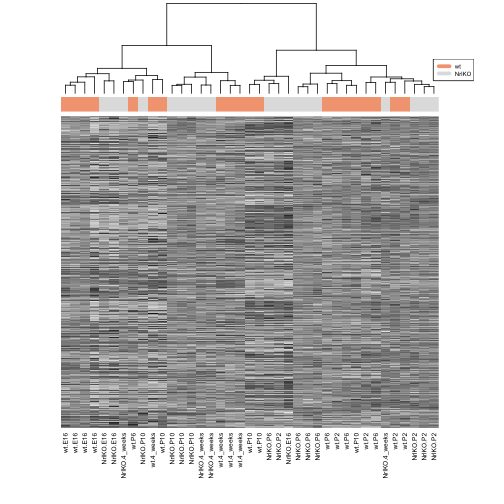
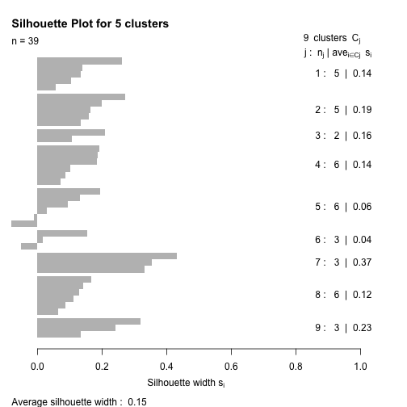

Seminar 9
========================================================

Ref1: http://www.ugrad.stat.ubc.ca/~stat540/seminars/seminar09_clustering-pca.html

*Excerpt from ref*
Clustering on the photoreceptor data set.


```r
library(edgeR)
```

```
## Loading required package: limma
```

```r
library(plyr)
library(gplots)
```

```
## KernSmooth 2.23 loaded
## Copyright M. P. Wand 1997-2009
## 
## Attaching package: 'gplots'
## 
## The following object is masked from 'package:stats':
## 
##     lowess
```

```r
library(RColorBrewer)
library(cluster)
library(pvclust)
library(xtable)
library(limma)
library(reshape2)
library(lattice)
```


```r
source("style.R")
```


# load the data

```r
dataDir <- "/Users/sohrab/Me/Apply/Canada Apply/Courses/Second Semester/Stat 540/Lab/stat540_2014/examples/photoRec/data/"
prDat <- read.table(paste(dataDir, "GSE4051_data.tsv", sep = ""), header = T, 
    row.names = 1)
str(prDat, max.level = 0)
```

```
## 'data.frame':	29949 obs. of  39 variables:
```

```r
prDesc <- readRDS(paste(dataDir, "GSE4051_design.rds", sep = ""))
str(prDesc)
```

```
## 'data.frame':	39 obs. of  4 variables:
##  $ sidChar : chr  "Sample_20" "Sample_21" "Sample_22" "Sample_23" ...
##  $ sidNum  : num  20 21 22 23 16 17 6 24 25 26 ...
##  $ devStage: Factor w/ 5 levels "E16","P2","P6",..: 1 1 1 1 1 1 1 2 2 2 ...
##  $ gType   : Factor w/ 2 levels "wt","NrlKO": 1 1 1 1 2 2 2 1 1 1 ...
```


Rescale the data (the rows, i.e., genes across samples) to aid visualization

```r
sprDat <- t(scale(t(prDat)))
str(sprDat, max.level = 0, give.attr = FALSE)
```

```
##  num [1:29949, 1:39] 0.0838 0.1758 0.7797 -0.3196 0.8358 ...
```

```r

# check the first 10...
round(data.frame(avgBefore = rowMeans(head(prDat)), avgAfter = rowMeans(head(sprDat)), 
    varBefore = apply(head(prDat), 1, var), varAfter = apply(head(sprDat), 1, 
        var)), 2)
```

```
##              avgBefore avgAfter varBefore varAfter
## 1415670_at        7.22        0      0.02        1
## 1415671_at        9.37        0      0.35        1
## 1415672_at        9.70        0      0.15        1
## 1415673_at        8.42        0      0.03        1
## 1415674_a_at      8.47        0      0.02        1
## 1415675_at        9.67        0      0.03        1
```


It worked, the rows have mean = 0 and variance 1.

# Sample Clustering

## Hierarchical Clustering
### Standards: Eucleadian Distance, average linkage kernel
#### Note
`dist` calculates distance between rows

```r
# create the distance matrix,
pr.dis <- dist(t(sprDat), method = "euclidean")

# interaction is a cool method :)
prDesc$grp <- with(prDesc, interaction(gType, devStage))
summary(prDesc$grp)
```

```
##        wt.E16     NrlKO.E16         wt.P2      NrlKO.P2         wt.P6 
##             4             3             4             4             4 
##      NrlKO.P6        wt.P10     NrlKO.P10    wt.4_weeks NrlKO.4_weeks 
##             4             4             4             4             4
```


```r
# do hierarchical clustering using different kernels
linkage.types <- c("single", "complete", "average", "ward")
pr.hc <- lapply(linkage.types, function(x) hclust(pr.dis, method = x))

# plot the results
op <- par(mar = c(0, 4, 4, 2), mfrow = c(2, 2))

lapply(seq(pr.hc), function(x) plot(pr.hc[[x]], labels = F, main = linkage.types[[x]], 
    xlab = ""))
```

 

```
## [[1]]
## NULL
## 
## [[2]]
## NULL
## 
## [[3]]
## NULL
## 
## [[4]]
## NULL
```


Cut the tree and choose number of clusters, say 9:


```r
par(op)

# identify 10 clusters
op <- par(mar = c(1, 4, 4, 1))
plot(pr.hc[[4]], labels = prDesc$grp, cex = 0.6, main = "Ward showing 9 clusters")
rect.hclust(pr.hc[[4]], k = 9)
```

 


Moving to heatmaps:


```r
jGraysFun <- colorRampPalette(brewer.pal(n = 9, "Greys"))
gTypeCols <- brewer.pal(11, "RdGy")[c(4, 7)]


heatmap(as.matrix(sprDat), Rowv = NA, col = jGraysFun(256), hclustfun = function(x) hclust(x, 
    method = "ward"), scale = "none", labCol = prDesc$grp, labRow = NA, margins = c(8, 
    1), ColSideColor = gTypeCols[unclass(prDesc$gType)])
legend("topright", legend = levels(prDesc$gType), col = gTypeCols, lty = 1, 
    lwd = 5, cex = 0.5)
```

 


# Partitioning methods for photoRec data

## K-means clustering

Refer to [this](http://www.r-statistics.com/2013/08/k-means-clustering-from-r-in-action/) for some explanation. For instance, nstart, tells the function to start from a random sample 50 times and
do the analysis and report the best result.


```r
# make it reproducable
set.seed(31)

# let's choose 9 clusters
k <- 9
pr.km <- kmeans(t(sprDat), centers = k, nstart = 50)

# within sum of squares, an indicator of clustering quality, can be used in
# a scree plot to choose the right k
pr.km$withinss
```

```
## [1] 21826 15377 30868 62690 18703 79673 58470 61275 48789
```


Peek into each cluster:


```r

pr.kmTable <- data.frame(devStage = prDesc$devStage, cluster = pr.km$cluster)
prTable <- xtable(with(pr.kmTable, table(devStage, cluster)), caption = "Number of samples from each develomental stage within each k-means cluster")

# it doens't accept only 7 letters, added the remaining ones
align(prTable) <- "lccccccccc"
print(prTable, type = "html", caption.placement = "top")
```

```
## <!-- html table generated in R 3.0.2 by xtable 1.7-3 package -->
## <!-- Wed Apr  2 22:39:58 2014 -->
## <TABLE border=1>
## <CAPTION ALIGN="top"> Number of samples from each develomental stage within each k-means cluster </CAPTION>
## <TR> <TH>  </TH> <TH> 1 </TH> <TH> 2 </TH> <TH> 3 </TH> <TH> 4 </TH> <TH> 5 </TH> <TH> 6 </TH> <TH> 7 </TH> <TH> 8 </TH> <TH> 9 </TH>  </TR>
##   <TR> <TD> E16 </TD> <TD align="center">   0 </TD> <TD align="center">   2 </TD> <TD align="center">   0 </TD> <TD align="center">   0 </TD> <TD align="center">   0 </TD> <TD align="center">   4 </TD> <TD align="center">   0 </TD> <TD align="center">   1 </TD> <TD align="center">   0 </TD> </TR>
##   <TR> <TD> P2 </TD> <TD align="center">   0 </TD> <TD align="center">   0 </TD> <TD align="center">   0 </TD> <TD align="center">   0 </TD> <TD align="center">   0 </TD> <TD align="center">   0 </TD> <TD align="center">   5 </TD> <TD align="center">   1 </TD> <TD align="center">   2 </TD> </TR>
##   <TR> <TD> P6 </TD> <TD align="center">   0 </TD> <TD align="center">   0 </TD> <TD align="center">   4 </TD> <TD align="center">   0 </TD> <TD align="center">   0 </TD> <TD align="center">   1 </TD> <TD align="center">   0 </TD> <TD align="center">   1 </TD> <TD align="center">   2 </TD> </TR>
##   <TR> <TD> P10 </TD> <TD align="center">   0 </TD> <TD align="center">   0 </TD> <TD align="center">   0 </TD> <TD align="center">   4 </TD> <TD align="center">   1 </TD> <TD align="center">   0 </TD> <TD align="center">   0 </TD> <TD align="center">   2 </TD> <TD align="center">   1 </TD> </TR>
##   <TR> <TD> 4_weeks </TD> <TD align="center">   3 </TD> <TD align="center">   0 </TD> <TD align="center">   0 </TD> <TD align="center">   2 </TD> <TD align="center">   1 </TD> <TD align="center">   1 </TD> <TD align="center">   1 </TD> <TD align="center">   0 </TD> <TD align="center">   0 </TD> </TR>
##    </TABLE>
```


## PAM


```r
# going for 9 clusters again
pr.pam <- pam(pr.dis, k = k)
pr.pamTable <- data.frame(devStage = prDesc$devStage, cluster = pr.pam$clustering)
pamTable <- xtable(with(pr.pamTable, table(devStage, cluster)), caption = "Number of samples from each develomental stage within each PAM cluster")
align(pamTable) <- "lccccccccc"
print(pamTable, type = "html", caption.placement = "top")
```

```
## <!-- html table generated in R 3.0.2 by xtable 1.7-3 package -->
## <!-- Wed Apr  2 22:39:58 2014 -->
## <TABLE border=1>
## <CAPTION ALIGN="top"> Number of samples from each develomental stage within each PAM cluster </CAPTION>
## <TR> <TH>  </TH> <TH> 1 </TH> <TH> 2 </TH> <TH> 3 </TH> <TH> 4 </TH> <TH> 5 </TH> <TH> 6 </TH> <TH> 7 </TH> <TH> 8 </TH> <TH> 9 </TH>  </TR>
##   <TR> <TD> E16 </TD> <TD align="center">   4 </TD> <TD align="center">   1 </TD> <TD align="center">   2 </TD> <TD align="center">   0 </TD> <TD align="center">   0 </TD> <TD align="center">   0 </TD> <TD align="center">   0 </TD> <TD align="center">   0 </TD> <TD align="center">   0 </TD> </TR>
##   <TR> <TD> P2 </TD> <TD align="center">   0 </TD> <TD align="center">   1 </TD> <TD align="center">   0 </TD> <TD align="center">   5 </TD> <TD align="center">   2 </TD> <TD align="center">   0 </TD> <TD align="center">   0 </TD> <TD align="center">   0 </TD> <TD align="center">   0 </TD> </TR>
##   <TR> <TD> P6 </TD> <TD align="center">   0 </TD> <TD align="center">   1 </TD> <TD align="center">   0 </TD> <TD align="center">   0 </TD> <TD align="center">   3 </TD> <TD align="center">   1 </TD> <TD align="center">   3 </TD> <TD align="center">   0 </TD> <TD align="center">   0 </TD> </TR>
##   <TR> <TD> P10 </TD> <TD align="center">   0 </TD> <TD align="center">   2 </TD> <TD align="center">   0 </TD> <TD align="center">   0 </TD> <TD align="center">   1 </TD> <TD align="center">   1 </TD> <TD align="center">   0 </TD> <TD align="center">   4 </TD> <TD align="center">   0 </TD> </TR>
##   <TR> <TD> 4_weeks </TD> <TD align="center">   1 </TD> <TD align="center">   0 </TD> <TD align="center">   0 </TD> <TD align="center">   1 </TD> <TD align="center">   0 </TD> <TD align="center">   1 </TD> <TD align="center">   0 </TD> <TD align="center">   2 </TD> <TD align="center">   3 </TD> </TR>
##    </TABLE>
```


##  The silhouette plot
$s(i) := ( b(i) - a(i) ) / max( a(i), b(i) )$ 

```r
op <- par(mar = c(5, 1, 4, 4))
plot(pr.pam, main = "Silhouette Plot for 5 clusters")
```

 


reference:
http://www.ugrad.stat.ubc.ca/~stat540/seminars/seminar09_clustering-pca.html

# Gene clustering

## A smaller dataset
Let's first do DE analysis using limma and select top 972 genes across different developmental stages:


```r
# DE analysis
model.mat <- model.matrix(~devStage, prDesc)

pr.fit <- lmFit(prDat, model.mat)
ebayes.fit <- eBayes(pr.fit)

# this list is sorted by adj.P.Val
top.genes <- topTable(ebayes.fit, number = 972, coef = grep("devStage", colnames(coef(ebayes.fit))))
head(top.genes)
```

```
##                    ID devStageP2 devStageP6 devStageP10 devStage4_weeks
## 1440645_at 1440645_at     0.3040    0.24339      0.8343           3.633
## 1421084_at 1421084_at     0.6697    3.49855      5.1652           5.506
## 1451590_at 1451590_at     0.4569    2.12916      3.5209           4.920
## 1428680_at 1428680_at     0.2265    0.21227      1.0350           3.072
## 1450215_at 1450215_at     1.5362    3.43618      4.8949           5.504
## 1416041_at 1416041_at    -0.1085    0.09961      0.8187           4.425
##            AveExpr     F   P.Value adj.P.Val
## 1440645_at   6.569 245.1 5.085e-26 1.523e-21
## 1421084_at  10.023 168.8 3.605e-23 5.398e-19
## 1451590_at   9.124 157.2 1.243e-22 1.240e-18
## 1428680_at   8.066 140.9 8.274e-22 6.195e-18
## 1450215_at   9.201 122.4 9.280e-21 5.558e-17
## 1416041_at   9.325 111.4 4.631e-20 2.311e-16
```

```r

# a sanity check
sum(top.genes$adj.P.Val < 1e-05) == 972
```

```
## [1] TRUE
```

```r


# filter it out
topDat <- sprDat[row.names(sprDat) %in% top.genes$ID, ]
nrow(topDat)
```

```
## [1] 972
```


### Hierarchical

```r
geneC.dis <- dist(topDat, method = "euclidean")
geneC.hc.a <- hclust(geneC.dis, method = "average")
plot(geneC.hc.a, labels = FALSE, main = "Hierarchical with Average Linkage", 
    xlab = "")
```

 


### Partitioning

Let's look at the centroids. But first, what is this plot? We've 972 points (for each gene) in a 39 dimensional space.

In this plot, we're doing something wierd! We're plotting dimensions in the x-axis. So **samples** are the ticks/points in the horizontal axis and the y-value would be their magnitude of the point in that dimension.

## Exercise: Improve the plot above [by] adding sample names to the x-axis (e.g., wt_E16_1)
Make a list for each sample name, joining all the columns in prDesc:

```r
l <- aaply(as.matrix(prDesc), 1, function(x) paste(x[3], x[4], x[2], sep = "_"))

# is the order right?
all(prDesc[, 1] == colnames(topDat))
```

```
## [1] TRUE
```


Now use l as the labels in the backbone plot:


```r
k <- 5
kmeans.genes <- kmeans(topDat, centers = k)

# choose which cluster we want
clusterNum <- 1

par(mar = c(10, 4, 4, 8))
# the wierd thing. Dimensions as ticks on the x-axis
plot(kmeans.genes$centers[clusterNum, ], type = "n", ylim = c(-5, 5), xaxt = "n", 
    xlab = "", ylab = "Relative expression")


axis(1, at = 1:39, labels = l, col.axis = "black", las = 2)

# Plot the expression of all the genes in the selected cluster in grey.
matlines(y = t(topDat[kmeans.genes$cluster == clusterNum, ]), col = "grey")

# Add the cluster center. This is last so it isn't underneath the members
points(kmeans.genes$centers[clusterNum, ], type = "l")

# Optional: colored points to show which development stage the samples are
# from.
points(kmeans.genes$centers[clusterNum, ], col = prDesc$devStage, pch = 20)
```

 


## Heatmaps and dendograms on top of them:


```r

devStageCols <- brewer.pal(11, "RdGy")[c(2, 4, 7, 9, 11)]
heatmap(as.matrix(topDat), col = jGraysFun(256), hclustfun = function(x) hclust(x, 
    method = "average"), labCol = prDesc$grp, labRow = NA, margin = c(8, 1), 
    scale = "none", ColSideColor = devStageCols[unclass(prDesc$devStage)])
legend("topleft", levels(prDesc$devStage), col = devStageCols, lty = 1, lwd = 5, 
    cex = 0.5)
```

 


# Redefining the attributes

Basically, define a linear model, don't fit the parameters and then cluster genes by them. Just reformat it in a form suitable for later plotting clustering etc.


```r
# stack probe data tall and skinny
annoTopDat <- stack(as.data.frame(topDat))

`?`(stack)


# add probeset ID as variable
annoTopDat$probeset <- rownames(topDat)

head(annoTopDat)
```

```
##    values       ind     probeset
## 1 -0.1351 Sample_20   1415711_at
## 2  1.2034 Sample_20 1415716_a_at
## 3 -0.2987 Sample_20   1415802_at
## 4  1.2596 Sample_20   1415810_at
## 5  0.9569 Sample_20 1415849_s_at
## 6  1.1586 Sample_20 1415876_a_at
```

```r
# perhaps could have done a melt? Yeah, we'll go with melt
exp <- melt(topDat)

## get info on gType and devStage, then average over reps within devStage
## it's basically a table join
annoTopDat <- merge(annoTopDat, prDesc, by.x = "ind", by.y = "sidChar")

# basically, for each probeset, return the average for each dev stage
devStageAvg <- ddply(annoTopDat, ~probeset, function(x) {
    avgByDevStage <- aggregate(values ~ devStage, x, mean)$values
    names(avgByDevStage) <- levels(x$devStage)
    avgByDevStage
})

## put probset info back into rownames
rownames(devStageAvg) <- devStageAvg$probeset
devStageAvg$probeset <- NULL
str(devStageAvg)
```

```
## 'data.frame':	972 obs. of  5 variables:
##  $ E16    : num  -0.628 1.235 -0.419 1.401 0.855 ...
##  $ P2     : num  -1.041 0.7 -0.918 0.737 0.74 ...
##  $ P6     : num  -0.214 -0.26 -0.744 -0.66 0.34 ...
##  $ P10    : num  0.722 -0.683 0.553 -0.779 -0.363 ...
##  $ 4_weeks: num  1.083 -0.838 1.475 -0.523 -1.464 ...
```

```r

heatmap(as.matrix(devStageAvg), Colv = NA, col = jGraysFun(256), hclustfun = function(x) hclust(x, 
    method = "average"), labCol = colnames(devStageAvg), labRow = NA, margin = c(8, 
    1))
```

 


Now we can cluster according to 

```r
k <- 4
geneDS.km <- kmeans(devStageAvg, centers = k, nstart = 50)
clust.centers <- geneDS.km$centers

# Look at all clusters
op <- par(mfrow = c(2, 2))
for (clusterNum in 1:4) {
    # Set up the axes without plotting; ylim set based on trial run.
    plot(clust.centers[clusterNum, ], ylim = c(-4, 4), type = "n", xlab = "Develomental Stage", 
        ylab = "Relative expression", axes = F, main = paste("Cluster", clusterNum, 
            sep = " "))
    axis(2)
    axis(1, 1:5, c(colnames(clust.centers)[1:4], "4W"), cex.axis = 0.9)
    
    # Plot the expression of all the genes in the selected cluster in grey.
    matlines(y = t(devStageAvg[geneDS.km$cluster == clusterNum, ]), col = "grey")
    
    # Add the cluster center. This is last so it isn't underneath the members
    points(clust.centers[clusterNum, ], type = "l")
    
    # Optional: points to show development stages.
    points(clust.centers[clusterNum, ], pch = 20)
}
```

 


Comparing cluster centers (centroids):

```r
plot(clust.centers[clusterNum, ], ylim = c(-4, 4), type = "n", xlab = "Develomental Stage", 
    ylab = "Average expression", axes = FALSE, main = "Clusters centers")
axis(2)
axis(1, 1:5, c(colnames(clust.centers)[1:4], "4W"), cex.axis = 0.9)

for (clusterNum in 1:4) {
    points(clust.centers[clusterNum, ], type = "l", col = clusterNum, lwd = 2)
    points(clust.centers[clusterNum, ], col = clusterNum, pch = 20)
}
```

 


Cloud! And some experimenting with formula. Turns on that * and + have the same effect here.


```r
cloud(devStageAvg[, "E16"] ~ devStageAvg[, "P6"] * devStageAvg[, "4_weeks"], 
    col = geneDS.km$clust, xlab = "E16", ylab = "P6", zlab = "4_weeks", main = "")
```

 

```r

t = rep(2, 100)
t3 = seq(100)
t1 = 1:100
t2 = 100:1
cloud(t ~ t1 * t2)
```

 

```r
wireframe(t ~ t1 * t2)
```

 

```r
plot(t ~ t1 + t2)
```

  


# Statistical measures to evaluate clusters

Let's give pvclust a try! The link [here](http://www.is.titech.ac.jp/~shimo/prog/pvclust/) notes that it can be used in parallel as well.

We're using both p-value calculation methods here, AU and BP. AU (Approximately Unbiased) was recommened in the package's homepage.

```r
pvc <- pvclust(topDat, nboot = 100)
```

```
## Bootstrap (r = 0.5)... Done.
## Bootstrap (r = 0.6)... Done.
## Bootstrap (r = 0.7)... Done.
## Bootstrap (r = 0.8)... Done.
## Bootstrap (r = 0.9)... Done.
## Bootstrap (r = 1.0)... Done.
## Bootstrap (r = 1.1)... Done.
## Bootstrap (r = 1.2)... Done.
## Bootstrap (r = 1.3)... Done.
## Bootstrap (r = 1.4)... Done.
```

```r

plot(pvc, labels = prDesc$grp, cex = 0.6)
pvrect(pvc, alpha = 0.95)
```

 


# PCA (principal components analysis) 

```r
pcs <- prcomp(sprDat, center = F, scale = F)

# scree plot
plot(pcs)
```

 


What is the y axis? What is the x axis? Y axis is the variable in the same column as the box and the x axis the same row. 

There's an interesting correlation between sidNumber and PC2!


```r
# append the rotations for the first 10 PCs to the phenodata
prinComp <- cbind(prDesc, pcs$rotation[prDesc$sidNum, 1:10])

# scatter plot showing us how the first few PCs relate to covariates
plot(prinComp[, c("sidNum", "devStage", "gType", "PC1", "PC2", "PC3")], pch = 19, 
    cex = 0.8)
```

 


Some experiments:
For each instance, i.e., each sample, plot the two variables.

```r
r <- pcs$rotation
plot(PC2 ~ PC1, r)
```

 


```r
# plot data on first two PCs, colored by development stage
plot(prinComp[, c("PC1", "PC2")], bg = prDesc$devStage, pch = 21, cex = 1.5)
legend(list(x = 0.2, y = 0.3), as.character(levels(prDesc$devStage)), pch = 21, 
    pt.bg = c(1, 2, 3, 4, 5))
```

 

